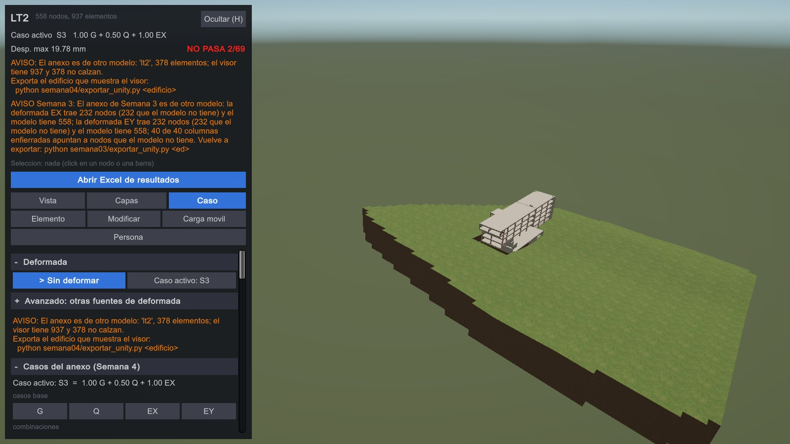
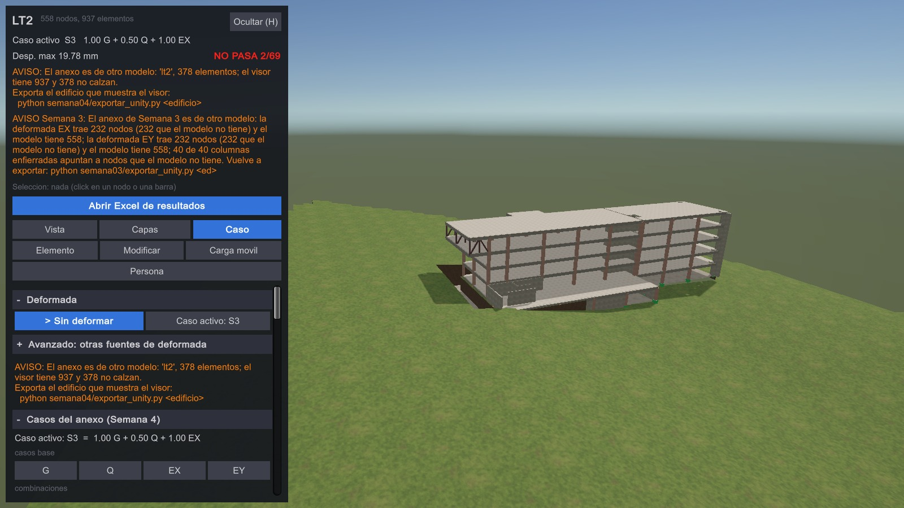
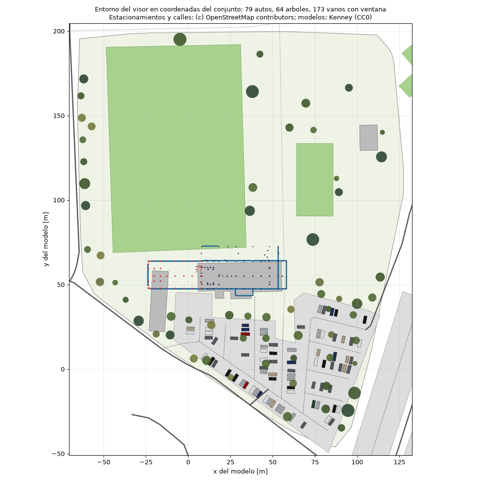
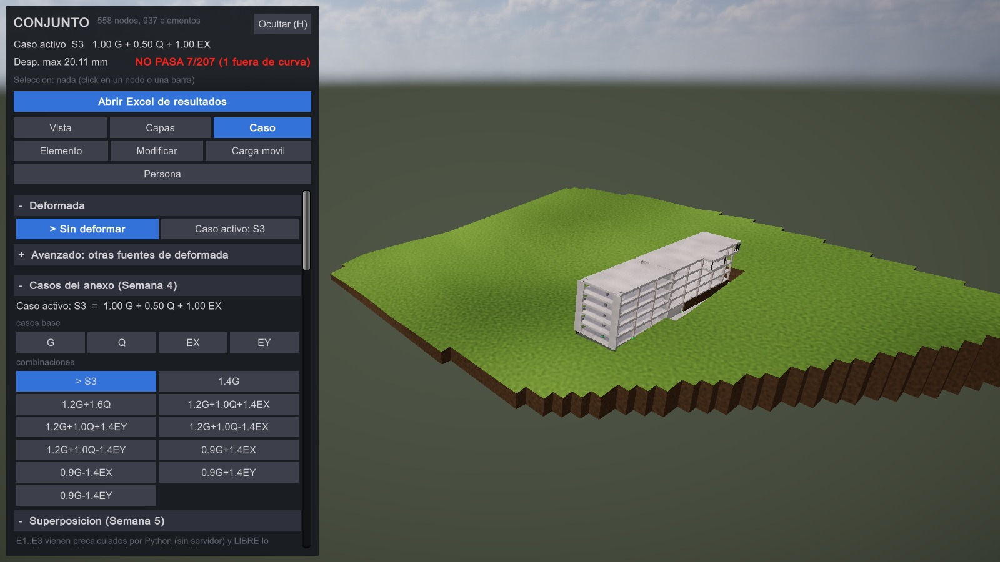
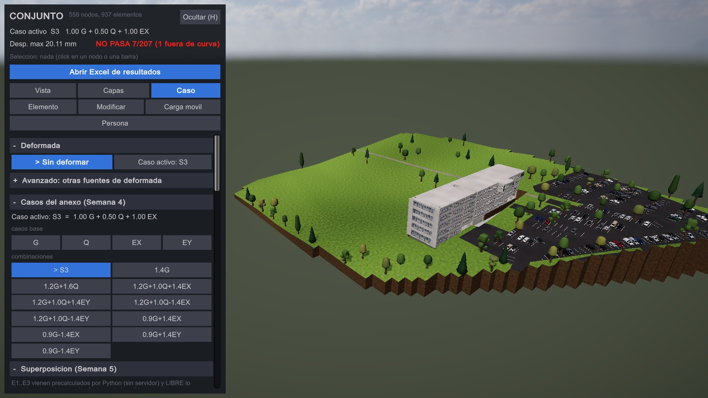
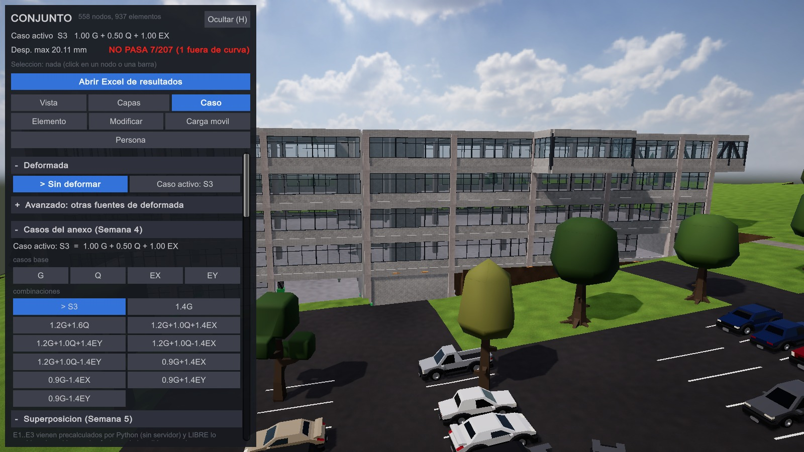
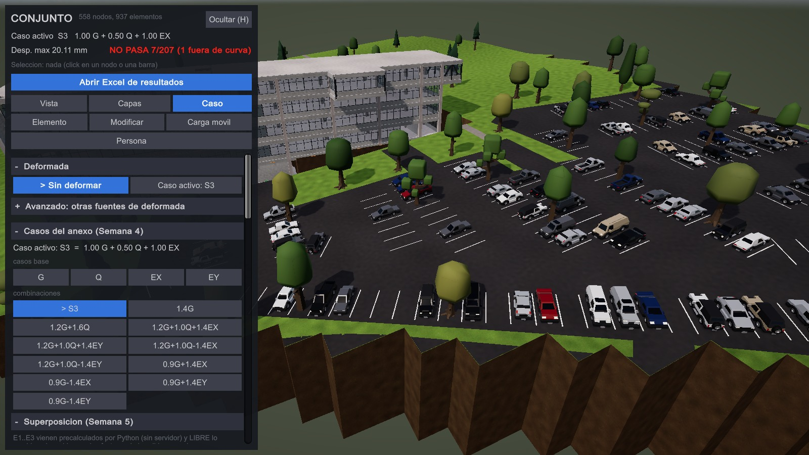
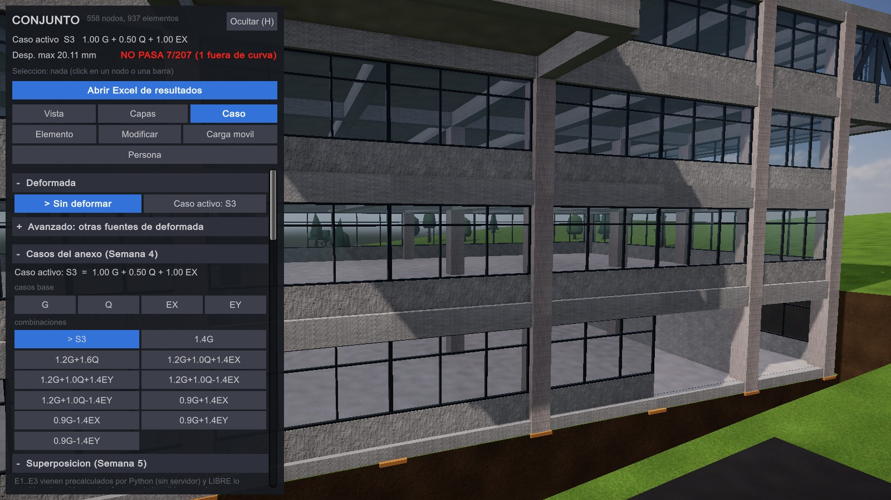
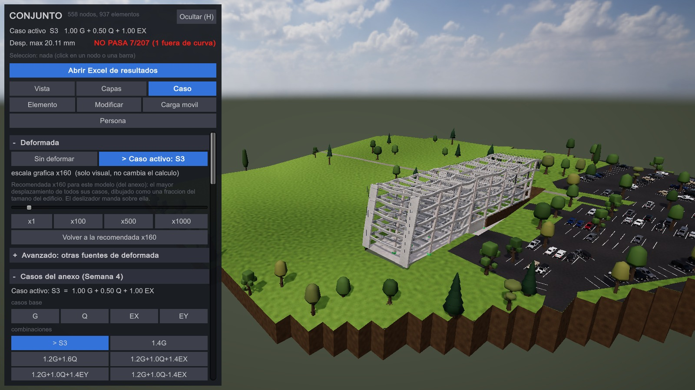

# El conjunto — los dos cuerpos unidos

Los dos modelos describen **el mismo edificio en dos etapas**: comparten
las seis cotas de piso (−7.97 a +11.83, 3.96 m entre niveles) y los
ejes numerados 1, 2 y 3, y los separa una junta de dilatación justo
después de la caja de ascensores del LT2. Cada plano refiere el otro
cuerpo como "etapa anterior" / "etapa nueva".

```
python edificios\conjunto\armar.py           une data/modelo/lt2 + ingenieria
python comun\calcular.py conjunto            resuelve G, Q, EX, EY
python edificios\conjunto\exportar_unity.py  data/unity/conjunto.json
python edificios\conjunto\verificar_conjunto.py
python comun\lanzar_unity.py app conjunto --pantalla-completa
```

## `calce.json` — la transformación entre los dos planos

Cada juego de planos está dibujado en su propio marco. `calce.json`
declara, por cuerpo, `dx`, `dy`, `dz` y el giro, **con cómo se midió
cada uno**:

| | valor | de dónde sale |
|---|---|---|
| `dy` | 36.904 | medido sobre los ejes 1, 2 y 3, que ambos planos comparten; los tres dan lo mismo a cuatro decimales |
| `dz` | −7.97 | Ingeniería está en alturas relativas, el LT2 en cotas reales |
| `dx` | −35.082 | **derivado** de las caras: cara este del LT2 + junta declarada = cara oeste de Ingeniería |
| junta | 0.05 m, libre | supuesto; `armar.py` mide la separación real y avisa si no es la declarada |

`dx` depende del modelo del otro cuerpo y ya cambió dos veces; no hace
falta acordarse porque `armar.py` mide las caras en cada corrida.

## Qué hace `armar.py`

1. Lee los dos `data/modelo/`, aplica el calce y renumera nodos,
   elementos y secciones con un corrimiento por cuerpo, tocando los
   siete sitios donde vive un tag.
2. **Sella `E` y `G` en cada sección** con el hormigón de su propio
   cuerpo. El contrato tiene un solo `material`; sin esto el LT2
   (G35) corría con los 28 MPa del otro, un 10.6 % más blando, y el
   equilibrio cerraba igual.
3. **Mide** que las caras queden a la junta declarada, que los cuerpos
   no se solapen y que compartan las cotas de piso.
4. La junta es **libre**: ningún elemento la cruza; los dos cuerpos se
   resuelven independientes dentro del mismo modelo.

## El invariante que lo vigila

Con la junta libre, cada cuerpo dentro del conjunto tiene que dar
**exactamente** lo mismo que resuelto solo. `verificar_conjunto.py` lo
compara GDL por GDL: el LT2 da 0.00e+00 en los cuatro casos; Ingeniería
queda dentro del redondeo del servidor (7e-8 m sobre 33 mm, con el 84 %
de los GDL exactos). Es la verificación que el equilibrio no puede
hacer, y la que atrapó el error del módulo elástico.

## Números

558 nodos, 937 elementos, 10 diafragmas, 47 secciones.
G = 97 885.36 kN = 34 148.98 (LT2) + 63 736.38 (Ingeniería).
Separación cara a cara 0.050 m. 705 polígonos tributarios.

## El relieve del sitio (`sitio/`, `topografia.py`)

El terreno natural alrededor del edificio, para el visor. **Solo dibujo**:
ningún cálculo lo usa.

```
python edificios\conjunto\bajar_dem.py             una vez: baja la ventana del DEM al repo
python edificios\conjunto\topografia.py            data/unity/topografia_<ed>.json + sitio/topografia_planta.png
python edificios\conjunto\topografia.py --verificar
python comun\lanzar_unity.py sincronizar conjunto   lo copia a StreamingAssets/topografia.json
```

| entrada | qué aporta |
|---|---|
| `sitio/topo_uandes.kmz` | la **zona**, trazada en Google Earth. Sin cotas: Google Earth guarda un trazo pegado al terreno con altura 0 |
| `sitio/techo_edificio_antiguo.kmz` | el techo del cuerpo antiguo en la foto (el LT2 todavía no aparece): de él salen el **giro** y la **posición** |
| `sitio/dem_copernicus_glo30.json` | las **cotas**: Copernicus DEM GLO-30 (celda de ~30 m, 2011-2015), solo la ventana del campus |
| `sitio/sitio.json` | los supuestos, con su porqué |

Cómo se ubica: el lado largo del techo de la foto da el rumbo de +x
(71.9°, hacia el ENE); su centro cae en el centro del techo del modelo
(entre ejes, x 8.02 a 58.02, y 47.70 a 64.10); y el DEM se corre en vertical
por mínimos cuadrados sobre los 84 apoyos en terreno. Lo que comprueba
`topografia.py`: el techo de la foto mide lo del modelo más el borde de la
losa (+1.29 y +1.70 m), el terreno sube hacia +x a lo largo del edificio
como sus terrazas (921.7 → 927.5 m), el calce vertical deja un residuo rms
de 1.22 m, y las claves del JSON son los campos de
`AmbienteVisor.Topografia.cs`.

En Unity: Capas > Vista > "Relieve del sitio". Con el relieve a la vista se
apaga el plano del suelo (no las terrazas), y el edificio queda en un hueco
con taludes hasta la cota del terreno del modelo.





Las fotos las saca la app sola: `build\LaboratorioEstructural.exe -capturarRelieve <carpeta>`
(`unity/Assets/Scripts/CapturaRelieve.cs`), con su `registro.txt`. La
figura en planta, con curvas cada 1 m, el techo de la foto y los nodos de
los dos cuerpos, es `sitio/topografia_planta.png`.

## Ventanas, autos y árboles (`entorno.py`)

Lo que rodea a la estructura en la vista realista, para que se lea como un
edificio en su campus. **Solo dibujo**: el modelo no tiene fachada, ni
autos, ni árboles, y ningún cálculo los ve.

```
python edificios\conjunto\bajar_osm.py              una vez: baja calles y estacionamientos de OpenStreetMap
python edificios\conjunto\entorno.py                data/unity/entorno_<ed>.json, Resources/Entorno/modelos.json y sitio/entorno_planta.png
python edificios\conjunto\entorno.py --verificar
python comun\lanzar_unity.py sincronizar conjunto    lo copia a StreamingAssets/entorno.json
```

| entrada | qué aporta |
|---|---|
| `data/unity/<ed>.json` | las vigas, pilares, muros y losas (áreas tributarias) que dibuja el visor: de ahí salen los vanos |
| `data/unity/topografia_<ed>.json` | el relieve: la cota de cada auto y árbol, y el suelo frente a cada vano |
| `sitio/osm_campus.json` | estacionamientos, sus pasillos, calles, edificios y áreas verdes. © OpenStreetMap contributors, ODbL 1.0 (`bajar_osm.py`) |
| `sitio/modelos/` | 7 autos y 8 árboles de Kenney, CC0 (`sitio/modelos/LICENCIA.md`) |
| `sitio/entorno.json` | los supuestos, con su porqué: antepecho 0.90 m, paños de a lo más 1.60 m, estacionamientos de 2.5 × 5.0 m, ocupación 60 %, colores de auto, alturas de árbol |

**Ventanas.** En cada cota, una viga es de fachada si a un lado hay losa y al
otro no hay nada en 10 m (así la junta de 5 cm y los shafts no llevan). El
vano va entre las caras de los pilares de sus extremos, sin lo que tapan los
muros, desde la cara de la losa (el criterio de `AmbienteVisor.Losas.cs`)
hasta la cara inferior de la viga de arriba; el vidrio va 0.10 m afuera del
eje, detrás del marco de hormigón. Un vano con el suelo de afuera sobre el
alféizar está enterrado y no lleva ventana. Conjunto: 173 vanos, 1666 m² de
vidrio (LT2 solo: 83; Ingeniería sola: 104, con la junta como fachada).

**Autos y árboles.** Se ubican con la misma georreferencia del relieve, y su
cota sale de la misma malla que dibuja Unity, así que no flotan ni se
entierran (las 4 ruedas a menos de 1.5 cm). 150 puestos a los dos lados de
los pasillos, 79 ocupados (sorteo con semilla fija) y 22 islas con árbol.
64 árboles: islas, borde de los estacionamientos, filas junto a las calles y
bosquetes en el terreno libre, a 7 m o más del edificio (12 m los sueltos).

**El piso.** Asfalto en los estacionamientos, sus pasillos y las calles
(8525 m²), veredas (274 m²) y las 174 líneas que separan los puestos. Cada
pieza se recorta contra los triángulos de la malla del relieve y toma el
plano de su triángulo, 5 a 8 cm encima del pasto: no se hunde entre dos
nodos de la malla ni flota (cada vértice a menos de 6 mm de su altura, con el
redondeo del JSON). Los autos van sobre el asfalto.

Lo que comprueba `entorno.py`, por otro camino que el que arma: del lado de
afuera de cada vano no hay losa, ningún vidrio cruza un muro ni un pilar,
cada auto está entero en su estacionamiento sin chocar con otro ni con el
pasillo, los árboles no caen en calles, canchas ni edificios, las claves del
JSON son los campos de `AmbienteVisor.Entorno.cs`, y las dos constantes de
dibujo que copia del C# (`SOBRE_EL_CANTO`, `TOL_EN_COTA`) son las del C#.

En Unity: Capas > Vista > "Ventanas" y "Autos y árboles". Las ventanas se
esconden con la deformada, la carga móvil, los diagramas y el mapa D/C, igual
que las losas (no siguen a la estructura); los autos y árboles van sobre el
relieve y se ven con él. El vidrio es `Resources/Ambiente/Mat_vidrio.mat`
(transparente, armado por `RecursosRealistas.CrearVidrio`).



Las fotos las saca la app sola, con el conjunto sincronizado:
`build\LaboratorioEstructural.exe -capturarEntorno <carpeta>`
(`unity/Assets/Scripts/CapturaEntorno.cs`), con su `registro.txt` (0 errores
del log; 173 ventanas y 25 mallas de autos, árboles y piso). La última foto
pone la deformada del caso activo y registra que se dibuja y que las ventanas
se esconden con ella; para eso los anexos tienen que ser del mismo modelo:
`python comun\lanzar_unity.py preparar conjunto` (sin eso el visor apaga la
deformada de los casos, y la captura lo dice en vez de sacar la foto).












