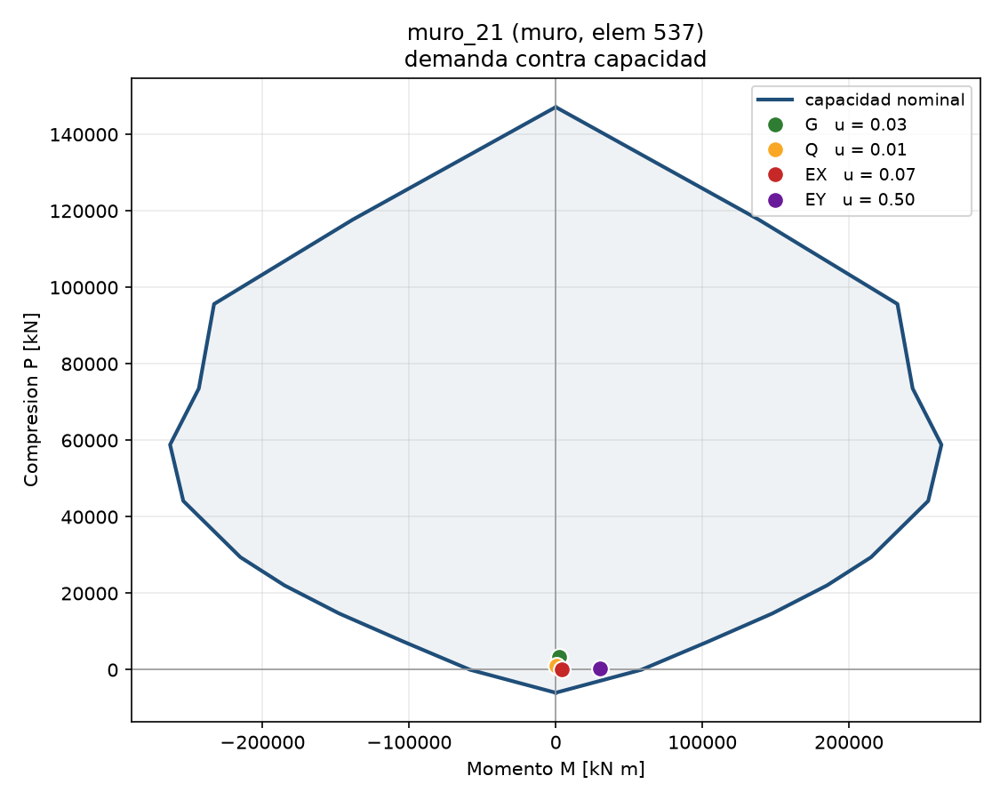

# Semana 3 — Casos base y curvas de interacción

**Edificio de Ingeniería, Universidad de los Andes**
Grupo 7 · Laboratorio estructural digital

Todos los números de este informe salen de correr los scripts de
`semana03/` y `comun/` sobre los modelos de `data/modelo/`. Ninguno está
escrito a mano. Para reproducirlos:

```bash
python comun/verificar_todo.py                                # la suite entera, 27 de 27
python semana03/lab_semana03.py ingenieria                    # secciones 1, 2 y 3
python comun/combinar.py ingenieria                           # sección 4, las cinco combinaciones
python comun/capacidad.py ingenieria 18  --pm --mphi --dibujo # secciones 5 y 6, columna
python comun/capacidad.py ingenieria 537 --pm --dibujo        # sección 7, muro
python semana03/verificar_rc.py ingenieria 18                 # sección 8
python semana03/demanda_capacidad.py ingenieria 18  --grafico # sección 9
python semana03/demanda_capacidad.py ingenieria 537 --grafico
```

El laboratorio corre igual sobre `lt2` y `conjunto`. Los tres cierran.

**El modelo** es el de la Semana 2: 326 nodos, 559 elementos (82 columnas,
56 muros, 301 vigas, 104 brazos rígidos, 8 pilares y 8 diagonales
metálicos), 5 diafragmas rígidos. No se reconstruye ni se modifica; lo
que la Semana 3 agrega es **cómo se usa**.

Los parámetros están en `semana03/parametros.json` y cualquiera se
sobreescribe por línea de comandos. En este informe valen `q_Q = 3.0
kN/m²` (NCh1537), `Cs = 0.10`, `W = G + 0.5 Q` y patrón triangular
invertido.

---

## 1. Casos base

Los cuatro casos que se resuelven. **G** viene del modelo; **Q**, **EX**
y **EY** se construyen en memoria con los parámetros, así que cambiarlos
no obliga a tocar ningún archivo.

| caso | qué es | cómo entra | total |
| --- | --- | --- | --- |
| **G** | peso propio + losa + terminaciones | 301 cargas distribuidas sobre vigas + 202 nodales | 50 652.2 kN |
| **Q** | sobrecarga de uso, `q_Q = 3.0 kN/m²` | 301 distribuidas, `q_Q · A_i` por elemento | 12 961.95 kN |
| **EX** | sismo pseudoestático en X | 5 cargas nodales, una por diafragma maestro | 5 713.32 kN |
| **EY** | sismo pseudoestático en Y | ídem, en la otra dirección | 5 713.32 kN |

`G` incluye el peso propio de las barras (lo integra OpenSees) más la
losa y las terminaciones como carga repartida: `w = γ·e + 1.5 kN/m²`.

`EX` y `EY` entran **en el nodo maestro de cada diafragma**, no repartidas
por los nodos del piso: el diafragma es rígido, así que la fuerza en el
maestro es la fuerza del piso, y ponerla ahí evita elegir un reparto que
el modelo no necesita.

**De dónde sale `q_Q = 3.0`.** De NCh1537 Of.2009, Tabla 4, para salas de
clases: el uso predominante de un edificio de facultad. La tabla —
pasillos 4.0, oficinas 2.5, bibliotecas 3.0, escaleras y uso público 5.0,
techo de mantención 1.0 — está en `parametros.json` y se elige con
`--uso`. El modelo de la Semana 2 traía Q a 2.0 kN/m², un valor de
trabajo sin fuente normativa; sigue en su caso Q precalculado, pero el
laboratorio ya no lo usa (ver §10).

---

## 2. Carga viva: reutilización de áreas tributarias y conservación

### Se reutiliza el reparto, se reemplaza la intensidad

El caso Q del modelo dice **por dónde** baja cada carga: repartida sobre
una viga, o puntual en la cabeza del muro que recibe la losa. Eso se
conserva, con el **área tributaria `A_i` que cada elemento trae sellada**
desde la etapa de armado. Lo único que se reemplaza es la intensidad:
cada elemento pasa a recibir `q_Q · A_i`.

No se escala el caso entero por un factor. Habría estado bien en este
edificio, cuyo plano trae una sola intensidad, pero no en el LT2:

| edificio | intensidades en el caso Q del modelo |
| --- | --- |
| Ingeniería | 2.0000 kN/m² en las 301 cargas |
| LT2 | 4.9033 kN/m² en 194 cargas y **2.9420 en 49** (500 y 300 kgf/m² del plano: pisos y techo) |
| conjunto | las tres anteriores a la vez |

Un factor único sobre el LT2 dejaba el techo a 1.95 kN/m² y los pisos a
3.26, ninguno igual a `q_Q`. La reconstrucción por elemento la da exacta
en los tres modelos: leída de vuelta, el peor desvío es **3.0e-16**.

La construcción se detiene si una carga nodal del modelo no tiene un
elemento con área que la explique, o si un elemento con área no baja por
ningún lado.

### Conservación

`sum(Q) = q_Q · A` es una **identidad**: así se construyó. Lo que sí dice
algo es que la carga llegue **entera al suelo**:

| | Ingeniería | LT2 | conjunto |
| --- | --- | --- | --- |
| elementos con losa | 301 | 243 (204 repartidos, 39 puntuales) | 544 |
| área tributaria | 4320.6505 m² | 2515.8939 m² | 6836.5444 m² |
| `q_Q · A` | 12961.9515 kN | 7547.6818 kN | 20509.6333 kN |
| reacciones Rz | 12961.9514 kN | 7547.6818 kN | 20509.6332 kN |
| error relativo | **7.7e-09** | 1.3e-09 | 4.4e-09 |

Y por diafragma, en Ingeniería: 3381.75, 2214.00, 2214.00, 2576.10 y
2576.10 kN. El primer nivel recibe más porque incluye el voladizo.

El reparto fino —que cada viga reciba lo que dibuja su polígono, con el
peso propio separado, piso por piso— lo revisa aparte
`comun/verificar_tributarias.py`.

---

## 3. Sismo pseudoestático

### Pesos y fuerzas por piso, corte basal

`V = Cs · Σ W_i`, con `W_i = G_i + f·Q_i` el peso sísmico del diafragma.
El reparto en altura es un parámetro (`potencia` con su `k`, `nch433` o
`manual`); acá, triangular invertido.

| cota | W sísmico [kN] | reparto | F [kN] | maestro |
| --- | --- | --- | --- | --- |
| +3.96 | 16 827.46 | 10.59 % | 604.94 | 714 |
| +7.92 | 10 071.34 | 12.67 % | 724.12 | 715 |
| +11.88 | 9 238.77 | 17.44 % | 996.39 | 716 |
| +15.84 | 10 738.84 | 27.03 % | 1 544.23 | 717 |
| +19.80 | 10 256.75 | 32.27 % | 1 843.63 | 718 |
| | **Σ = 47 133.16** | 100 % | **V = 5 713.32** | |

`V = 0.10 · 47133.16 = 5713.3157 kN` y `Σ F = 5713.3157 kN`: diferencia
`0.0e+00`, porque el reparto se normaliza.

El peso se asigna **por diafragma, no por cota**. Importa en el conjunto,
que tiene dos diafragmas por nivel —uno por cuerpo— a la misma altura:
buscar el nivel por la cota más cercana metía todo el peso en el primero
de cada par y dejaba al segundo cuerpo sin sismo.

### El corte basal no se obtiene sumando reacciones

Sumar todas las filas de `reacciones` da **−20 970.76 kN** en EX, casi
cuatro veces el corte real, porque el nodo maestro de cada diafragma
devuelve la fuerza de su restricción —que es **interna**— como si fuera
un apoyo. Se separa por grado de libertad en `calcular.equilibrio()`:

| | EX | EY |
| --- | --- | --- |
| carga aplicada | 5713.316 kN | 5713.316 kN |
| corte basal (apoyos) | −5713.316 kN | −5713.316 kN |
| sumando todas las filas | −20 970.76 kN | −15 271.57 kN |
| error | 7.74e-06 kN (1.4e-09 rel.) | 7.74e-06 kN |

### Desplazamientos y rotación de diafragmas

`rz` es el giro del diafragma alrededor del eje vertical, en microradianes.
`u` es el desplazamiento en la dirección empujada y *fuera* el que se sale
de ella. El cociente `u_max/u_prom` se mide sobre los nodos del piso, con
el promedio de los **dos extremos** (NCh433 / ASCE 7): `>1.2` irregular,
`>1.4` extremo.

**EX** — centro de rigidez en Y = 57.77 m, geométrico 60.23 m, excentricidad −2.46 m (10 % del ancho)

| cota | u [mm] | fuera [mm] | **rz [µrad]** | u_max/u_prom |
| --- | --- | --- | --- | --- |
| +3.96 | 0.049 | 0.032 | 2.90 | – |
| +7.92 | 0.179 | −0.056 | 9.88 | **1.735** |
| +11.88 | 2.269 | 0.106 | 8.14 | 1.029 |
| +15.84 | 5.056 | 0.454 | −0.25 | 1.001 |
| +19.80 | 7.761 | 0.767 | −14.73 | 1.019 |

**EY** — centro de rigidez en X = 20.29 m, geométrico 18.59 m, excentricidad 1.70 m (8 % del ancho)

| cota | u [mm] | fuera [mm] | **rz [µrad]** | u_max/u_prom |
| --- | --- | --- | --- | --- |
| +3.96 | 0.082 | 0.010 | 2.10 | – |
| +7.92 | 0.376 | −0.075 | −8.85 | – |
| +11.88 | 8.908 | 0.140 | **241.62** | **1.633** |
| +15.84 | 18.156 | 0.478 | **468.59** | **1.626** |
| +19.80 | 24.033 | 0.743 | **531.12** | **1.538** |

**La rotación es el hallazgo.** Bajo EX el diafragma casi no gira (−15 a
+10 µrad, y cambia de signo). Bajo EY gira **treinta veces más** —hasta
531 µrad en el techo— y crece monótonamente con la altura. Sobre 16.85 m
de planta, 531 µrad son 9 mm de diferencia entre un extremo y el otro,
que es de dónde sale el `1.538`.

Es un hallazgo sobre el **edificio**, no sobre el modelo: la planta es
asimétrica y los muros que resisten Y están concentrados. Los niveles
contra el terreno casi no se mueven (0.05 mm contra 7.8 del techo) y ahí
el cociente es un cociente entre casi-ceros; se marca con `–` en vez de
informar 1.97 de puro ruido.

**Sentido de la deformada.** Tres cosas que el equilibrio no garantiza y
que se revisan piso a piso: que cada piso vaya hacia donde lo empujan,
que el desplazamiento crezca con la altura sin devolverse, y que el
movimiento fuera de la dirección de carga no supere al de la dirección
empujada. Las tres se cumplen. El techo se mueve 7.76 mm bajo EX y 24.03
bajo EY: el edificio es **tres veces más flexible en Y**.

---

## 4. Superposición

Cada combinación se obtiene de dos maneras: sumando algebraicamente los
resultados de los casos independientes, y resolviendo en OpenSees una
corrida con las cargas ya combinadas. Se comparan **todos** los grados de
libertad, no tres números.

Las cinco combinaciones declaradas en `parametros.json` —el enunciado
pide al menos tres— sobre el edificio de Ingeniería:

| combinación | familia | valores | peor desacuerdo | cota de redondeo | |
| --- | --- | --- | --- | --- | --- |
| **S3** `1.0G+0.5Q+1.0EX` | desplazamientos | 1956 | 1.500e-08 | 1.750e-08 | ok |
| | reacciones | 438 | 1.500e-04 | 1.750e-04 | ok |
| | fuerzas internas | 6708 | 1.500e-04 | 1.750e-04 | ok |
| **1.4G** | desplazamientos | 1956 | 1.000e-08 | 1.200e-08 | ok |
| | reacciones | 438 | 1.000e-04 | 1.200e-04 | ok |
| | fuerzas internas | 6708 | 1.200e-04 | 1.200e-04 | ok |
| **1.2G+1.6Q** | desplazamientos | 1956 | 1.800e-08 | 1.900e-08 | ok |
| | reacciones | 438 | 1.600e-04 | 1.900e-04 | ok |
| | fuerzas internas | 6708 | 1.800e-04 | 1.900e-04 | ok |
| **1.2G+1.0Q+1.4EX** | desplazamientos | 1956 | 1.800e-08 | 2.300e-08 | ok |
| | reacciones | 438 | 2.000e-04 | 2.300e-04 | ok |
| | fuerzas internas | 6708 | 2.000e-04 | 2.300e-04 | ok |
| **1.2G+1.0Q+1.4EY** | desplazamientos | 1956 | 2.000e-08 | 2.300e-08 | ok |
| | reacciones | 438 | 1.800e-04 | 2.300e-04 | ok |
| | fuerzas internas | 6708 | 2.000e-04 | 2.300e-04 | ok |

Son 9102 valores por combinación, 45 510 en total. **Ninguno supera su
cota.** Las combinaciones vienen de ACI 318 9.2.1 / NCh3171; `1.4E`
porque el corte basal de NCh433 está a nivel de servicio.

**El criterio no es una tolerancia elegida.** El motor redondea su salida
a 8 decimales los desplazamientos y a 4 las fuerzas. La cota es el error
máximo que ese redondeo puede meter al sumar los casos y compararlos
contra una corrida que también viene redondeada, y por eso **cambia con
los factores**: `1.4G` usa un caso y su cota es 1.2e-08; `1.2G+1.0Q+1.4EY`
usa tres y sube a 2.3e-08. Que el desacuerdo observado siga cada
combinación por debajo de su propia cota es lo que prueba que la
superposición no aporta error medible.

**Por qué funciona.** El modelo es lineal elástico: `K u = F` con `K`
constante, así que `K(a·u₁ + b·u₂) = a·F₁ + b·F₂`. Las fuerzas internas y
las reacciones salen de `u` por operaciones lineales.

**Cuándo dejaría de funcionar.** En cuanto `K` deje de ser constante:
material no lineal —lo que pasa en las secciones 5 a 7, donde el hormigón
se fisura y el acero fluye, y por eso **las curvas P-M no se superponen**—,
geometría no lineal (P-Δ), contacto, o cualquier cosa que dependa del
camino de carga.

---

## 5. Momento-curvatura

Sección representativa: la **columna 18**, 0.50 × 0.50 m, la más cargada
del edificio bajo G. `comun/capacidad.py`.

### Definición de la sección

Se lee del modelo, no se escribe en el código: `b` y `h` de `secciones`,
`f'c` del material, y la armadura del campo `enfierradura` que el
elemento trae desde el armado.

```
columna (elem 18)   0.50 x 0.50 m
  hormigón   f'c = 28.0 MPa
  acero      fy  = 420 MPa, Es = 200 GPa
  refuerzo   16 barras φ16, As = 32.17 cm², cuantía = 1.29 %
  estribo    Eφ10@10 (lámina 2017_67-000, esquema 2E)
  confinado  f'cc = 39.4 MPa (K = 1.407), ε_cc = 0.00607, ε_cu = 0.02204
```


*`python comun/capacidad.py ingenieria 18 --dibujo` → `fibras_ingenieria_18.png`.
Cada fibra con su material y cada barra en su posición: es la misma función
que alimenta a OpenSees, no un dibujo aparte.*

**Tres materiales, no uno**: núcleo confinado (`Concrete01` con `f'cc`),
recubrimiento sin confinar (`Concrete01` con `f'c`, que se pierde antes)
y acero (`Steel01` con 1 % de endurecimiento). La sección se corta en un
parche de 20×20 fibras para el núcleo y cuatro tiras de 4 fibras para el
recubrimiento; las 16 barras entran una por una con su posición y área.

El **confinamiento no es un factor puesto a mano**: sale del estribo que
el plano le pone a *este* elemento. Se cuentan las ramas que cruzan el
núcleo (2 del estribo + 1 por traba), se obtiene `ρ` y la presión lateral
`f_l = k_e·ρ·f_y`, y de ahí Mander:
`K = −1.254 + 2.254·√(1+7.94r) − 2r`, con `r = f_l/f'c`.

### Carga axial

Un `zeroLengthSection` entre dos nodos en el mismo punto: el GDL 3 es la
curvatura y su fuerza es el momento. **La axial se aplica primero, en
control de carga, y se deja fija con `loadConst`** mientras se impone la
curvatura en control de desplazamiento. Entre las dos etapas va un
`wipeAnalysis()`: sin él OpenSees se queda con el integrador anterior y
la curvatura no llega a imponerse.

### La curva, a P = 0

```
2231 puntos
M máximo  = 312.4 kN·m  en φ = 0.29190 1/m
M nominal = 256.5 kN·m  en φ = 0.05278 1/m   (hormigón a ε = 0.003)
```


*`python comun/capacidad.py ingenieria 18 --mphi` → `mphi_ingenieria_18.png`.
La de `P = 0` es la de arriba; las otras tres muestran lo que la compresión
le hace a la misma sección — es la §6 vista de otra manera.*

### Rigidez inicial

**32 924 kN·m²**, la pendiente del primer tramo. Se mide sobre los
primeros pasos y no sobre el primero solo, que es ruido numérico:
concretamente sobre el cuarto punto de la curva.

Comparada con la sección bruta:

```
Ec  = 4700·√28 = 24 870 MPa
Ig  = 0.50 · 0.50³/12 = 5.208e-3 m⁴
EIg = 129 532 kN·m²          ->  la medida es 0.25 EIg
```

**Ese 0.25 no es la rigidez sin fisurar, y no debería leerse como tal.**
Con `f_r = 0.62√28 = 3.28 MPa`, esta sección fisura en `M_cr = 68.3 kN·m`,
o sea `φ_cr = 5.28e-04 1/m`. El paso de curvatura del análisis es
`1.40e-04 1/m`, así que el cuarto punto cae en `φ = 5.60e-04`: **justo en
la fisuración**. Lo que se mide es la secante ahí, ya con la sección
agrietada.

Por eso queda cerca del `0.35 EIg` que ACI 318 da para vigas y lejos del
`0.70 EIg` de columnas — que es lo correcto, porque esta curva es a
`P = 0`: sin axial que cierre las fisuras, la columna se comporta como
una viga. Con `P = 1239 kN` (15 % de la compresión pura) la rigidez sube,
que es parte de lo que muestra la P-M de §6.

### Criterio de término

**Manda el material, no un número de pasos.** Se lee `section deformation`
y se reconstruye `ε(y) = ε_axial − κ·y`; el análisis se corta cuando:

| criterio | valor |
| --- | --- |
| la fibra más comprimida del núcleo llega a `ε_cu` | 0.02204, de Mander con el estribo real |
| la barra más traccionada llega a `ε_su` | 0.10 (A630-420H) |
| el momento cae bajo el 80 % del máximo | post-peak |
| deja de converger | se reintenta con `ModifiedNewton -initial` y paso/10 |

A `P = 0` termina por el primero: *el núcleo llegó a ε_cu = 0.02204 (se
corta el estribo)*, con `ε_hormigón = −0.02205` y `ε_acero = 0.09565`. El
motivo queda guardado en el resultado.

Se registra además `M_aci`, el momento cuando el hormigón llega a 0.003:
la capacidad **nominal**, siempre menor que el máximo, porque después de
ese punto el núcleo confinado sigue tomando carga y el acero endurece. Es
la que se compara con el cálculo a mano (§8) y con la que se construye la
P-M.

### Sensibilidad de la discretización

`python comun/capacidad.py ingenieria 18 --sensibilidad`

| fibras en el núcleo | M máx [kN·m] | vs la más fina |
| --- | --- | --- |
| 8 | 318.3 | 1.671 % |
| 12 | 321.8 | 2.791 % |
| **20** | **312.4** | **0.207 %** |
| 30 | 313.0 | 0.012 % |
| 40 | 313.1 | 0.000 % |

Se adoptan **20**: el error contra 40 fibras es 0.2 %, y de 20 a 30 baja a
0.01 %. Con 8 y 12 la curva sale *más alta*, no más baja: pocas fibras no
alcanzan a representar la caída del recubrimiento. El número no se eligió
a ojo, se midió.

---

## 6. Curva P-M de columna

`python comun/capacidad.py ingenieria 18 --pm` imprime la tabla y su lectura;
la figura la dibuja `python semana03/demanda_capacidad.py ingenieria 18 --grafico`,
que le agrega encima los puntos de demanda de §9.


**Cada punto sale de su propio M-φ.** No se integra aparte con una ley
escrita en Python: se corre un momento-curvatura completo con esa
compresión y se toma el momento nominal. Es más lento, pero garantiza que
el M-φ de §5 y esta curva son de **la misma sección** — si se separan,
dejan de serlo y nadie lo nota, porque los dos gráficos siguen saliendo
con forma razonable.

| P [kN] | Mn [kN·m] | M máx | de dónde sale |
| --- | --- | --- | --- |
| −1351.1 | 0.0 | 0.0 | **tracción pura**, analítico: `−As·fy` |
| 0.0 | 256.5 | 312.4 | M-φ, hormigón a 0.003 |
| 413.1 | 305.8 | 340.8 | M-φ |
| 826.1 | 352.3 | 390.6 | M-φ |
| 1239.2 | 386.3 | 430.3 | M-φ |
| 1652.2 | 414.0 | 454.5 | M-φ |
| **2478.3** | **426.6** | 456.7 | M-φ — **la nariz** |
| 3304.4 | 393.6 | 449.1 | M-φ |
| 4130.5 | 341.7 | 375.1 | M-φ |
| 5369.7 | 204.6 | 235.4 | M-φ |
| 6608.8 | 85.0 | 85.0 | M-φ, ya sin rama nominal |
| 8261.1 | 0.0 | 0.0 | **compresión pura**, analítico: `f'c(Ag−As) + fy·As` |

**Los dos extremos son analíticos**, el resto son corridas. Los niveles de
`P` se toman más densos abajo, que es donde está la nariz.

**La forma.** Subiendo `P` el momento primero **crece** —la compresión
cierra las fisuras y retrasa la fluencia del acero traccionado— hasta el
punto balanceado en `P = 2478 kN`, donde admite `427 kN·m`, un **66 % más**
que en flexión pura. Después **cae**, porque el hormigón se aplasta antes
de que el acero alcance a fluir. Esa nariz es la respuesta a *por qué P
cambia la capacidad a momento*.

La compresión pura es el **tope teórico**: una norma la recorta por
excentricidad mínima.

---

## 7. Curva P-M de muro, en su dirección principal

`python comun/capacidad.py ingenieria 537 --pm` para la tabla;
`python semana03/demanda_capacidad.py ingenieria 537 --grafico` para la figura.



**El muro 537**: `muro_21`, 0.30 × 16.85 m, el más largo del edificio, en
el arranque (`z = +0.00`).

### La sección de un muro no es la de una columna

`h` es el **largo** del muro —ahí flecta bajo sismo— y `b` el espesor: una
sección de 30 cm de ancho y 16.85 m de canto. Solo se construye la
**dirección principal** (en el plano), que es la única que se compara: la
otra tiene mil veces menos inercia y no es la que resiste el sismo.

Dos familias de fierro, no una:

- la **malla** en dos cortinas (`D.M.`), repartida a lo largo del muro y
  con poco brazo de palanca;
- las **barras de punta**, en los extremos, que son las que mandan.

```
muro_21 (muro, elem 537)   0.30 x 16.85 m
  hormigón   f'c = 28.0 MPa
  refuerzo   182 barras, As = 142.94 cm², cuantía = 0.28 %
  malla vertical φ10@20 en dos cortinas + 3 φ10 por cara en cada punta
```

El hormigón va **sin confinar**: el alma no lleva estribos y el
confinamiento de las puntas no está asociado muro por muro. La capacidad
queda del lado seguro.


*La misma discretización de la columna sobre una sección de 16.85 m de canto:
se ven las dos cortinas de malla repartidas a lo largo y las barras
agrupadas en las dos puntas, que son las que dan el momento.*

### De dónde sale esa armadura

Las once elevaciones de eje del proyecto (láminas `2017_67-300` a `-310`)
traen **66 bloques de muro** con `ESPESOR`, `MALLA_2` y `MALLA_3` en sus
atributos, y **211 llamadas de punta** del tipo `L:3+3φ10`. Es el mismo
formato que el LT2, así que el contrato de `comun/capacidad.py` los lee
sin cambios.

Se asigna **por espesor**, y queda declarado como tal en
`edificios/ingenieria/perfiles/muros_2017_67.json`, que separa el
inventario leído de lo adoptado:

| espesor | malla vertical | respaldo | otras que aparecen |
| --- | --- | --- | --- |
| 15 cm | φ8@12 | 3 de 4 bloques | φ8@15 ×1 |
| 20 cm | φ10@20 | 16 de 30 | φ8@20 ×11, φ8@18 ×2 |
| **25 cm** | **φ8@16** | **10 de 10** | — |
| 30 cm | φ10@20 | 11 de 22 | φ16@20 ×7, φ10@16 ×4 |

Los cuatro espesores del modelo son exactamente los cuatro de los
bloques, y en dos el **conteo coincide**: 15 cm son 4 muros y 4 bloques,
25 cm son 10 y 10. En 25 cm la malla es además la misma en los diez, así
que ahí no hay nada que elegir.

**Por qué por espesor y no muro por muro.** La elevación da el fierro por
tramo de eje; llevarlo a cada muro pediría el calce geométrico
elevación→planta, y este proyecto tiene once láminas con ejes secundarios
(1A, 1b, Eb, Ec, Ga, H1, H2, IA, IB, J) cuyas coordenadas el modelo no
conoce. El espesor sí lo comparten los dos.

### La envolvente

| P [kN] | Mn [kN·m] | M máx | de dónde sale |
| --- | --- | --- | --- |
| −6003.6 | 0.0 | 0.0 | **tracción pura** |
| 0.0 | 58 456 | 61 867 | M-φ |
| 7 357.2 | 103 865 | 104 638 | M-φ |
| 14 714.3 | 147 712 | 149 800 | M-φ |
| 22 071.5 | 185 070 | 188 865 | M-φ |
| 29 428.7 | 215 073 | 221 451 | M-φ |
| 44 143.0 | 254 040 | 266 707 | M-φ |
| **58 857.3** | **263 073** | 285 490 | **la nariz** |
| 73 571.7 | 243 430 | 281 865 | M-φ |
| 95 643.2 | 233 069 | 233 069 | M-φ |
| 117 714.7 | 138 437 | 138 437 | M-φ |
| 147 143.3 | 0.0 | 0.0 | **compresión pura** |

### Qué se ve, comparado con la columna

**La misma forma y otra escala.** El muro admite `58 456 kN·m` en flexión
pura contra `256 kN·m` de la columna: **228 veces más**, con solo 4.4
veces más acero. La diferencia es el **brazo de palanca** — 16.85 m de
canto contra 0.50.

**La nariz está mucho más arriba en `P`** (58 857 kN contra 2478) y es
mucho más plana: entre `P = 44 000` y `P = 74 000` el momento se mueve
menos del 8 %. Un muro trabaja casi siempre en la rama ascendente, donde
más compresión es más capacidad; una columna cruza la nariz con las
cargas de servicio.

**La cuantía es 0.28 %**, contra 1.29 % de la columna. En un muro eso es
normal: la resistencia la da la geometría, no el acero.

---

## 8. Verificación RC contra el cálculo a mano

La verificación es la **comparación**: los puntos característicos que da
la Fiber Section contra los que da el método simplificado del curso. Se
apoya en **dos cálculos a mano independientes**, hechos por caminos
distintos:

| | qué es | dónde |
| --- | --- | --- |
| en Python | Whitney automatizado, se recalcula en cada corrida | `semana03/verificar_rc.py` |
| en Excel | el método del curso a mano, iterando `c`, con los factores `φ` | [`semana03/calculo_a_mano/interaccion_columna18.xlsx`](../semana03/calculo_a_mano/interaccion_columna18.xlsx) |

Que dos cálculos hechos aparte coincidan entre sí es lo que le da peso a
la comparación: un error del código que ambos reprodujeran tendría que
estar en la teoría, no en la implementación.

### El cálculo en Python

`python semana03/verificar_rc.py ingenieria 18`

Los puntos característicos calculados **a mano** con el bloque de Whitney
—como en el curso de hormigón armado— contra los que da la Fiber Section.
`β₁ = 0.850`, `d = 0.4320 m`, `ε_y = 0.00210`.

| punto | P a mano | P fibras | M a mano | M fibras | dif. |
| --- | --- | --- | --- | --- | --- |
| tracción pura | −1351.1 | −1351.1 | 0.0 | 0.0 | **0.00e+00** |
| flexión pura (P=0) | 0.0 | 0.0 | 273.4 | 256.5 | 6.6 % |
| balanceado | 2548.6 | 2548.6 | 529.2 | 424.6 | 24.6 % |
| compresión pura | 7224.6 | 8261.1 | 0.0 | 0.0 | −12.5 % |

**Cada diferencia está explicada, no tolerada:**

- **Tracción pura, 0.00e+00.** Acá no hay hipótesis distintas: los dos
  calculan `As·fy`. Tiene que coincidir exactamente, y coincide. Es el
  control de que la sección de fibras tiene el acero que se cree.
- **Compresión pura, −12.5 %.** Es **solo el 0.85 de ACI**: el cálculo a
  mano usa `0.85 f'c` y las fibras usan `f'c`. Rehecho con `f'c`, el
  cálculo a mano da 8261.1 kN — el **100.00 %** del de fibras.
- **Flexión pura, 6.6 %.** Whitney contra la parábola de `Concrete01`, y
  sobre todo **endurecimiento**: con `c = 0.083 m` sobre un canto de 0.50,
  la barra más traccionada llega a `ε = 0.0126`, donde `Steel01` da 441
  MPa en vez de los 420 de `fy`, un 5 % más.
- **Balanceado, 24.6 %.** La misma sección **sin confinar** da 442.4 kN·m
  (19.6 %): o sea que el confinamiento explica la mitad de la diferencia,
  y el resto es el bloque equivalente evaluado con axial alto, donde no
  fue calibrado.

Las cuatro apuntan en la dirección correcta: el cálculo a mano es
conservador donde debe serlo.

### El cálculo en Excel

`semana03/calculo_a_mano/interaccion_columna18.xlsx` arma la misma curva
por el método del curso, iterando la profundidad del eje neutro, con los
**siete** puntos característicos y sus factores `φ`:

| punto | `c` [mm] | `Pn` [kN] | `Mn` [kN·m] | `φ` | `φMn` |
| --- | --- | --- | --- | --- | --- |
| a. compresión pura | — | 7224.57 | 0 | 0.65 | 0 |
| b. deformación inferior nula | 350 | 4013.15 | 480.38 | 0.65 | 312.25 |
| c. balance | 260 | 2659.13 | 540.98 | 0.65 | 351.64 |
| d. transición | 221 | 2135.69 | 525.12 | 0.733 | 385.08 |
| e. última falla dúctil | 163.7 | 1337.49 | 471.25 | 0.90 | 424.12 |
| f. flexión pura | 76.6 | 0 | 279.13 | 0.90 | 251.22 |
| g. tracción pura | — | −1351.14 | 0 | 0.90 | 0 |

**Coincide con `verificar_rc.py` en los dos puntos que no admiten
hipótesis distintas**, por caminos independientes: tracción pura
`−1351.14` contra `−1351.1` (0.003 %), y compresión pura **7224.57
contra 7224.6**, el mismo número al primer decimal.

En flexión pura da `279.13` contra los `273.4` de `verificar_rc.py` y los
`256.5` de las fibras. La diferencia entre los dos cálculos a mano es la
**idealización del acero**: el Excel agrupa las 16 barras en cuatro capas
(5·3·3·5) con el recubrimiento sin descontar el estribo, y las fibras las
ponen en las cinco filas reales (5·2·2·2·5) a 68 mm de la cara. Las dos
cosas le dan al Excel algo más de brazo de palanca.

**Y aporta lo que el repositorio no tiene: los factores `φ`.**
`comun/capacidad.py` calcula capacidad **nominal**; la curva de diseño
`φPn`–`φMn` sale solo del Excel. Son dos curvas distintas y conviene no
confundirlas: la utilización de §9 es nominal contra nominal.

La hoja trae además la tabla de demandas de §9, **a los mismos
parámetros que este informe** (`q_Q = 3.0` de NCh1537), para que los dos
documentos se puedan leer juntos sin traducir números.

---

## 9. Primera demanda-capacidad

`python semana03/demanda_capacidad.py ingenieria 18 --grafico`

Toma el `(P_d, M_d)` de la columna de los **mismos casos que arma el
laboratorio** con los parámetros —resueltos en memoria en la misma
corrida— y lo pone sobre su curva. Usa el momento resultante
`√(My² + Mz²)`, porque una columna cuadrada con armadura perimetral
resiste parecido en cualquier dirección.

**Columna 18** — `pm_ingenieria_18.png`

| caso | P_d [kN] | M_d [kN·m] | Mn a ese P | utilización |
| --- | --- | --- | --- | --- |
| G | 3385.9 | 34.6 | 388.5 | 0.089 |
| Q | 1026.7 | 10.6 | 368.8 | 0.029 |
| EX | 5.5 | 18.5 | 257.2 | 0.072 |
| EY | 58.3 | 38.7 | 263.5 | 0.147 |

Es la columna más cargada del edificio bajo G y usa el **9 %** de su
capacidad a momento. Los cuatro puntos caen holgadamente dentro de la
envolvente.

**Muro 537** — `pm_ingenieria_537.png`. En un muro se toma solo el momento
**en su plano**, que en los muros de este edificio es `My`; el de fuera de
plano se informa aparte.

> **Errata, encontrada en la Semana 4.** La versión entregada de esta
> tabla tomaba `|Mz|` como momento del plano. Esa regla vale para los
> muros del LT2, que traen como `vecxz` su normal; los de Ingeniería lo
> traen a lo largo, la inercia grande queda en `Iy` y su `Mz` es el de
> **fuera** de plano. La tabla entregada decía M_d = 641.6, 207.0, 29.3 y
> 45.7 kN·m, y una utilización de 0.8 %. Hoy
> `demanda_capacidad.demanda()` elige el eje por inercias y exige que se
> lo digan; la tabla y el gráfico están rehechos. Las columnas y el
> resultado de `--todas` bajo `G + Q` (columnas 80 y 66 fuera) **no
> cambian**. Detalle en `reports/semana04.md`.

| caso | P_d [kN] | M_d = \|My\| [kN·m] | Mn a ese P | utilización |
| --- | --- | --- | --- | --- |
| G | 3250.2 | 2243.1 | 78 516.4 | 0.029 |
| Q | 940.8 | 701.8 | 64 262.5 | 0.011 |
| EX | 163.5 | 4391.6 | 59 464.8 | 0.074 |
| EY | 283.0 | 30 352.4 | 60 202.5 | 0.504 |

Bajo carga vertical el muro trabaja al **3 %**: 16.85 m de largo dan un
brazo enorme, y bajo carga vertical un muro toma poco momento. Su papel es
resistir el **sismo**, y ahí sí trabaja: con el sismo en la dirección de su
largo, EY, llega al **50 %** de su capacidad.

### Las 138 columnas y muros a la vez

`--todas` recorre todo lo que tiene fierro (82 columnas + 56 muros) con 28
curvas distintas —una por familia de armadura, no una por elemento—. Bajo
`G + Q` nominal, **dos columnas quedan fuera de su curva**:

| columna | dónde | P [kN] | M [kN·m] | Mn | u |
| --- | --- | --- | --- | --- | --- |
| 80 | techo, ejes I–2 (48.02, 55.20), +15.84 a +19.80 | 841.7 | 396.5 | 353.6 | **1.122** |
| 66 | techo, ejes E–2 (8.02, 55.20) | 397.7 | 316.3 | 304.0 | **1.041** |

**No lo produce la carga de norma**: con el 2.0 kN/m² anterior la 80 ya
daba `u = 1.053`. Son columnas de **último piso**: poco axial —la 80 lleva
643 kN bajo G, la 18 lleva 3386— y el momento entero de las vigas que le
llegan al techo, porque arriba no hay otra columna con la que repartirlo.
En el nudo 606 le entran dos `viga_y` de 0.80 m de canto y dos `viga_x`.
Con poco axial la curva está en su tramo bajo, y el momento la sobrepasa.


*La demanda de G queda **fuera** de la curva. Es el único gráfico del informe
donde eso pasa, y es el que más dice.*

Lo que dice el gráfico no es que el edificio falle: dice que el **detalle
típico de la lámina `-000`, puesto igual en las 82 columnas** porque el
proyecto no tiene cuadro de pilares, no alcanza para las de la esquina del
techo. Es exactamente lo que el diagrama de interacción existe para
mostrar. Una comparación de diseño exigiría combinaciones mayoradas y
factores de reducción; esto es nominal contra nominal.

---

## 10. Uso de IA

El agente (Claude Code) se usó para escribir y auditar los scripts de
`semana03/` y `comun/`. Tres casos en que **propuso algo que hubo que
revisar**, con lo que pasó después.

### Caso 1 — Atribuyó a NCh433 un reparto que es de ASCE 7

Al hacer configurable el patrón de fuerzas en altura, el agente escribió
la forma de potencia `F_i ∝ W_i · h_i^k` y documentó, **en cuatro
archivos**, que `k = 2` era *"el límite superior de NCh433 / ASCE 7"*.

La forma de potencia con `k` interpolado entre 1 y 2 según el período es
de **ASCE 7 §12.8.3**. **NCh433 no usa exponente**: su artículo 6.2.6
define

```
A_k = √(1 − Z_(k−1)/H) − √(1 − Z_k/H)
F_k = A_k·P_k / Σ(A_j·P_j) · Q_0
```

que es otra distribución. El error era **plausible** —las dos concentran
fuerza arriba y dan curvas parecidas— y por eso sobrevivió a la primera
lectura. En un curso chileno, citar la norma equivocada es peor que no
citarla.

**Qué se hizo.** Corregir la atribución en los cuatro sitios, e implementar
el reparto de NCh433 de verdad como tercer patrón (`--patron nch433`).
Comprobado a mano en el último nivel, donde el segundo término se anula:
`A₅ = √(1 − 15.84/19.8) = 0.4472`, que con su peso da el 42.08 % que
imprime el script.

Sobre el mismo corte basal, el reparto importa:

| patrón | base | | | | techo |
| --- | --- | --- | --- | --- | --- |
| `k = 0` uniforme | 29.6 | 17.7 | 16.1 | 18.8 | 17.9 % |
| `k = 1` triangular | 10.7 | 12.7 | 17.4 | 27.0 | 32.2 % |
| `k = 2` ASCE 7 | 3.0 | 7.1 | 14.6 | 30.2 | 45.0 % |
| **NCh433 6.2.6** | 16.4 | 11.1 | 12.1 | 18.3 | 42.1 % |

Al implementarlo apareció un segundo detalle: el coeficiente `A_k` debe
calcularse por **altura distinta** y no por posición en la lista. El
conjunto tiene dos diafragmas por cota, y tomar *"el anterior de la
lista"* le habría dado `A = 0` al segundo de cada par — un cuerpo entero
sin sismo.

### Caso 2 — Propuso una carga viva sin fuente y la arrastró todo el laboratorio

El modelo traía `q = 2.0 kN/m²` escrito en `benchmark_3d.py` como
`w_live_val = 2.0`, sin comentario ni referencia — el único número de ese
archivo sin justificación al lado. El agente lo adoptó como parámetro por
defecto de la Semana 3 sin cuestionarlo.

Revisado contra **NCh1537 Of.2009 Tabla 4**, ese valor está por debajo de
cualquier uso del edificio: salas de clases 3.0, pasillos 4.0, oficinas
2.5, uso público 5.0.

**Qué se hizo.** El defecto pasa a 3.0 (salas de clases, el uso
predominante); la tabla vive en `parametros.json` con `--uso` para
cambiar de fila; `validar()` rechaza un JSON que declare un uso y un `q`
que no calcen. El 2.0 queda en `benchmark_3d.py` **declarado como lo que
es**, un valor de trabajo.

Al verificarlo apareció una incoherencia que el agente había introducido:
`demanda_capacidad.py` leía la demanda de `data/resultados/` —o sea el Q
del modelo a 2.0— así que `--q` no la movía. El informe habría dicho 3.0
y la tabla de la columna 18 habría estado a 2.0, **sin que nada avisara**.
Ahora arma los casos con los mismos parámetros y los resuelve en memoria.

### Caso 3 — Propuso "arreglar" vigas que no estaban malas

Al ver en el visor vigas hundidas en el medio —161/164, 169/172, 175/178—
la primera hipótesis, del grupo y del agente, fue que estaban **partidas
en dos elementos** y que ahí se formaba una rótula. La propuesta era
unirlas en un solo elemento.

**Qué se hizo.** Antes de tocar el modelo, comprobarlo: si el corte fuera
el problema, refinar la malla cambiaría la respuesta.
`semana03/verificar_viga_partida.py` parte los dos tramos en 2, 4, 8 y 16:

| malla | uz nodo 373 | flecha relativa |
| --- | --- | --- |
| 2 tramos (como está) | −8.8524 mm | −6.5500 mm |
| 4 / 8 / 16 tramos | −8.8524 mm | −6.5500 mm |

Idéntico al cuarto decimal. Dos elementos que comparten un nodo comparten
sus **seis** grados de libertad: el momento pasa entero. La causa real es
la viga secundaria que aterriza ahí con 25 m² de losa y sin columna
debajo — quitándole esa losa la flecha cae a 0.96 mm, o sea que ella trae
el **85 %**. Y no es grande: 6.55 mm sobre 10 m son `L/1527`, contra el
`L/360` de la norma. Lo que se ve en el visor es la **escala gráfica ×300**.

Probar la "solución" propuesta la descartó sola: poner una columna bajo
ese nodo **empeora** la flecha (6.55 → 7.08 mm), porque el piso de abajo
en ese mismo punto tampoco tiene apoyo.

### Qué se aprendió

Las tres tienen la misma forma: **el agente produjo algo plausible y bien
escrito, y el error estaba en la premisa, no en la ejecución**. La
atribución normativa sonaba razonable; el `2.0` venía "del modelo"; la
viga partida "obviamente" era el problema. Ninguna se habría caído sola:
los tres scripts corrían y daban números con forma correcta.

Lo que las cazó fue, en los tres casos, **buscar la fuente**: la norma
citada, el archivo donde nace el número, y una comprobación que pudiera
fallar (refinar la malla). Es la regla que quedó escrita en `CLAUDE.md`:
*cuando una verificación marque algo, primero sospechar de la
verificación*, y *lo leído del plano y lo supuesto se distinguen en el
dato, no en la memoria de nadie*.

---

## Limitaciones

- `Cs = 0.10` es un coeficiente de trabajo, no un análisis de NCh433 con
  su `R`, su zona sísmica y su tipo de suelo.
- `q_Q` es **una** intensidad para toda la losa, como pide el enunciado.
  Con NCh1537 los pasillos irían a 4.0 y el techo de mantención a 1.0. No
  se aplica la reducción por área tributaria de NCh1537 8.1.
- El armado de los muros se asigna **por espesor**, no muro por muro: el
  calce elevación→planta pediría resolver los ejes secundarios que el
  modelo no conoce. Queda declarado con su respaldo en el JSON del perfil.
- La sección de columna 0.50 × 0.50 m es la del modelo, no la de un pilar
  del plano, que no existe como tal: el proyecto no tiene cuadro de
  pilares. El diámetro `φ16` es supuesto; el resto viene de la lámina
  `-000`.
- La comparación demanda-capacidad es **nominal**, sin combinaciones
  mayoradas ni factores de reducción `φ`.
- El modelo es lineal elástico. La capacidad no lineal de las secciones 5
  a 7 es de la **sección aislada**, no del edificio: no hay un pushover.
