# Semana 4 — Unity como postprocesador estructural

**Grupo 7** · Métodos Computacionales en Obras Civiles, UAndes ·
repositorio `bitscochits/A1P3_Grupo_7`

Edificio de la demo: **Ingeniería** (cuerpo antiguo, planos `2017_67`),
326 nodos y 559 elementos. Todo lo de la entrega está en
[`semana04/`](../semana04/); la guía de estudio es
[`semana04/GUIA_DEFENSA.md`](../semana04/GUIA_DEFENSA.md).

---

## 0. Resumen

Unity pasa a ser un **postprocesador**: lee resultados de OpenSees ya
verificados y los muestra; no calcula. Python resuelve los casos, combina,
reconstruye los esfuerzos a lo largo de cada barra, arma las curvas P-M y
las demandas, **verifica todo eso** y lo escribe en un JSON que Unity
dibuja.

| criterio | pts | dónde se ve | cómo se sabe que está bien |
| --- | --- | --- | --- |
| Resultados conectados | 3 | clic en una barra → panel con ID, nodos, sección, material, ejes locales, restricciones y los seis esfuerzos (§2) | los números del panel son los del JSON, y el JSON es el de OpenSees (§6, §7) |
| Diagramas / deformada | 2 | diagramas 3D de My, Mz, Vz, Vy, N y T; deformada del caso activo (§3) | la reconstrucción llega a `f_j` de OpenSees en las 60 372 comparaciones; el lado traccionado, probado con fibras |
| Capas estructurales | 2 | apoyos, áreas tributarias, cargas, ejes locales, diafragmas, enfierradura, diagramas (§4) | cada capa sale del JSON |
| Demanda-capacidad | 1 | ventana P-M de la columna 18 y del muro 537, con el caso activo en el título (§5) | curva y demanda = `capacidad.interaccion` y `demanda_capacidad.revisar` |
| Defensa / trazabilidad | 2 | bloque de trazabilidad del panel + `trazabilidad.py` (§6) | Unity comprueba en vivo nombre y `DatoElemento`; Python compara cada número |

Durante la verificación apareció un **error heredado de la Semana 3**: la
demanda de los muros de Ingeniería usaba el momento de **fuera** de plano.
Está corregido y con una prueba que impide que vuelva (§8).

---

## 1. Arquitectura

```
OpenSees (localForce, nodeDisp)
   │  semana03/lab_semana03.py        armar_casos() + resolver(): G, Q, EX, EY
   ▼
semana04/exportar_unity.py            combinaciones, esfuerzos internos,
   │                                  material, restricciones, curvas P-M, demandas
   │  se autoverifica: si una barra no cierra contra f_j, no escribe
   ▼
data/unity/semana04.json              (+ copia en unity/Assets/StreamingAssets/)
   │  JsonUtility
   ▼
unity/Assets/Scripts/VisorSemana04*.cs   dibuja: panel, diagramas, ventana P-M
```

Parámetros, los mismos del informe de la Semana 3: `q_Q = 3.0 kN/m²`
(NCh1537 Of.2009, salas de clases), `Cs = 0.10`, 50 % de Q en el peso
sísmico, patrón triangular invertido. Casos: **G, Q, EX, EY** y las
combinaciones **S3** (`1.0G + 0.5Q + 1.0EX`, la que abre por defecto),
**1.4G**, **1.2G+1.6Q**, **1.2G+1.0Q+1.4EX** y **1.2G+1.0Q+1.4EY**.

El contrato completo —cada campo, de dónde sale y quién lo usa— está en
[`semana04/CONTRATO.md`](../semana04/CONTRATO.md).

```powershell
python semana04\exportar_unity.py ingenieria     # el anexo
python semana03\exportar_unity.py ingenieria     # las capas de la Semana 3
python comun\lanzar_unity.py editor ingenieria   # y Play
```

---

## 2. Resultados conectados

Al hacer clic en una barra, el panel muestra:

| pide el enunciado | en el panel |
| --- | --- |
| ID, nodos | `ELEMENTO 18`, nodos 158 → 263, y la línea de OpenSees `element elasticBeamColumn 18 158 263 ...` |
| sección | `--- seccion ---`: nombre, b, h, L, A, J, Iy, Iz |
| material | `--- material ---`: f'c 28 MPa, E 24 870 MPa, G 10 363 MPa, ν 0.20, γ 25 kN/m³ — **los que usa OpenSees** para esa barra |
| ejes locales | `--- ejes locales (OpenSees) ---`: x, y, z; y el `vecxz` en la línea de OpenSees |
| condiciones / restricciones | `--- condiciones [ux uy uz rx ry rz] ---`: lo que el servidor fija en cada nodo y su maestro de diafragma |
| N, Vy/Vz, T, My/Mz | `--- esfuerzos, caso activo ---`: los seis en *i* y en *j*, con `*` en los que mandan según el tipo de barra, y el máximo de cada momento con su `x` |

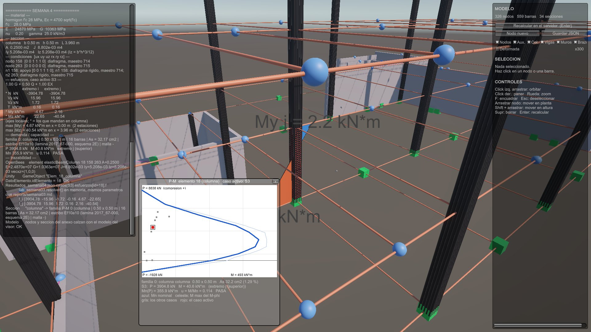

*Columna 18 en S3. El panel trae material, sección, condiciones,
esfuerzos, demanda-capacidad y trazabilidad; la ventana, su curva P-M con
el punto de S3 en rojo y los otros casos en gris.*

La tabla del panel son los esfuerzos **internos** en *i* y en *j*, en ejes
locales, del caso activo. Salen de los doce de `eleResponse(tag,
'localForce')` —las fuerzas **sobre** la barra—, que el bloque de
trazabilidad muestra tal cual como `f_i` y `f_j` (en *i* con el signo
cambiado respecto de la tabla). En una combinación, `Σ λ·f` hecho en
Python.

---

## 3. Diagramas y deformada

### Cómo sale el diagrama

OpenSees da los extremos. El medio se reconstruye por equilibrio del tramo
`[0, x]` con la carga repartida `w = (wx, wy, wz)` en ejes locales:

```
N(x)  = −(N_i  + wx·x)            Vy(x) = −(Vy_i + wy·x)
Vz(x) = −(Vz_i + wz·x)            T(x)  = −T_i
My(x) = −(My_i + x·Vz_i + wz·x²/2)
Mz(x) = −(Mz_i − x·Vy_i − wy·x²/2)
```

en 9 estaciones si la barra lleva carga repartida y en 2 si no.

**Verificación** (`verificar_semana04.py`, bloque [1]): en `x = L` las
fórmulas tienen que devolver el `f_j` que OpenSees calculó aparte. Son
**60 372 comparaciones** en Ingeniería (9 casos × 559 elementos × 6
esfuerzos × 2 extremos), todas dentro de su cota, que sale del redondeo
del servidor (`5e-5` por fuerza): `5e-5·2·Σ|λ|` en N, V y T y
`5e-5·(2 + L)·Σ|λ|` en los momentos, más `1e-4` porque se comparan dos
valores ya redondeados por el JSON. El peor es `My` en `1.4G`, elemento
292: `6.0e-4` contra `7.65e-4`. `trazabilidad.py` muestra el cierre de una
barra: la columna 18 en S3 (`Σ|λ| = 2.5`, `L = 3.96`) cierra `My` con
`3.3e-4` contra `5e-5·5.96·2.5 = 7.5e-4`. El exportador hace la misma prueba antes de escribir, y si una
barra no cierra **no escribe el archivo**.

### De qué lado se dibuja

Del **lado traccionado**: `+My` hacia `+z` local y `−Mz` hacia `+y` local.
Corte, axial y torsión, en una dirección fija y coloreados por signo.

La convención no se eligió: se comprobó con **modelos chicos resueltos en
OpenSees** (bloque [6]):

| prueba | resultado |
| --- | --- |
| voladizo, `wz = −q` | `My(0) = +180.0000 = qL²/2`; la punta baja |
| voladizo, `wy = −q` | `Mz(0) = −180.0000 = −qL²/2`; la punta va a −Y |
| viga simple, `wz = −q` | `My(L/2) = −45.0000 = −qL²/8`, negativo en todo el tramo |
| voladizo con **sección de fibras**, `wz = −q` | fibra `+z` en tracción, +12 579.5 kPa |
| voladizo con **sección de fibras**, `wy = −q` | fibra `+y` en tracción, +20 965.8 kPa |

Con `My > 0` tracciona `+z` y con `Mz < 0` tracciona `+y`: exactamente la
convención de dibujo.

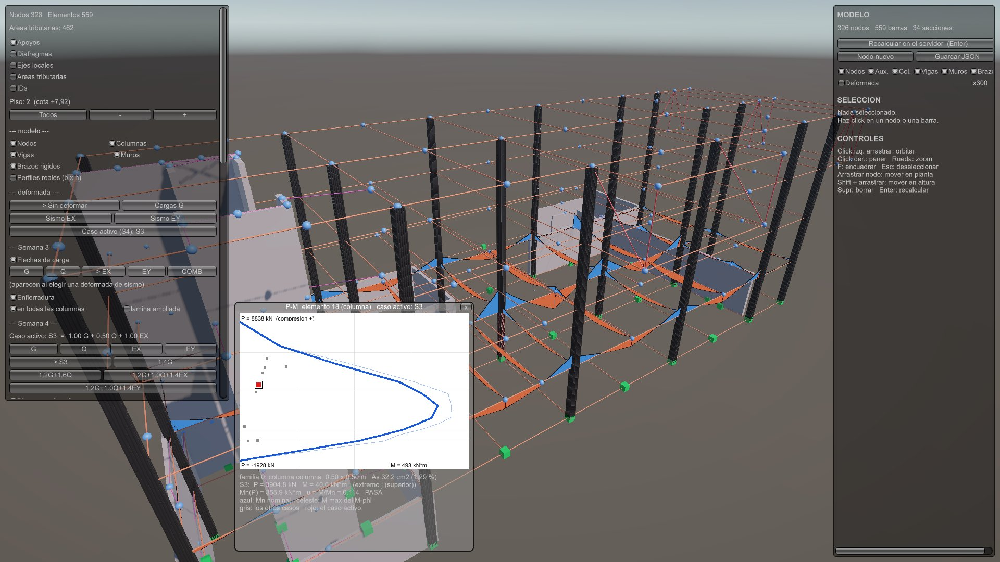

*My de las barras del piso 2 en S3, del lado traccionado. Los muros llevan
escala gráfica aparte: en este piso toman momentos unas siete veces mayores
(5 189 contra 751 kN·m) y dejarían las vigas de centímetros. La leyenda del panel dice las dos escalas.*

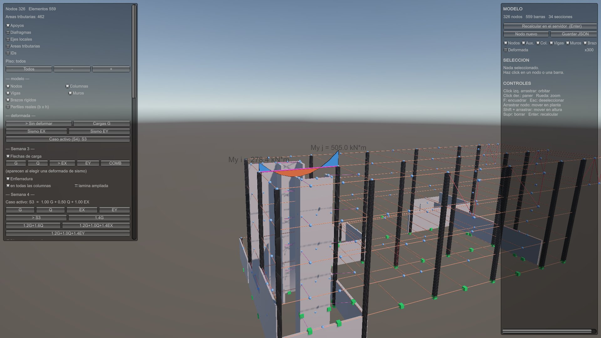

*Viga 222 en S3: tracción arriba en los apoyos (`My i = 278.4`,
`My j = 505.0 kN·m`) y abajo en el tramo.*

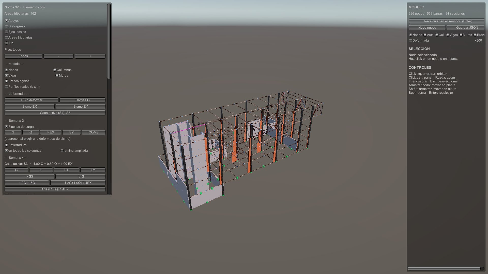

*Axial N de todo el edificio en S3.*

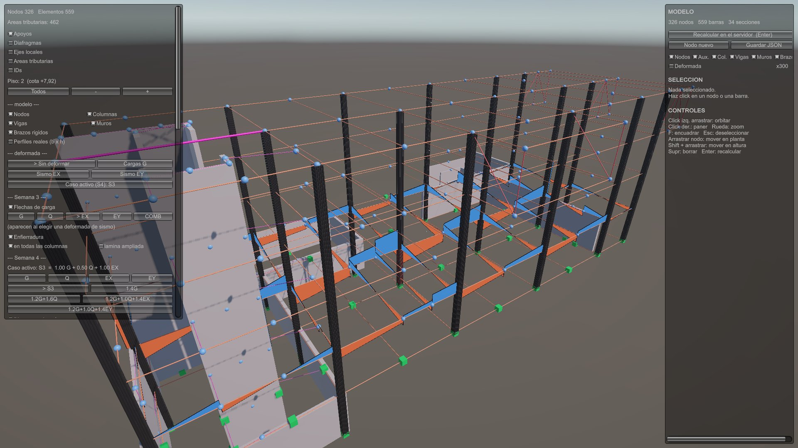

*Corte Vz de las barras del piso 2.*

### Deformada

La deformada del modo **"Caso activo (S4)"** usa los desplazamientos del
caso o combinación activa, combinados en Python (bloque [2]: los 6 GDL de
cada nodo de cada combinación son la suma rehecha).

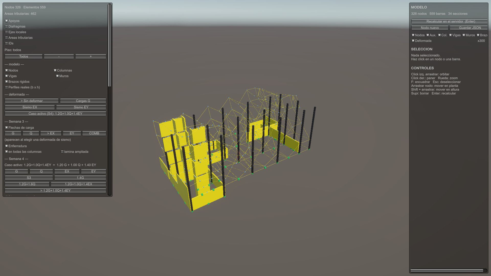

*Deformada en `1.2G+1.0Q+1.4EY`, amplificada solo para dibujarla.*

---

## 4. Capas estructurales

| capa | dónde | de dónde sale |
| --- | --- | --- |
| Apoyos | toggle "Apoyos" | restricciones del modelo |
| Áreas tributarias | toggle "Areas tributarias" | el polígono de losa de cada viga, calculado en Python (Semana 2) |
| Cargas | Semana 3, "Flechas de carga" `G` `Q` `EX` `EY`, con una deformada de sismo puesta | los casos armados por `lab_semana03` |
| Ejes locales | toggle "Ejes locales" | `contrato.ejes_locales`, la regla del servidor |
| Diafragmas | toggle "Diafragmas" | los diafragmas del modelo |
| Enfierradura | Semana 3, "Enfierradura" | la sección de `comun/capacidad.py` |
| Diagramas | Semana 4, "Diagramas de esfuerzos" | este anexo |
| Filtro de piso | "Piso" `-` `+` | las cotas del modelo; los diagramas lo respetan |

Cada una se prende y apaga por separado.

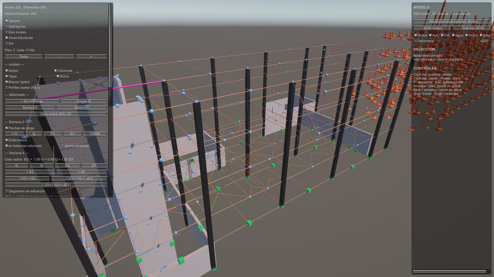

*Piso 2 con las capas de apoyos, áreas tributarias y flechas de carga del
caso G prendidas, y los diagramas apagados.*

---

## 5. Demanda-capacidad

La curva P-M sale de la **sección de fibras** de `comun/capacidad.py`, con
el fierro leído de los planos; hay **28 familias** para los 138 elementos
con fierro (82 columnas y 56 muros). El punto de demanda sale de
`localForce`: `P` en compresión positiva; en columna `M = √(My² + Mz²)`, y
en muro **solo el momento de su plano** (§8). Se toma el extremo de mayor
momento. `u = M / Mn(P)`, nominal y sin φ.

El caso activo es **uno** y manda sobre el panel, los diagramas, la
deformada y el punto rojo. Su nombre está en el título de la ventana:
`P-M elemento 537 (muro) caso activo: 1.2G+1.0Q+1.4EY`.

| elemento | caso | P [kN] | M [kN·m] | Mn [kN·m] | u |
| --- | --- | --- | --- | --- | --- |
| columna 18 | S3 | 3904.8 | 40.6 | 355.9 | 0.114 |
| columna 18 | 1.2G+1.0Q+1.4EY | 5171.4 | 99.6 | 226.6 | 0.439 |
| muro 537 | S3 | 3884.0 | 5 556.4 (\|My\|) | 82 428.5 | 0.067 |
| muro 537 | 1.2G+1.0Q+1.4EY | 5237.2 | 40 969.1 (\|My\|) | 90 780.2 | 0.451 |

La familia de cada demo es la de `capacidad.interaccion(capacidad.desde_elemento(...))`
punto a punto (peor diferencia `4.9e-5`, dentro del redondeo del JSON), y
las demandas de G, Q, EX y EY son las de `demanda_capacidad.revisar()`
(bloque [5]).

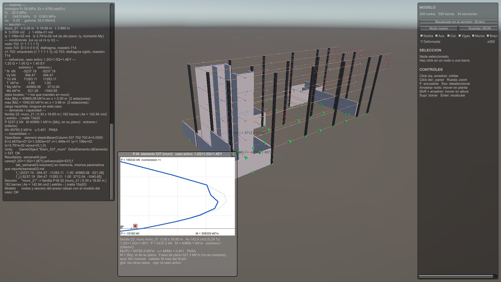

*Muro 537 (0.30 × 16.85 m) en `1.2G+1.0Q+1.4EY`: el panel marca `N`, `Vz`
y `My` como los que mandan, y la demanda dice `(|My|, en su plano)`.*

### Los que no pasan

| | S3 | 1.4G | 1.2G+1.6Q | 1.2G+1.0Q+1.4EX | 1.2G+1.0Q+1.4EY |
| --- | --- | --- | --- | --- | --- |
| columnas | 2 | 3 | 4 | 4 | 23 |
| muros | 8 | 0 | 0 | 13 | 13 |
| de ellas, `u = 9999` | 4 | 0 | 0 | 5 | 1 |

`u = 9999` no es un cociente: marca un `P` fuera de la curva, donde
`Mn = 0`. El bloque [7] exige que las 17 demandas con esa marca tengan de
verdad `P` fuera, y que ningún `P` fuera tenga un `u` finito.

Tres casos que se explican solos:

- **Columna 80, S3, `u = 1.226`.** Último piso: poco axial y el momento de
  las vigas del techo, sobre el detalle típico de las 82 columnas. Ya salía
  en la Semana 3 bajo G + Q.
- **Muro 427, `1.2G+1.0Q+1.4EX`.** `P = −3510 kN` de tracción, más que la
  tracción pura de su sección (−1649 kN): no le queda momento resistente.
- **Muro 508, `1.2G+1.0Q+1.4EY`, `u = 36`.** Muro corto (2.35 m)
  traccionado casi hasta su tracción pura (`P = −1108` contra −1188 kN),
  donde la curva ya no tiene momento (`Mn = 105 kN·m`), y el sismo le pide
  3814 kN·m.

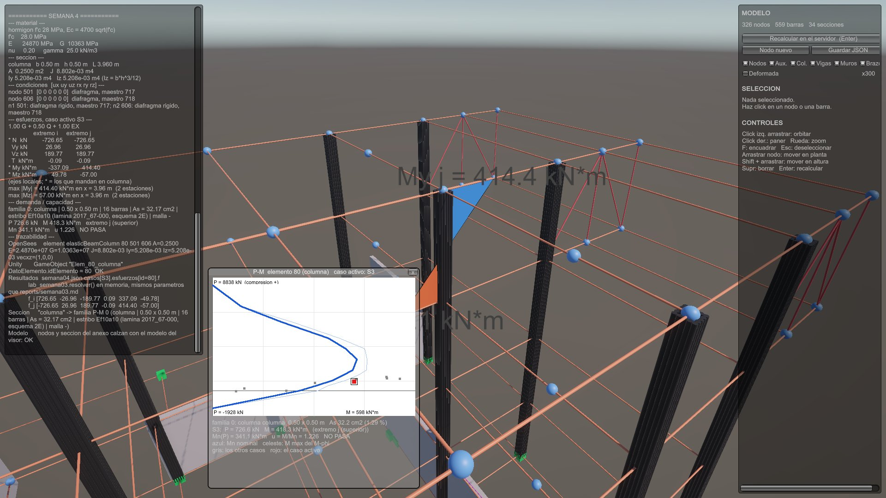

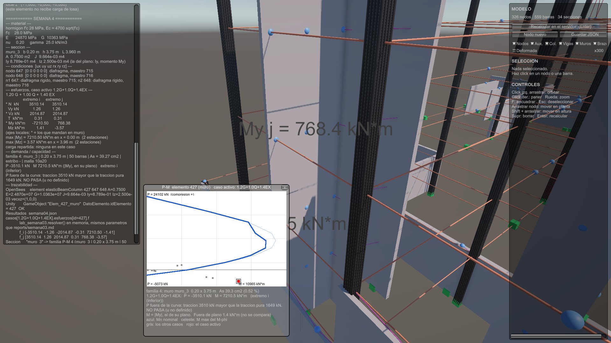

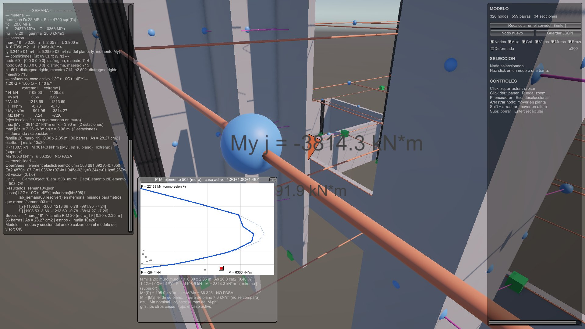

Es capacidad nominal contra un sismo con coeficiente supuesto en un modelo
elástico: dice **dónde mirar** —muros que el sismo tracciona o carga más (de los 13 que no pasan en
`1.2G+1.0Q+1.4EY`, 7 traccionados y 6 comprimidos) y
columnas del techo—, no es un diseño.

---

## 6. Trazabilidad

El mismo número en los cuatro lados, sin tabla de traducción:

```
OpenSees   ops.element('elasticBeamColumn', 18, 158, 263, 0.25, 24870062.32, 10362525.97,
                       0.0088021, 0.0052083, 0.0052083, 1)
JSON       casos[S3].esfuerzos[id=18]   elementos[id=18]   demandas[id=18]
Unity      GameObject "Elem_18_columna"  con  DatoElemento.idElemento = 18
Capacidad  seccion "columna" -> familia P-M 0 (82 elementos, 16 barras, As 32.17 cm2)
```

**En Unity**, el final del panel:

```
--- trazabilidad ---
OpenSees    element elasticBeamColumn 18 158 263 A=0.2500 E=2.4870e+07 ...
Unity       GameObject "Elem_18_columna"  DatoElemento.idElemento = 18  OK
Resultados  semana04.json casos[S3].esfuerzos[id=18].f
            f_i [...]
            f_j [...]
Seccion     "columna" -> familia P-M 0 (...)
Modelo      nodos y seccion del anexo calzan con el modelo del visor: OK
```

El `OK` de la línea Unity se comprueba **en el momento**, sobre el objeto
seleccionado: que su nombre sea el del JSON y que su `DatoElemento` tenga
ese id. La línea Modelo compara nodos y sección del anexo contra el modelo
que dibujó el visor; si el anexo fuera de otro edificio, no se dibuja nada.

**Desde Python**, `python semana04\trazabilidad.py ingenieria 18` recorre:

- **(a) OpenSees**: la llamada `ops.element(...)` capturada al construir el
  modelo, y la rigidez que OpenSees guardó de vuelta (`E·A`, `E·Iy`,
  `E·Iz`, `G·J` iguales a lo pasado).
- **(b) Modelo**: nodos con coordenadas y restricciones (158 lleva
  `[0 0 1 1 1 0]`: la losa del nivel 1 apoyada en el terreno), `vecxz` y
  ejes locales.
- **(c) Unity**: el nombre del objeto y la línea 314 de
  `VisorEstructura.cs` que lo arma.
- **(d) Resultados**: `f_i`, `f_j`, los esfuerzos internos y su cierre en
  `x = L` (peor error/cota 0.446).
- **(e) Sección y capacidad**: fierro, confinamiento, la familia, los 12
  puntos de la curva y la demanda `P = 3904.8 kN`, `M = 40.6 kN·m`,
  `u = 0.114`.

y termina comparando cada campo contra el JSON y contra lo que Unity lee en
`float32`: `LA CADENA CALZA`. Lo mismo con el muro 537 y el 427.

**Que Unity lee lo que Python escribe** no se da por hecho: `JsonUtility`
deja en cero, sin avisar, un campo que no calza.
`test_contrato_semana04.py` compara los nombres C# ↔ JSON en las dos
direcciones, y `verificar_unity_semana04.py` abre Unity sin interfaz, le
hace leer el anexo y compara campo a campo: `UNITY LEE EL ANEXO DE SEMANA 4
TAL COMO PYTHON LO ESCRIBIO`.

---

## 7. Verificación

`python semana04\verificar_semana04.py ingenieria` → **TODO CALZA**.

| bloque | qué comprueba | resultado |
| --- | --- | --- |
| [1] reconstrucción | esfuerzos en `x = L` = `f_j` de OpenSees | 60 372 comparaciones dentro de su cota |
| [2] superposición | cada combinación = `Σ λ·caso` en fuerzas, desplazamientos y máximo | los 9 casos |
| [3] corrida explícita | `1.2G+1.0Q+1.4EX` resuelta de verdad en OpenSees | fuerzas y desplazamientos dentro del redondeo (peor 0.957 de la cota) |
| [4] E y A del panel | el N de OpenSees = `E·A/L` por el alargamiento, con el E y A del JSON | 455 elementos |
| [5] trazabilidad | ids, nombres de objeto, familias, curvas y demandas de los demos | 559 elementos, 28 familias |
| [6] signos | voladizos y viga simple en OpenSees, y sección de fibras | los 10 chequeos |
| [7] `u = 9999` | toda marca tiene `P` fuera de su curva, y al revés | 17 de 1242 demandas |
| [8] muros | el momento del plano es el mayor bajo EX y EY, y es el que usa la demanda | 56 de 56; 504 demandas |

Todo corre en `python comun\verificar_todo.py`, con el test de contrato,
la trazabilidad y la lectura real de Unity.

---

## 8. Hallazgo: el momento del plano de los muros

Hasta la Semana 3, `demanda_capacidad.demanda()` tomaba **siempre**
`M = |Mz|` en un muro. Se había comprobado con el muro 9 del LT2 (bajo EY,
`Mz = 9661` y `My = 24 kN·m`). Pero los dos cuerpos modelaron sus muros
distinto: el LT2 les da como `vecxz` su normal y la inercia grande queda en
`Iz`; Ingeniería les da la dirección del largo y la grande queda en `Iy`.

Al construir la trazabilidad se compararon las inercias que recibe
OpenSees: los **56 muros** de Ingeniería tienen `Iy > Iz`, así que su
momento del plano es `My` y el `Mz` usado era el de **fuera** de plano.

| muro 537 | M usado en la Semana 3 (\|Mz\|) | M de su plano (\|My\|) | u entregado | u correcto |
| --- | --- | --- | --- | --- |
| G | 641.6 | 2 243.1 | 0.008 | 0.029 |
| Q | 207.0 | 701.8 | 0.003 | 0.011 |
| EX | 29.3 | 4 391.6 | 0.000 | 0.074 |
| EY | 45.7 | 30 352.4 | 0.001 | 0.504 |

**Corrección:**

- `momento_en_el_plano(Iy, Iz)` elige el eje de **inercia mayor**.
- `demanda()` ya no tiene valor por defecto para un muro: sin el eje, lanza
  un error.
- El eje viaja en el JSON (`elementos[].momento_en_el_plano`); Unity lo
  muestra y no lo decide.
- Bloque [8], sin mirar las inercias: bajo EX y EY el momento declarado del
  plano es el mayor en los **96 muros** de los dos cuerpos (el más justo,
  5.2 veces). Con la regla vieja forzada, la prueba falla.

La tabla y el gráfico del muro 537 en `reports/semana03.md` quedaron
corregidos con una nota de errata. Las columnas y el resultado de `--todas`
bajo G + Q (columnas 80 y 66 fuera de su curva) no cambian.

---

## 9. Limitaciones

- **Nominal, sin φ, con un sismo supuesto** (`Cs = 0.10`, estático, modelo
  elástico). Los "no pasa" señalan dónde mirar; no son un diseño.
- **El diagrama de `My` de un muro** va en su propio plano y queda dentro
  del muro; en los muros se leen las etiquetas y la ventana P-M.
- **Resuelto antes de entregar:** el muro 10 del LT2 (curva con `Mn = 0`
  en `P = 0`, por leer `L:8+8` —laterales de la viga de fundación— como
  fierro de muro) y el `f'c` único del conjunto (ahora `fpc_MPa` por
  sección). El bloque [7] calza en los tres edificios.
- **Fierro de muro del LT2, contado de menos.** En los bloques de barra de
  las elevaciones el número que dibuja el plano (`5 Ø32 L=900`) es el
  atributo `NUM`; el extractor lee `CANT`, que es invisible y vale `1`.
  Pasa en 660 de 780 bloques: los 29 muros armados llevan 181 barras de
  borde donde el plano da 411. Del lado seguro (el `Mn` a `P = 0` del
  muro 12 sube 97 %), pero los números de capacidad de esos muros no son
  los del plano.
- **Barras que no son del muro, pegadas como borde (LT2).** De esas 181
  asignaciones, 36 son barras horizontales (dinteles bajo losa, vigas de
  fundación) y 30 vienen de la elevación perpendicular; 22 bloques entran
  en dos muros. Del lado **inseguro**: quitándolas, el `Mn` baja hasta
  33 % (muro 16).
- **Puntas de muro de Ingeniería.** Las `L:3+3 Ø10` que se ponen en las
  dos puntas de los 56 muros son las laterales de las vigas `V. 60/80`:
  la lámina 2017_67-000 dice `L:` = LATERALES, igual que la del LT2. En el
  muro 537 pesan 7 % del `Mn` a `P = 0`; en los muros cortos, 42 %. El
  plano dibuja en las puntas otras barras contadas (`2 Ø22`, `2 Ø18`).
- **La curva P-M es de un solo signo.** `capacidad.interaccion()` flecta
  hacia un lado y la demanda usa `|M|`. En una sección con el acero
  descentrado la capacidad cambia con el signo (20 a 36 % en varios muros
  del LT2), y para uno de los dos queda del lado inseguro. Parte de esa
  asimetría es de los dos puntos de arriba y de que la malla no queda
  centrada en `_seccion_de_muro`.
- **Los M 0.60x2.92 del LT2 (eje A') van sin fierro.** El plano les da
  cuatro mallas y núcleos de borde de Ø32, en texto suelto y en cortes que
  el extractor no lee; no entran a la revisión P-M.

---

## 10. Uso de IA

Registrado en [`AGENTS.md`](../AGENTS.md), Semana 4: cómo se organizó el
trabajo con agentes, los errores de la API que obligaron a rehacer el
visor, la corrección 10 (el eje de los muros) y los hallazgos que quedan
para el grupo.
