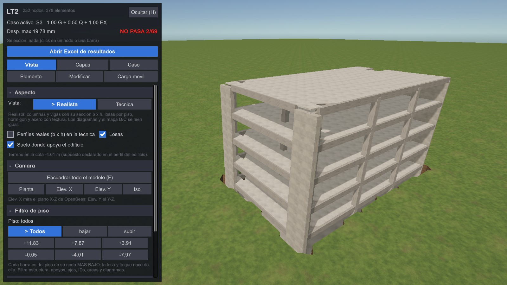
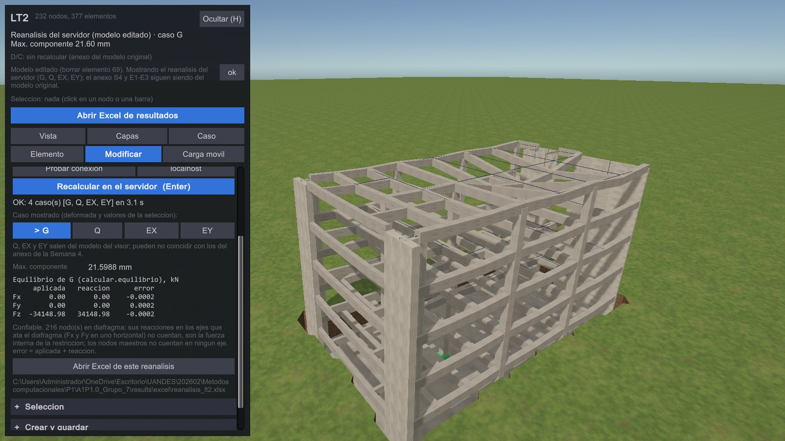
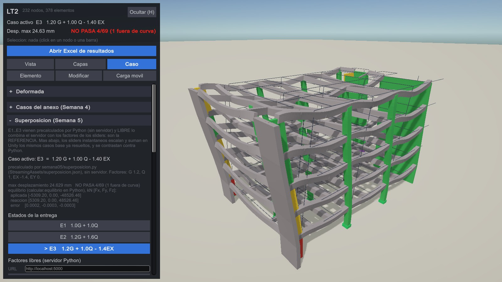
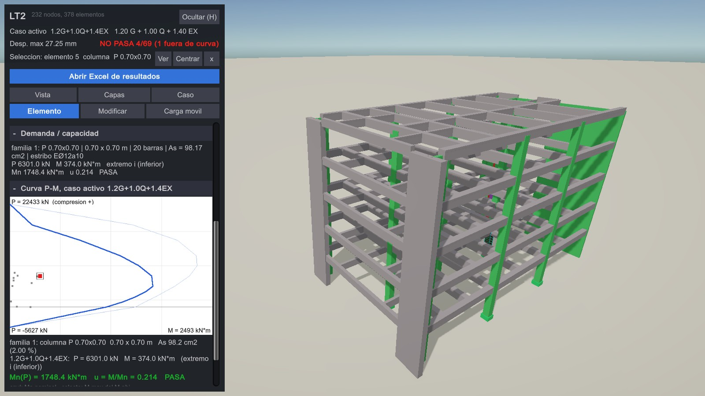
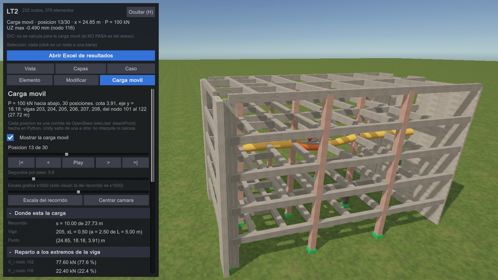
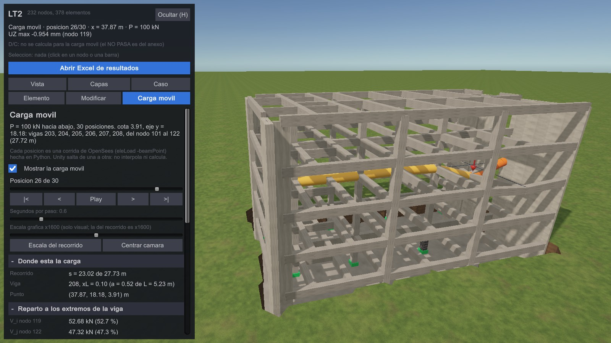
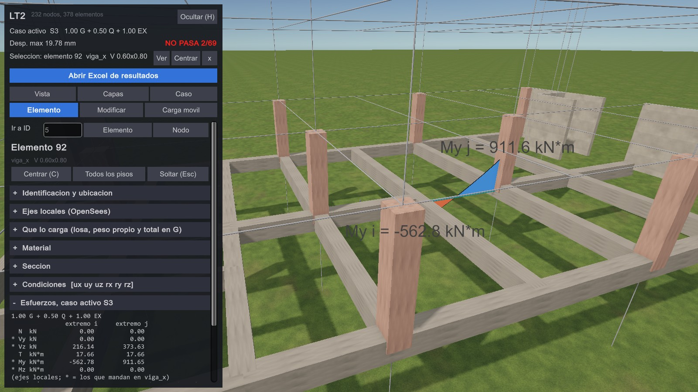

# Semana 5 — Viewer estructural, modificación y superposición interactiva

**Grupo 7** · Métodos Computacionales en Obras Civiles, UAndes
Integrantes: Pedro Castillo, Monserrat Cubillos, Eduardo Vergara
Repositorio: https://github.com/bitscochits/A1P3_Grupo_7
Commit entregado: el hash que figura en Canvas (rama `semana05`, llevada a `main` por fast-forward)

Edificio de la demo: **LT2** (cuerpo nuevo, planos `2024_22`): 232 nodos y
378 elementos. Todo lo de la entrega está en [`semana05/`](../semana05/).
Documentos de apoyo:

- qué hay y dónde: [`semana05/README.md`](../semana05/README.md)
- comandos: [`semana05/COMANDOS.md`](../semana05/COMANDOS.md)
- guion de la demo: [`semana05/GUION_DEMO.md`](../semana05/GUION_DEMO.md)
- detalle de UX: [`semana05/UX.md`](../semana05/UX.md)
- detalle móvil: [`semana05/MOVIL.md`](../semana05/MOVIL.md)
- modificaciones: [`semana05/MODIFICACIONES.md`](../semana05/MODIFICACIONES.md)
- carga móvil: [`semana05/CARGA_MOVIL.md`](../semana05/CARGA_MOVIL.md)
- app autónoma: [`semana05/APP_AUTONOMA.md`](../semana05/APP_AUTONOMA.md)
- contrato entre piezas: [`semana05/CONTRATO.md`](../semana05/CONTRATO.md)

La regla de oro no cambia: **Python/OpenSees calcula y Unity muestra**. En
C# no hay sumas de superposición, repartos ni interpolación de `Mn`. Cuando
Unity necesita un número nuevo, se lo pide a Python (servidor) o lo lee de
un JSON que Python precalculó.

Todos los números de este informe salen de una salida real. Los
`archivo:línea` se comprobaron con `grep` el 17-09 sobre la rama
`semana05`. Cuando algo no se comprobó, se dice.

```powershell
python comun\verificar_todo.py                         # la suite: 41 de 41 EN OK
python semana05\servidor_s5.py                         # EL servidor de la Semana 5 (puerto 5000)
python comun\lanzar_unity.py app lt2                   # la app de Windows
build\LaboratorioEstructural.exe -capturarS5 semana05\capturas   # las 23 fotos + registro.txt
python semana05\comparar_unity.py semana05\capturas\registro.txt  # Unity contra Python
```

---

## 1. Funciones implementadas

Estado de las once funciones del enunciado. "Cómo se verificó" nombra la
evidencia; `[n]` es el bloque de
[`semana05/evidencia/unity_vs_python.txt`](../semana05/evidencia/unity_vs_python.txt),
que compara lo que Unity leyó (float de 32 bits, escrito por el exe en
`registro.txt`) contra lo que calculó Python. Da **486 filas y 0 FALLA**.

| función | estado | cómo se usa en la app | código | cómo se verificó | limitación |
| --- | --- | --- | --- | --- | --- |
| **Navegación** | implementada en Windows; la táctil está compilada pero no se probó en un equipo | Clic izquierdo y arrastrar orbita, clic derecho o medio panea, la rueda hace zoom y **F** encuadra. En Vista > Cámara hay botones Planta, Elev. X, Elev. Y e Iso; en el inspector, "Centrar (C)". En pantalla táctil: un dedo orbita, la pinza hace zoom y dos dedos panean | `CamaraOrbital.cs:170` (táctil), `:224` (rueda), `:234` (F), `:348` `Aplicar` (corre la cámara medio panel), `:382` `EncuadrarTodo` | Las 23 fotos las encuadra la captura automática con esta cámara, y el registro guarda su centro y distancia (foto 01: distancia 41.2) | La F no responde si un campo de texto tiene el foco (`CamaraOrbital.cs:234`). Pinza y dos dedos no se probaron en un teléfono |
| **Selección** | implementada | Clic en una barra, un nodo o un símbolo de apoyo. También "Ir a ID" con los botones Elemento o Nodo. La cabecera muestra lo seleccionado con Ver, Centrar y x, y Esc lo suelta. Lo seleccionado se resalta en cian | `VisorQA.cs:424` `LeerClick`, `:485` `SeleccionarNodo`, `:501` `FijarSeleccion`, `:2374` "Ir a ID" | `[4]` `ux.donde.*`: elemento 5, nodos 5 → 21 y sus coordenadas calzan con `data/unity/lt2.json`. Fotos 09 y 10 | La captura selecciona por código, no con el mouse. El campo "Ir a ID" no se actualiza al seleccionar con clic: en las fotos 11 y 13 dice 5 con la viga 92 seleccionada |
| **Apoyos** | implementada | Capas > Control de calidad > "Apoyos". Hay un símbolo por tipo con leyenda y conteo: cubo verde = empotrado `[1 1 1 1 1 1]` (16 en el LT2), placa = apoyo en terreno `[0 0 1 1 1 0]`, rombo = otra combinación, esfera = maestro de diafragma. Al seleccionar un nodo, el bloque "Como esta apoyado" lo explica en palabras | `VisorQA.cs:250` `TipoApoyo`, `:1200` `DibujarApoyos`, `:1059` bloque del nodo, `:2192` leyenda | `[4]` `ux.apoyo.*`: nodo 5, restricciones `1,1,1,1,1,1`, fijo. Fotos 04 y 10 | En el LT2 no hay apoyos en terreno (el conteo da 0); sí los hay en Ingeniería y en el conjunto |
| **Ejes (locales)** | implementada | Capas > "Ejes locales" dibuja rojo = x, verde = y, azul = z de OpenSees. El inspector tiene el bloque "Ejes locales (OpenSees)" | `VisorQA.cs:1277` `DibujarEjesLocales` (lee `localX/Y/Z` del JSON), `:2171` casilla. Se calculan en Python: `edificios/lt2/exportar_unity.py:106` y `:549`, con `contrato.ejes_locales` | `comun/test_contrato_unity.py:203` exige que vengan. `semana04/verificar_semana04.py` usa la misma regla para la prueba E·A/L (en la suite, OK) | Ninguna foto de la Semana 5 los muestra prendidos, y no hay una fila de ejes en `unity_vs_python.txt` |
| **Cargas** | implementada | Tres formas de verlas: las flechas de carga de la Semana 3 (G, Q, EX, EY; Capas > Semana 3), las magnitudes `wy` y `wz` en Caso > Diagramas y el bloque "Cargas nodales (ejes globales)" del nodo. **La app tiene dos sobrecargas Q distintas, y cada vista usa una:** (1) el **modelo del visor** (`data/unity/lt2.json`), que es el que Unity manda a `/analizar` y el que lee el bloque "Que lo carga", trae la Q del plano de cargas, 500 kgf/m² ≈ 4.90 kN/m² hasta el piso 3: en la viga 92, `wz` −12.258313 kN/m; (2) el **anexo de la Semana 4** (`semana04.json`), del que salen los diagramas de Caso > Diagramas, sus combinaciones y E1..E3, usa q_Q = 3 kN/m²: en la misma viga, −7.5 kN/m. En G los dos traen lo mismo, −27.749323 kN/m | `VisorSemana03.cs:598` `DibujarCargas`, `VisorQA.cs:2228` casilla, `VisorSemana04.cs:280` magnitudes `wy`/`wz` | `[4]` compara las cargas del **modelo del visor** contra `lt2.json`: en la viga 92, `G[wz]` −27.749323 y `Q[wz]` −12.258313 kN/m calzan. La `w` del anexo no tiene fila propia en `[4]`; queda en el registro del exe (`ux.carga.anexo_w_local.G` −27.7493) y en E1 = G + Q del anexo, −35.2492981 kN/m, que es el −35.2493 de `superposicion_lt2.json` (−27.7493 − 7.5). En la Semana 4, el bloque [1] exige que la `w` del anexo cierre contra `f_j` | Las flechas nodales no salen en las fotos de la Semana 5. Por qué hay dos Q, en Limitaciones: "Q y el sismo de `/analizar` no son los del anexo" |
| **Áreas tributarias** | implementada en el LT2 | Capas > "Areas tributarias". Con "Piso: todos" dibuja solo la de la barra seleccionada. El bloque "Que lo carga" muestra, en orden, A_trib; q_G y la carga de losa; `w_losa`; el peso propio `w_pp`; `= w_G`, la w total que recibe OpenSees en G; y el `wz` de G y de Q leídos de `casos_de_carga`. Todos los números vienen del JSON: C# no suma. En la vista realista, las **losas de dibujo** salen de los mismos polígonos | `VisorQA.cs:1307` `DibujarTributarias`, `:913` bloque, `:939` `TextoTributaria`, `:2654` `NotaQueLoCarga`, `ModeloEstructural.cs:201-202` `w_peso_propio`/`w_total_G`, `:350` `TributariasDe`, `edificios/lt2/exportar_unity.py:657` `en_G` (lee `ModeloLT2.repartidas`, `modelo_lt2.py:1388` y `:1411`), `AmbienteVisor.Losas.cs:100` `ActualizarLosas` | `[4]` viga 92: 12.5 m², qG 6.2997 kN/m², 78.7466 kN, w 15.749323 kN/m, luz 5 m, `w_peso_propio` 12 y `w_total_G` 27.749323 kN/m calzan. `test_contrato_unity.py lt2` da `w·L = q·A` con peor error 9.591e-04 kN, `w + w_peso_propio = w_total_G` en 204 entradas (peor 3.6e-15 kN/m) y `w_total_G = −wz` de G (peor 0.0). El exportador lo exige barra por barra contra lo que el modelo pasó a `eleLoad` (`exportar_unity.py:775`: 220 barras, peor 0.0e+00 kN/m). Foto 11: `w_pp 12.000 kN/m de peso propio de la barra` y `= w_G 27.749 kN/m, la w total que recibe OpenSees en G` | En Ingeniería y en el conjunto hay 462 entradas sin qG, w ni luz, ni `w_peso_propio` ni `w_total_G` (PEND de `test_contrato_unity.py`); el panel lo dice en una línea tenue. Las 39 entradas de muro del LT2 no llevan el desglose: su losa y su peso propio entran como cargas nodales, y el bloque lo dice. El peso propio es el del modelo exportado: cambiar una sección en Unity no lo cambia (Limitaciones) |
| **Deformada** | implementada | Caso > Deformada: Sin, Gravedad, Sismo EX o EY, o Caso activo (S4, E1..E3, LIBRE), con escala. El inspector del nodo tiene "Desplazamiento, caso activo". La posición original queda en líneas oscuras | `VisorQA.cs:1518` `AplicarModo`, `VisorSemana04.cs:670` `AplicarDeformadaDelCaso`, `VisorEstructura.cs:340` `AplicarDeformada`, `:746` `InclinarPlaca` (muros cizallados) | `[4]` nodo 207 en S3: ux 0.0181899, uy −0.00091917, uz −0.00770534 m y máximo 19.776 mm calzan. `[1]` compara E1..E3 y `[2]` la M1. Fotos 12, 15-18 y 21 | La escala es solo gráfica. Los desplazamientos llegan en float32 |
| **Diagramas** | implementada (Semana 4) | Caso > Diagramas: My, Mz, Vz, Vy, N, T, wy y wz, de todas las barras o solo de la seleccionada, del lado traccionado | `VisorSemana04.Diagramas.cs:82` `Redibujar`, `:146`; `VisorEstructura.cs:194` `FijarBarrasDelgadas` | `[4]` viga 92 en S3: My_i −562.7818, My_j 911.6467, Vz 216.1374 / 373.634 kN y 9 estaciones calzan. `verificar_semana04.py lt2` y `conjunto` (cierre contra `f_j`) pasan en la suite. Foto 13 | Las etiquetas 3D no tienen fondo y quedan montadas sobre las vigas (foto 13). En la vista realista, la barra con diagrama se dibuja delgada para que el diagrama no quede dentro de la caja |
| **Superposición** | implementada | Caso > Superposición (Semana 5). E1, E2 y E3 están precalculados y andan sin servidor. "Factores libres" (LIBRE) tiene sliders G, Q, EX y EY que piden `POST /combinar` 0.6 s después de dejar de mover el slider. El panel dice el origen del número, Δmax, NO PASA y el equilibrio | `VisorSemana04.Superposicion.cs:324`, `:559` `CombinarEnPython`, `:582` `Sup_Combinar`, `:687`; `semana05/superposicion.py:196` `caso_combinado`; `semana05/servidor_s5.py:142` `/combinar` | §3: cuatro vías en todo el modelo y `[1]` con 136 filas y 0 FALLA. Fotos 15-18 | Sin servidor, los sliders se apagan. Si se edita el modelo, E1..E3 y LIBRE quedan del modelo original y el panel lo avisa |
| **P-M** | implementada | Al seleccionar una columna o un muro con fierro, el panel muestra "Demanda / capacidad" y justo debajo la "Curva P-M, caso activo" (y la ventana flotante de la Semana 4). El mapa D/C pinta el edificio por u y tiene el botón "Ver el caso con mas NO PASA" | `VisorSemana04.PM.cs:124` (curva en el panel), `:200` ventana; `VisorSemana04.Mapa.cs:131` `MostrarMapaDC`, `:151`; `PanelUI.cs:499` `TextoDemanda` | `[4]` columna 5 en 1.2G+1.0Q+1.4EX: P 6301.0471, M 373.9621, Mn 1748.3593, u 0.213893, PASA. NO PASA 4 (ids 12, 28, 29, 45), 1 fuera de curva. `verificar_unity_semana04.py`: 23 OK. Fotos 14 y 14b | Nominal y sin φ. Hereda los abiertos del fierro de muros (Semana 4 §9). Las 309 barras sin fierro van en gris, sin curva |
| **Modificación del modelo** | implementada | Pestaña Modificar: mover, crear y borrar nodos y barras, cambiar sección y apoyos, "Recalcular en el servidor (Enter)", botones de caso G, Q, EX y EY, tabla de equilibrio y "Abrir Excel de este reanalisis" | `EditorEstructura.cs:727` `BorrarElementoPorId`, `:740`; `AnalizadorEstructural.cs:219` `EnviarModelo`, `:227` `Analizar`, `:456` `ProcesarRespuesta`; `comun/servidor_opensees.py:759` `analizar` | §2: `[2]` M1 con 138 filas y 0 FALLA. Fotos 21 y 22 | Ver §2: el anexo de la Semana 4 no se recalcula en vivo y el peso propio va horneado en las cargas |



*Foto 01. El LT2 en la vista realista. El panel tiene pestañas y una
cabecera fija con caso, Δmax y NO PASA. Las losas por piso son **dibujo**:
salen de los polígonos de las áreas tributarias y no son un dato nuevo. El
suelo está en −4.01, una cota supuesta que se discute en Limitaciones. La
misma vista en técnica es la
[foto 02](../semana05/capturas/02_vista_general_tecnica.jpg).*

---

## 2. Modificación

Hay dos modificaciones completas del LT2. El detalle línea por línea está en
[`semana05/MODIFICACIONES.md`](../semana05/MODIFICACIONES.md). Los números
de esta sección salen de correr de nuevo, el 17-09, los dos scripts de
abajo (salida 0 y `TODO OK` en ambos; ninguno escribe en `data/`) y del
registro del exe.

| | qué cambia | por dónde entra | cómo vuelve a Unity |
| --- | --- | --- | --- |
| **M1** | se borra la columna 69 | la pestaña Modificar de Unity | en vivo: `POST /analizar` → OpenSees → respuesta dibujada |
| **M2** | coeficiente sísmico 0.10 → 0.20 | un dato: `--cs 0.20` | se vuelve a exportar el anexo y se hace Stop + Play |

### M1 — borrar la columna 69 desde Unity (automática)

```powershell
python semana05\servidor_s5.py                     # terminal 1 (puerto 5000)
python comun\lanzar_unity.py app lt2               # seleccionar 69 -> Modificar -> Borrar barra (Supr) -> Enter
python semana05\reanalisis_demo.py lt2 --borrar-elemento 69 --nodo 186 --elemento 337   # lo mismo, sin Unity
```

La columna 69 es una `P 0.70x0.70` entre los nodos 144 (z 7.87) y 186
(z 11.83), con L = 3.96 m. Se sigue el nodo 186, arriba de ella, y la viga
337 (207 → 186).

| paso | qué pasa | código | números |
| --- | --- | --- | --- |
| **1. Interfaz** | El botón y la tecla Supr llaman a `BorrarElementoPorId(69)`, que quita la barra y las cargas repartidas que la nombran, y avisa `ModeloEditado`. Al recibir ese aviso, el anexo de la Semana 4 se marca desactualizado | `EditorEstructura.cs:727`, `:740`; `VisorSemana04.cs:527` y `:532` | Registro del exe: `m1.borrado True`, `m1.elementos_despues 377`, `m1.anexo_desactualizado True`. Cargas repartidas quitadas: 0 |
| **2. Modelo** | `EnviarModelo` serializa `visor.Modelo` con `JsonUtility` (floats de 32 bits) y lo manda por POST con `?edificio=lt2` | `AnalizadorEstructural.cs:219`, `:254`, `:293` | Unity mandó 378 elementos antes y 377 después. El peso propio de la columna, `0.49·25·3.96 = 48.51 kN`, **sigue aplicado** como carga nodal de G (`edificios/lt2/exportar_unity.py:395`, mitad en cada extremo) |
| **3. OpenSees** | `/analizar` arma el modelo, resuelve G, Q, EX y EY y calcula el equilibrio de **cada caso** con `calcular.equilibrio`. Después escribe el Excel del reanálisis | `comun/servidor_opensees.py:759`, `:598`, `:578`, `:731` | En Unity: "OK: 4 caso(s) [G, Q, EX, EY] en 3.1 s" (3.81 s antes y 3.16 s después, con el Excel incluido) |
| **4. Resultados** | Ver la tabla de abajo | `reanalisis_demo.py` | UZ del nodo 186 en G: −3.64515 → **−21.59875 mm**. G aplicada: −34148.979 kN antes y después |
| **5. Unity** | `ProcesarRespuesta` lee la respuesta, `ElegirCaso` prende la deformada y la aplica. La pestaña Modificar muestra el máximo, la tabla de equilibrio y el Excel. La cabecera dice la fuente de lo que se ve: "Reanalisis del servidor (modelo editado) · caso G", "Max. componente 21.60 mm" (el rótulo de la pestaña: el servidor devuelve la mayor componente, no la norma que el anexo llama "Desp. max") y, en lugar del NO PASA del anexo, "D/C: sin recalcular (anexo del modelo original)" (`VisorQA.cs:2594` `FuenteDeLoQueSeVe`, `:2610` `CabeceraDeOtraFuente`), y deja **una** línea de aviso: "Mostrando el reanálisis del servidor (G, Q, EX, EY); el anexo S4 y E1-E3 siguen siendo del modelo original" | `AnalizadorEstructural.cs:456`, `:538`, `:562` | Foto 21: "Max. componente 21.5988 mm" y equilibrio Fz −34148.98 / 34148.98 / −0.0002. Foto 22: nodo 186 "UZ -21.5988 mm". `[2]`: 146 filas, 0 FALLA; 8 son la cabecera de las fotos 21 y 22 (fuente `reanalisis`, "Max. componente 21.60 mm" contra los 21.59875 mm de `reanalisis_demo.py`) |

| M1, de `reanalisis_demo.py` | antes | después |
| --- | --- | --- |
| nodo 186, UZ en G | −3.64515 mm | −21.59875 mm |
| nodo 186, UZ en Q | −1.41122 mm | −6.29423 mm |
| máximo en G (mayor componente) | 6.71145 mm | 21.59875 mm (×3.22) |
| máximo en EX | 16.41508 mm | 16.65065 mm (×1.01) |
| viga 337 en G: Vz_i; My_i / My_j | −140.941 kN; 457.871 / 575.311 kN·m | 67.579 kN; 268.933 / −278.347 kN·m |
| viga 314 en G (183 → 186, ahora salva el vano): My_i / My_j | −132.169 / 103.871 kN·m | −871.713 / −810.304 kN·m |
| equilibrio G: aplicada Fz; peor error | −34148.979 kN; 2.0e-04 kN | −34148.979 kN; 2.0e-04 kN (cota 1.1e-03) |
| equilibrio EX: aplicada Fx; peor error | 3633.063 kN; 2.1e-04 kN | 3633.063 kN; 2.0e-04 kN |

**Qué dice Unity de verdad.** El exe, con el servidor prendido, borró la
columna 69 y reanalizó. El registro trae
`m1.despues.G.nodo.186.uz_m = -0.0215987507`. Contra −21.59875 mm de Python,
la diferencia es 7.0e-07 mm y la tolerancia 1.69e-05 mm. La tolerancia
suma cuatro causas: el float32, el último dígito impreso, el modelo en
float32 y el redondeo del servidor (§7). También calzan las fuerzas de la
viga 337, las cuatro tablas de equilibrio (todas `confiable True`) y la
existencia de `results/excel/reanalisis_lt2.xlsx`.



*Foto 21. Después de borrar la 69 (377 barras): la esquina del techo baja,
y el panel muestra el máximo de G, el equilibrio separado por grado de
libertad y el botón al Excel de este reanálisis. La cabecera dice de dónde
sale lo que se ve: "Reanalisis del servidor (modelo editado) · caso G",
"Max. componente 21.60 mm" (los 21.5988 mm del panel) y, en gris, "D/C: sin
recalcular (anexo del modelo original)". El nodo 186, en la
[foto 22](../semana05/capturas/22_M1_nodo_186_UZ_G.jpg).*

### M2 — coeficiente sísmico 0.10 → 0.20 (por dato)

```powershell
python semana05\comparar_anexos.py lt2 --cs 0.20   # compara los dos anexos sin escribir nada
python semana04\exportar_unity.py lt2 --cs 0.20    # escribe el anexo; en Unity: Stop + Play
python semana04\exportar_unity.py lt2              # al terminar, vuelve a la base
```

| paso | qué pasa | código | números |
| --- | --- | --- | --- |
| **1. Dato** | `--cs 0.20` pisa `coef_sismico` y queda escrito en `info.parametros` del anexo | `semana03/parametros.py:177-179` | "coeficiente sismico = 0.1000 → 0.2000" |
| **2. Modelo** | `armar_casos` arma `V = Cs·W` y lo reparte en altura. G y Q no dependen de Cs | `semana03/lab_semana03.py:337`, `:374` | Corte basal: 3792.28 → 7584.56 kN (×2.0000) |
| **3. OpenSees** | `lab.resolver` llama al **mismo** motor que `/analizar` | `lab_semana03.py:389`, `:393`; `semana04/exportar_unity.py:588` | G y Q idénticos (peor 0.0e+00). EX nuevo = 2·EX base (peor error/cota 0.67 en m y 0.72 en kN). EY nuevo = 2·EY base (0.67 y 0.67). Cada combinación = Σλ·casos (error/cota 0.33) |
| **4. Resultados** | Ver las tablas de abajo | `comparar_anexos.py` | NO PASA en 1.2G+1.0Q+1.4EX: 4 → 10 de 69 |
| **5. Unity** | El exportador escribe `data/unity/semana04.json` y su copia en StreamingAssets. `VisorSemana04` lo lee una vez, en `Start` | `semana04/exportar_unity.py:711-717`; `VisorSemana04.cs:340`, `:352` | Registro del exe con el anexo `--cs 0.20`: columna 5 en S3 "Mn 1757.7 kN*m   u 0.296   PASA" y muro 9 en 1.2G+1.0Q+1.4EY "Mn 25605.2 kN*m   u 1.078   NO PASA", los mismos textos que emula `comparar_anexos.py` (ver abajo) |

| caso | máx. antes → después (mm) | NO PASA de 69 |
| --- | --- | --- |
| EX | 17.2532 → 34.5064 | 2 → 8 |
| EY | 16.5587 → 33.1174 | 0 → 8 |
| S3 | 19.7760 → 36.1204 | 2 → 5 |
| 1.2G+1.0Q+1.4EX | 27.2455 → 50.2473 | 4 → 10 |
| 1.2G+1.0Q+1.4EY | 22.6660 → 45.6782 | 0 → 7 |
| G, Q, 1.4G, 1.2G+1.6Q | sin cambio | 0 → 0 |

| elemento y caso | P (kN) | M (kN·m) | Mn (kN·m) | u |
| --- | --- | --- | --- | --- |
| columna 5, S3 | 4860.3 → 4889.6 | 267.7 → 521.1 | 1757.9 → 1757.7 | 0.152 → 0.296 PASA |
| muro 9, EY | −479.1 → −958.2 | 9661.1 → 19322.2 | 15218.0 → **13065.4** | 0.635 → **1.479 NO PASA** |
| muro 9, 1.2G+1.0Q+1.4EY | 3517.2 → 2846.5 | 14069.9 → 27595.5 | 27545.5 → 25605.2 | 0.511 → 1.078 NO PASA |

En el muro 9, **u no se duplica**. EY lo tracciona: al doblar el sismo
crece la tracción, `Mn` **baja** y u pasa de 0.635 a 1.479.

**La M2 en Unity.** Se exportó el anexo con `--cs 0.20`, se corrió
`sincronizar lt2` y se abrió la build con `-capturarS4`. Después se volvió
a exportar la base y a sincronizar, y `semana04.json` quedó otra vez en md5
`7ad6a421…`. Los dos registros del exe y las fotos están en
[`semana05/evidencia/m2_cs020/`](../semana05/evidencia/m2_cs020/). Los
registros tienen 151 líneas cada uno. Entre la base y `--cs 0.20` solo
cambian los esfuerzos, las líneas de capacidad y la viga de la foto 03,
que la captura elige según el caso (`CapturaSemana04.cs:133`
`VigaConParabola`). El panel de Unity dice lo mismo que emula
`comparar_anexos.py`:

| elemento y caso | base (Cs 0.10) | Cs 0.20 | fotos |
| --- | --- | --- | --- |
| columna 5, S3 | `Mn 1757.9 kN*m   u 0.152   PASA` | `Mn 1757.7 kN*m   u 0.296   PASA` | [antes](../semana05/evidencia/m2_cs020/columna_5_S3_PM_base_cs010.jpg), [después](../semana05/evidencia/m2_cs020/columna_5_S3_PM_cs020.jpg) |
| muro 9, 1.2G+1.0Q+1.4EY | `Mn 27545.5 kN*m   u 0.511   PASA` | `Mn 25605.2 kN*m   u 1.078   NO PASA` | [antes](../semana05/evidencia/m2_cs020/muro_9_Mz_PM_1.2G+1.0Q+1.4EY_base_cs010.jpg), [después](../semana05/evidencia/m2_cs020/muro_9_Mz_PM_1.2G+1.0Q+1.4EY_cs020.jpg) |

En la foto del muro con `--cs 0.20`, la cabecera dice "Desp. max 45.68
mm" y "NO PASA 7/69". Son los 45.6782 mm y el 0 → 7 de la tabla de casos.
El muro 9 en EY (u 1.479) no tiene foto, porque la captura de la Semana 4
muestra el muro en 1.2G+1.0Q+1.4EY. Con la misma build y el anexo base, el
registro salió idéntico al de la integración (md5 `ceb64162…`).

**Limitaciones de las dos.**
- El anexo de la Semana 4 no se recalcula en vivo: tras la M1 quedan del
  modelo original los diagramas, las combinaciones, E1..E3, la P-M y la
  carga móvil, y el panel lo avisa.
- El peso propio va horneado en las cargas.
- `/analizar` resuelve la Q y el sismo del modelo del visor, no los del
  anexo. Por eso en vivo se contrasta **solo G** (Limitaciones).

---

## 3. Superposición interactiva

**Qué es.** Tres estados de la entrega y uno libre:

- E1 = 1.0G + 1.0Q
- E2 = 1.2G + 1.6Q
- E3 = 1.2G + 1.0Q − 1.4EX
- LIBRE = factores elegidos con sliders

Python combina con `superposicion.caso_combinado`
(`semana05/superposicion.py:196`): Σλ·caso en desplazamientos, fuerzas
`localForce`, estaciones de los diagramas, reacciones y demanda-capacidad.
El equilibrio lo calcula `equilibrio_combinado` (`:230`).

Los números llegan a Unity por dos caminos:
- **Precalculados** en `data/unity/superposicion_lt2.json` (copia en
  `StreamingAssets/superposicion.json`). Así E1..E3 funcionan en el exe sin
  servidor.
- **Por `POST /combinar`** de `semana05/servidor_s5.py:142` para LIBRE. En
  la foto 18, Python devolvió la combinación "en 0.28 s" (registro).

### E1..E3 contra resultados numéricos

`semana05/verificar_superposicion.py lt2` pone lado a lado cuatro vías y
compara **todo el modelo**: los 6 GDL de cada nodo, las 12 fuerzas de cada
barra, las estaciones N..Mz, las reacciones, el equilibrio y la D/C de las
69 barras con fierro.

1. **OpenSees explícito** (`combinar.resolver_explicito`): la carga
   combinada resuelta de verdad. Es la referencia.
2. **Python combinado** (`caso_combinado`).
3. **`/combinar`**, llamado con `app.test_client()`: el mismo código que
   atiende a Unity.
4. **El precalculado** que lee el exe.

La quinta columna es **Unity**: el bloque `[1]` de `unity_vs_python.txt`.

| estado | Σ\|λ\| | (1) OpenSees explícito | (2) Python combinado: peor error/cota | (3) `/combinar` | (4) precalculado | Unity |
| --- | --- | --- | --- | --- | --- | --- |
| E1 | 2.0 | Δmax 8.7856 mm, NO PASA 0/69 | 0.814 (u de la D/C, elemento 61); desplazamientos 0.5; fuerzas 0.5; estaciones N..Mz 0.75 | = (2) bit a bit en 24 372 valores | = (2) en 24 372 valores | 32 filas, peor \|dif\|/tol 0.48, 0 FALLA |
| E2 | 2.8 | Δmax 11.3393 mm, NO PASA 0/69 | 0.903 (u, elemento 28); desplazamientos 0.833; fuerzas 0.833; estaciones 0.869 | = (2) en 24 372 | = (2) en 24 372, y = el caso `1.2G+1.6Q` del anexo S4 en 24 370 | 32 filas, 0.48, 0 FALLA |
| E3 | 3.6 | Δmax 24.6286 mm, NO PASA 4/69 (1 fuera de curva) | 0.917 (u, elemento 28); desplazamientos 0.714; fuerzas 0.714; estaciones 0.736 | = (2) en 24 372 | = (2) en 24 372 | precalculado 36 filas y LIBRE por el servidor 36 filas; peor 0.48; 0 FALLA |

En cada estado la vía (2) hace 22 691 comparaciones y las vías (3) y (4)
22 346, con **0 fuera de cota**. En las tres vías hay una familia que llega
a **1.000**. No es un desvío, es el redondeo mismo: la estación `x[4]` del
elemento 355 vale exactamente 0.17485 y el anexo la escribe 0.1748, un error
de 5.000e-05, justo medio último decimal. La comparación de u contra
`dc.revisar` llega a 0.998, 0.993 y 0.991 por la misma razón
(`notas_cocientes` en la evidencia).

**Tolerancias medidas, no elegidas.** Cada cota sale de los decimales que
escribe cada fuente, medidos con `combinar.decimales_de`: el servidor
escribe desplazamientos con 8 y fuerzas con 4.
- `e_lin = r_base·Σ|λ| + r_explícita`. En desplazamientos da 1.5e-8, 1.9e-8
  y 2.3e-8 m (E1, E2, E3); en fuerzas, 1.5e-4, 1.9e-4 y 2.3e-4 kN.
- La cota de cada fila es `e_lin + r_vía + 4ε·tamaño`. En `My` y `Mz` a lo
  largo de la barra, `e_lin·(1 + x)`.
- En Unity, la tolerancia de cada fila es la separación entre floats de 32
  bits vecinos en ese valor (`f32`), más la diferencia medida entre la
  referencia y el archivo que leyó Unity (`ref`, hoy 0).

**Elementos de control** (en `superposicion_lt2_control.csv` y en el
registro de Unity), para E3:

| control | Python combinado | OpenSees explícito | Unity (float32) |
| --- | --- | --- | --- |
| nodo 207, uz | −0.01004662 m | −0.01004663 m | −0.0100466199 m |
| viga 92, My(0) / My(L) | −742.6361 / 628.8631 kN·m | −742.6359 / 628.8635 kN·m | (en `[1]`, 0 FALLA) |
| columna 5 | P 6219.2412, M 337.755, Mn 1750.4023, u 0.192959 PASA | igual al redondeo | P 6219.24121 (LIBRE) |
| muro 9 | P 3285.0992, M 4826.6975, Mn 26874.1318, u 0.179604 PASA | igual al redondeo | en `[1]` |
| equilibrio E3 (superpuesto) | aplicada [−5309.1948, 0, −48526.4569] kN; error Fz −3.0e-04 ≤ 2.9e-03 kN | error Fz 1.2e-04 ≤ 8.0e-04 kN | aplicada Fz −48526.457 |



*Foto 17. E3 sin servidor. El panel dice de dónde sale el número
("precalculado por semana05/superposicion.py ... sin servidor. Factores: G
1.2, Q 1, EX -1.4, EY 0"), el Δmax de 24.629 mm, NO PASA 4/69 y el
equilibrio. El mapa D/C va encima de la deformada. E1 y E2 están en las
[fotos 15](../semana05/capturas/15_superposicion_E1_precalculado.jpg) y
[16](../semana05/capturas/16_superposicion_E2_precalculado.jpg); LIBRE,
pedido al servidor con sliders, en la
[foto 18](../semana05/capturas/18_superposicion_E3_LIBRE_servidor.jpg).*

### Demanda-capacidad

- **NO PASA en la cabecera.** Desde la Semana 5, la cabecera del panel, la
  leyenda del mapa y el resumen de la superposición usan un solo texto
  (`PanelUI.cs:499`): "PASAN 69/69" en verde si nada falla y "NO PASA n/m
  (k fuera de curva)" en rojo si algo falla. El conteo viene del JSON.
- **Mapa D/C** (`VisorSemana04.Mapa.cs:131`). Pinta cada barra con fierro
  según su u del caso activo. En 1.2G+1.0Q+1.4EX (foto 14b): 64 pasan con
  u < 0.7, 1 pasa con u ≥ 0.7, 3 NO PASAN, 1 tiene P fuera de la curva y 309
  van en gris, sin fierro. El botón "Ver el caso con mas NO PASA" lleva a
  1.2G+1.0Q+1.4EX (4).
- **P-M.** La curva sale en el panel, justo debajo del bloque de demanda,
  con el punto del caso activo en rojo y los otros casos en gris.

En E3 no pasan cuatro muros:

| muro | sección | P (kN) | M (kN·m) | Mn (kN·m) | u |
| --- | --- | --- | --- | --- | --- |
| 14 | M 0.30x1.45 | −1041.697 | 1189.5904 | 966.9471 | 1.230 |
| 15 | M 0.30x1.45 | −799.0082 | 1178.1383 | 806.0708 | 1.462 |
| 16 | M 0.25x5.80 | −5316.0493 | 3152.0277 | 0.0 | 9999: P fuera de la curva |
| 29 | M 0.30x2.89 | 1998.9404 | 6052.5555 | 5621.7696 | 1.077 |

Con +1.4EX, que es la combinación del anexo, no pasan otros: 12, 28, 29 y
45. Cambiar el signo del sismo cambia qué muros quedan traccionados. Por
eso E3 va como estado aparte y no se reemplaza por el caso del anexo.



*Foto 14. Columna 5 en 1.2G+1.0Q+1.4EX: familia 1 (20 barras, As 98.17 cm²,
estribo EØ12a10), P 6301.0 kN, M 374.0 kN·m, Mn 1748.4 kN·m y u 0.214 PASA,
con su curva P-M. La leyenda completa del mapa está en la
[foto 14b](../semana05/capturas/14b_mapa_DC_leyenda_y_criticos_1.2G+1.0Q+1.4EX.jpg).*

---

## 4. Sidequest: carga móvil

El detalle está en [`semana05/CARGA_MOVIL.md`](../semana05/CARGA_MOVIL.md).
Los números salen de `python semana05/carga_movil.py lt2`, que solo escribe
si todas las verificaciones cierran (en la suite: `--no-escribir`, OK en
1.1 s).

**La regla física.**
- Una carga vertical **P = 100 kN** (de demostración, declarada en el JSON)
  recorre las seis vigas continuas del eje y = 18.18 en la cota +3.91:
  203, 204, 205, 206, 207 y 208, del nodo 101 al 122, 27.725 m.
- Las vigas se buscan por geometría (`carga_movil.py:235`, `recorrido`).
- Hay 5 posiciones por viga, en xL = 0.1, 0.3, 0.5, 0.7 y 0.9: 30 en total
  (`:285`). Ninguna cae sobre un nodo.
- Cada posición es **una corrida de OpenSees** con
  `eleLoad('-beamPoint')` (`:349`) sobre el mismo modelo del servidor.
- **Unity no interpola.** Promediar las posiciones 0.30 y 0.50 para
  obtener la 0.40 erra un 34.2 % en el diagrama My.

**El panel** es la pestaña "Carga movil" (`VisorCargaMovil.cs:759`). Tiene:
- la casilla "Mostrar la carga movil", un slider de posición y los botones
  `|<  <  Play  >  >|`;
- los segundos por paso, la escala gráfica y "Centrar camara";
- bloques con dónde está la carga, el reparto, la conservación y la
  respuesta;
- las verificaciones hechas en Python.

**El reparto.** A cada extremo le llega el corte `Vz` de `localForce`:
`Vz_j = P·a/L + (My_i + My_j)/L`. La carga se va hacia el extremo
**rígido** (con columna). Con P a mitad de la viga 205 (posición 12):

| | nodo 102 (con columna) | nodo 116 (cruce de vigas, sin columna) |
| --- | --- | --- |
| palanca (viga simple) | 50.0 kN | 50.0 kN |
| empotramiento perfecto | 50.0 kN | 50.0 kN |
| My de `localForce` | −110.4838 kN·m | −27.5241 kN·m |
| **real, Vz de `localForce`** | **77.6016 kN (77.6 %)** | **22.3984 kN (22.4 %)** |

Se comprueba con los mismos números: (My_i + My_j)/L = −27.6016 kN, y
50 − 27.6016 = 22.3984.

**Conservación.** ΣRz = P se suma con la regla de `calcular.equilibrio`, por
grado de libertad: cuentan 16 de los 21 nodos con reacción. La cota es
16 × 5e-5 = 8.0e-4 kN, porque cada reacción viene redondeada a 4 decimales.

| posición | viga, xL | ΣRz (kN) | error (kN) | ΣRx / ΣRy (kN) | cierre en x = L / cota | en memoria (kN) |
| --- | --- | --- | --- | --- | --- | --- |
| 0 | 203, 0.10 | 100.0002 | 2.0e-04 (el peor) | −0.0000 / 0.0001 | 0.435 | 9.4e-11 |
| 3 | 203, 0.70 | 100.0001 | 1.0e-04 | −0.0000 / 0.0000 | 0.783 (el peor) | 9.3e-12 |
| 12 | 205, 0.50 | 100.0000 | 0.0e+00 | 0.0001 / 0.0000 | 0.286 | 9.3e-11 |
| 25 | 208, 0.10 | 99.9999 | 1.0e-04 | −0.0001 / −0.0001 | 0.740 | 1.9e-09 |
| **las 30** | | | **peor 2.0e-04 ≤ 8.0e-04** | peor 1.0e-04 / 2.0e-04 | **peor 0.783** | peor 3.7e-09 |

Hay además verificaciones globales, todas en memoria:
- `[e]` beamPoint contra la viga 205 partida en 10 con carga nodal: los 232
  nodos con max |du| 1.6e-17 m.
- `[f]` continuidad al cruzar el nodo 121.
- `[g]` reciprocidad de Betti: diferencia 3.5e-19 m.
- `[h]` superposición de dos cargas.
- `[i]` empotramiento perfecto contra OpenSees: peor 0.0e+00.
- `[j]` el JSON contra las clases C#, en las dos direcciones.

**En Unity** (bloque `[3]`: 97 filas, 0 FALLA; 12 son la cabecera de las fotos 19 y 20), las posiciones 12 y 25
calzan con el JSON de Python:
- posición 12: `movil.p12.reparto.V_i_kN` 77.6016006 contra 77.6016, y
  `movil.p12.conservacion.suma_Rz_kN` 100 contra 100;
- posición 25: |ΣRz − P| = 9.92e-05 ≤ 8.15e-04 kN.

**Respuesta visual:**
- la deformada de todo el edificio con **una** escala para todo el
  recorrido: x1600, que lleva el mayor desplazamiento (0.9635 mm, posición
  25) a 1.5 m;
- el recorrido en ámbar;
- la viga cargada con su **elástica** (11 puntos que exporta Python);
- la flecha de P.

Nada tiene collider y ningún material de la estructura se toca.



*Foto 19 (índice 12; el panel dice "Posicion 13 de 30"). Viga 205, xL =
0.50, s = 10.00 de 27.73 m. V_i en el nodo 102 = 77.60 kN (77.6 %) y V_j en
el nodo 116 = 22.40 kN (22.4 %).*



*Foto 20 (índice 25; "Posicion 26 de 30"). Viga 208, xL = 0.10, s = 23.02 m.
V_i en el nodo 119 = 52.68 kN (52.7 %) y V_j en el nodo 122 = 47.32 kN
(47.3 %). El nodo 119 no tiene columna: cuelga de la viga transversal, y por
eso el reparto queda cerca de la mitad.*

Qué no se ve bien en las fotos:
- A x1600 la deformada del resto del edificio casi no se distingue; lo que
  se lee es el tramo cargado y la flecha.
- La conservación está más abajo en el panel y no entra en la foto. Sus
  números están en el registro y en `[3]`.
- La cabecera ya no dice el caso del anexo ("Caso activo LIBRE ... NO PASA
  4/69" hasta la revisión final): dice "Carga movil · posicion 13/30 · x =
  24.85 m · P = 100 kN", "UZ max -0.490 mm (nodo 116)" y, en gris, "D/C: no
  se calcula para la carga movil (el NO PASA es del anexo)". Los números son
  los de `carga_movil.json` (`VisorQA.cs:2610` `CabeceraDeOtraFuente`), y
  `[3]` los compara en las fotos 19 y 20.

---

## 5. UX estructural

Las seis preguntas del enunciado, contestadas en la app. Los números del
panel están comprobados contra Python en el bloque `[4]` (58 filas, 0
FALLA). El detalle está en [`semana05/UX.md`](../semana05/UX.md).

| pregunta | foto | qué contesta el panel | qué muestra el 3D | veredicto |
| --- | --- | --- | --- | --- |
| **¿Dónde está?** | [09](../semana05/capturas/09_donde_esta_columna_5.jpg) | Elemento 5: columna P 0.70x0.70, nodos 5 → 21, (32.35, 18.18, −7.97) → (32.35, 18.18, −4.01), largo 3.960 m, "cota -7.97 m, nivel 1 de 6" | Con "Su piso" queda solo el subterráneo. La columna tiene aristas cian, y dentro se ve la jaula de enfierradura de la columna demo | **Sí** |
| **¿Cómo está apoyado?** | [10](../semana05/capturas/10_como_esta_apoyado_nodo_5.jpg) | Nodo 5: insignia EMPOTRADO, `[1 1 1 1 1 1] (fijo)`, "los 6 grados de libertad restringidos (no se traslada ni gira)", "Fuera de todo diafragma" | Cubo verde al pie de la columna. En Capas, la leyenda con 16 empotrados | **Sí** |
| **¿Qué lo carga?** | [11](../semana05/capturas/11_que_lo_carga_viga_92_area_tributaria_y_w_G.jpg) | Viga 92, bloque "Que lo carga": A_trib 12.500 m² (1 entrada, 2 paños); q_G 6.30 kN/m² de losa → 78.75 kN; `w_losa` 15.749 kN/m (luz 5.00 m); `w_pp` 12.000 kN/m de peso propio; `= w_G` 27.749 kN/m, la w total que recibe OpenSees en G; `wz en G` −27.749 y `Q wz` −12.258 kN/m (Q del modelo, la de `/analizar`) | Los paños tributarios del piso en naranjo y el diagrama wz = −27.7 kN/m | **Sí.** Losa + peso propio = total, los tres como número y los tres de Python (`w_peso_propio` y `w_total_G` del JSON; C# no suma). `[4]` compara los tres. Las etiquetas 3D no tienen fondo |
| **¿Cómo se deforma?** | [12](../semana05/capturas/12_como_se_deforma_S3_nodo_207.jpg) | Nodo 207 en S3: ux 18.190, uy −0.919, uz −7.705 mm; rx −3.185e-04, ry −2.387e-04, rz 2.721e-05 rad. Cabecera: Δmax 19.78 mm | Deformada con la posición original en líneas oscuras; los muros se ven continuos e inclinados | **Sí.** El marcador del nodo seleccionado es chico |
| **¿Qué fuerzas tiene?** | [13](../semana05/capturas/13_que_fuerzas_tiene_viga_92_My_S3.jpg) | Viga 92 en S3: tabla i/j con N, Vy, Vz, T, My y Mz, y `*` en los que mandan en viga_x: Vz 216.14 / 373.63 kN, T 17.66 kN·m, My −562.78 / 911.65 kN·m | Diagrama My del lado traccionado, en azul y naranjo | **Sí.** Las etiquetas "My i/j" quedan montadas sobre las vigas |
| **¿Cuánta capacidad tiene?** | [14](../semana05/capturas/14_capacidad_columna_5_PM_y_mapa_DC_1.2G+1.0Q+1.4EX.jpg), [14b](../semana05/capturas/14b_mapa_DC_leyenda_y_criticos_1.2G+1.0Q+1.4EX.jpg) | Columna 5: familia, P, M, Mn, u 0.214 PASA y la curva P-M con el punto rojo. En el mapa, conteos por color | El edificio pintado por u, con el suelo neutro mientras el mapa está prendido | **Sí en el panel.** En 3D, las 4 barras que no pasan son interiores y las tapan muros verdes: se llega a ellas con la lista de críticos del mapa, no mirando |



*Foto 13. La pregunta que mejor se contesta: la tabla de esfuerzos en i y en j y el
diagrama My de la misma viga.*

### Mejoras del panel y del realismo

Comparación contra la Semana 4:
[`semana04/capturas/01_columna_18_panel_PM.jpg`](../semana04/capturas/01_columna_18_panel_PM.jpg)
es el antes y las fotos 01 a 14 de la Semana 5 son el después.

| aspecto | Semana 4 | Semana 5 |
| --- | --- | --- |
| organización | Dos paneles grises semitransparentes: uno de texto corrido ("=== SEMANA 4 ===") a la izquierda y otro de modelo y controles a la derecha. Todo iba en un solo scroll de 430 px, con lo seleccionado al final (comentario en `VisorQA.cs:34-36`) | Un panel oscuro con seis pestañas: Vista, Capas, Caso, Elemento, Modificar y Carga móvil. Tiene secciones plegables (fotos 03-08) |
| lo que siempre está a la vista | nada fijo | Cabecera: edificio; la fuente de lo que se ve en 3D (caso activo con Δmax y PASAN / NO PASA, reanálisis del servidor o carga móvil, cada uno con sus números); avisos y la selección con Ver, Centrar y x |
| tamaño | estilos por defecto de IMGUI | escalado por DPI (`PanelUI.cs:126`): 1.25 a 120 dpi, un panel de 500 × 880 px en 1600 × 900 (registro) |
| casillas | las de IMGUI, apenas distinguibles | cuadro dibujado, con relleno de acento cuando está prendida (fotos 01 y 04) |
| lectura de la capacidad | curva en una ventana flotante sobre el edificio | la curva en el panel, justo debajo de "Demanda / capacidad" |
| textos del plano | `estribo E%%C12a10` | `EØ12a10`, traducido solo al mostrar (`PanelUI.cs:510`); el JSON no cambia |
| aspecto del edificio | barras como tubos, esferas grandes en los nudos, columnas negras por la jaula de fierro, piso gris | Vista **Realista** por defecto (y Técnica, foto 02): secciones b×h, losas de dibujo por piso, hormigón con textura procedural y sol orientado hacia la cámara |
| suelo | un plano | pasto, sin collider, en −4.01, con el hueco del subterráneo (603 m² y fondo en −7.97, según el log del exe) |
| deformada | cajas verticales | muros como prisma cizallado (`VisorEstructura.cs:746`) que siguen a sus nodos |

Lo que quedó pendiente (baja prioridad):
- etiquetas 3D sin fondo;
- el botón Excel con el mismo azul que la pestaña activa;
- el prefijo `> ` en los botones activos;
- "Ir a ID" que no se sincroniza con la selección;
- las fotos 19 y 20 nombradas con el índice que empieza en 0.

---

## 6. Preparación móvil

Detalle en [`semana05/MOVIL.md`](../semana05/MOVIL.md).

**El build móvil inicial no se hizo, por decisión de prioridad: Windows
primero, móvil al final y sin instalar Android.** No hay un APK ni un build
Web. El editor tiene `WebGLSupport` y `windowsstandalonesupport` en
`PlaybackEngines`, y no tiene Android (listado el 17-09). El build Web no
necesitaba instalar nada (`lanzar_unity.py web lt2`), pero tampoco se hizo,
por la misma prioridad.

**Tampoco se identificó un teléfono concreto.** Ningún integrante revisó
el suyo, y la tabla de `MOVIL.md` §3 sigue por llenar. Esta sección da los
requisitos que tiene que cumplir ese teléfono y cómo revisarlos.

### Teléfono compatible

Lo que pide el proyecto está en `unity/ProjectSettings/ProjectSettings.asset`
y en `ConstruirApp.cs`:

| requisito | valor | dónde | cómo identificarlo en el teléfono |
| --- | --- | --- | --- |
| Android | 8.0 o superior (API 26) | `ProjectSettings.asset:182` `AndroidMinSdkVersion: 26` | Ajustes > Acerca del teléfono > Versión de Android |
| procesador | ARM64 | `ProjectSettings.asset:274`; `ConstruirApp.cs:129` | `adb shell getprop ro.product.cpu.abi` debe decir `arm64-v8a` (o una app de información de hardware) |
| gráficos | Vulkan u OpenGL ES 3 | `ProjectSettings.asset:541-542` | `adb shell dumpsys SurfaceFlinger` muestra la versión de GLES |
| orientación | horizontal | `ConstruirApp.cs:132` | — |
| iPhone | no hay build nativo (hace falta un Mac con Xcode); solo el build Web en el navegador | — | — |

Los comandos de identificación **no se probaron**: no hay un teléfono
conectado ni `adb` instalado (viene con el módulo de Android).

### Qué quedó listo en el código

Todo está compilado para Windows (0 errores). Nada se probó en un
teléfono ni en un navegador.

- **Lectura de datos que sirve en Android y Web.** En esas plataformas
  `StreamingAssets` no es una carpeta y `File.ReadAllText` falla. Por eso
  todo pasa por `LectorStreaming.Leer`, que usa `UnityWebRequest`
  (`LectorStreaming.cs:111`). Lo usan `VisorEstructura.cs:246`,
  `VisorSemana03.cs:341`, `VisorSemana04.cs:352`,
  `VisorSemana04.Superposicion.cs:310` y `VisorCargaMovil.cs:318`.
- **Cámara táctil** (`CamaraOrbital.cs:170`, `:244`): un dedo orbita, la
  pinza hace zoom y dos dedos panean. El umbral que separa un toque de un
  arrastre crece con el dpi (`PanelUI.cs:149`), porque en un teléfono de
  alta densidad un dedo quieto se mueve más de 5 px.
- **Panel escalado por DPI** (`PanelUI.cs:126`): toma 96 dpi de referencia
  en PC y 160 en móvil, acotado entre 0.8 y 3.5.
- **Métodos de build**:
  - `ConstruirApp.ConstruirWeb` (`:93`), con compresión `Disabled` (`:107`)
    para que el navegador lo cargue desde un servidor simple;
  - `ConstruirApp.ConstruirAndroid` (`:114`): id `cl.uandes.grupo7.laboratorio`
    (`:59`), IL2CPP, ARM64, horizontal y `.apk`;
  - toda build permite HTTP (`:202`), para poder hablar con el servidor del
    PC.
- **Lanzador**: modos `web` y `android` (`comun/lanzar_unity.py:555`,
  `:558`). Sin el módulo, `python comun/lanzar_unity.py android lt2 --seco`
  responde "El editor de Unity no tiene el modulo para android ... No se
  abrio Unity ni se copio nada" (corrido el 17-09).

### Pasos para hacer el build móvil

1. Unity Hub > Installs > 6000.5.10f1 > Add modules > **Android Build
   Support** con OpenJDK y Android SDK & NDK Tools. La auditoría midió con
   un *dry-run* unos 2.42 GB de descarga y unos 8.3 GB en disco.
2. `python comun\lanzar_unity.py sincronizar lt2` (copia modelo, anexos,
   superposición, carga móvil y Excel).
3. `python comun\lanzar_unity.py android lt2` → `build/android/LaboratorioEstructural.apk`.
4. En el teléfono, activar la depuración USB y correr
   `adb install build\android\LaboratorioEstructural.apk`.
5. Para reanalizar desde el teléfono: `python semana05\servidor_s5.py --lan`
   (escucha en `0.0.0.0`, `servidor_s5.py:210`) y escribir la IP del PC en
   el campo URL del panel. Sin servidor, la app muestra lo precalculado:
   modelo, casos, E1..E3, P-M y carga móvil.
6. Alternativa sin Android: `python comun\lanzar_unity.py web lt2` →
   `build/web`, servido por HTTP.

---

## 7. Uso de IA

### La funcionalidad: superposición interactiva

La implementó un agente de principio a fin, en cinco piezas que se hablan
por contrato ([`semana05/CONTRATO.md`](../semana05/CONTRATO.md) §3 y §6):

```
semana05/superposicion.py          caso_combinado: Σλ·caso de desplazamientos, localForce,
   │                               estaciones, reacciones y D/C; equilibrio_combinado
   ├── exportar  ──>  data/unity/superposicion_lt2.json  (E1..E3, sin servidor)
   └── semana05/servidor_s5.py     POST /combinar (:142), GET /estados (:173)
                    │
unity/.../VisorSemana04.Superposicion.cs   lee el precalculado (:324), pide /combinar (:582),
                                           dibuja el panel (:687). No suma nada.
```

Se verificó de cuatro formas independientes:

1. **`verificar_superposicion.py`** compara las cuatro vías contra la corrida
   explícita de OpenSees en todo el modelo, con cotas medidas (§3). Si algo
   no calza, sale con 1. Corre en la suite (`superposicion s5 lt2`, 5.6 s).
2. **`test_contrato_semana05.py`** compara el JSON contra los campos C# en las
   dos direcciones, en **cada** objeto: `JsonUtility` deja en cero, sin
   avisar, un campo que no calza. Resultado: 181 OK.
3. **Identidad bit a bit.** `/combinar` y el precalculado tienen que ser
   **iguales** a la vía (2) en las 24 372 hojas, y E2 igual al caso
   `1.2G+1.6Q` del anexo en 24 370.
4. **Lo que muestra Unity.** El exe (`-capturarS5`, con el servidor
   prendido) escribe cada número que cargó y `comparar_unity.py` lo compara
   con el CSV de control: bloque `[1]`, 144 filas (8 de la cabecera), 0 FALLA, con LIBRE pedido
   de verdad al servidor.

### Cómo se trabajó con agentes

1. **Auditoría en paralelo** sobre `f357eb6`. Ocho informes: viewer,
   modificación, superposición, carga móvil, panel y realismo, móvil y app,
   Excel, suite. Una síntesis los juntó en una matriz de rúbrica, paquetes
   de trabajo y decisiones para el grupo.
2. **Decisiones antes de programar**, doce en total. Las principales:
   - LT2 como edificio de la demo;
   - ningún cálculo en C#;
   - un solo servidor en el puerto 5000;
   - E1..E3 precalculados para el exe;
   - un protocolo de materiales para que el mapa D/C y la vista realista no
     se pisen.
3. **Contratos.** Un agente base escribió `CONTRATO.md`, la API común de C#
   (`EventosVisor`, `PanelUI`, `LectorStreaming`, `IPanelIncrustable`) y
   `compilar_unity.py`, que compila los C# sin abrir Unity.
4. **Paquetes en paralelo con archivos exclusivos**: P1 Excel, P2
   superposición, P3 reanálisis, P4 carga móvil, U1-U7 Unity y D0 app
   autónoma. Cada agente tocaba solo su lista. Si necesitaba otro archivo,
   lo pedía por escrito.
5. **Un revisor adversarial por paquete**, que intentaba romperlo. Los 13
   veredictos fueron "ok con arreglos".
6. **Cierre**: compilación de todo junto (0 errores) y la suite pasó de 34 a
   41 entradas. El workflow de implementación usó 28 agentes y 1 543
   llamadas a herramientas.
7. **Integración con Unity real**:
   - import en batch con 0 `error CS`;
   - regresión de la Semana 4 byte a byte;
   - build de Windows;
   - las 23 fotos con `CapturaSemana05.cs` y `comparar_unity.py`.
8. **Revisión**:
   - un agente miró las 23 fotos buscando lo que no se entiende;
   - otro corrigió lo de severidad alta y media;
   - al final se volvió a correr todo: captura, comparación, regresión y
     suite.

### Errores reales que atraparon los revisores o la integración

- **La suite daba 41 de 41 solo en la terminal del agente.** `test_excel.py`
  imprime "φ", y `verificar_todo.py` lee a cada entrada por un pipe. En
  Windows, un pipe usa cp1252 si no está `PYTHONIOENCODING`, así que en una
  terminal normal "excel s5" caía con `UnicodeEncodeError`. El entorno del
  agente define esa variable. Lo encontró la revisión final corriendo sin
  ella. Ahora `verificar_todo.py` le pasa UTF-8 al hijo y `test_excel.py`
  reconfigura su salida.
- **La escena pisaba el color de la selección.** El C# nuevo resaltaba en
  cian, pero `SampleScene.unity` guardaba `colorSeleccion` magenta, y el
  valor serializado manda. Es la misma trampa que el `nombreArchivo` de la
  Semana 2. La encontró el revisor de U2a. Se arregló con un campo
  serializado nuevo, así el valor viejo de la escena se ignora.
- **La huella del Excel dependía del fin de línea.** La hoja LEEME guardaba
  el sha256 de los bytes en disco, y con `core.autocrlf` git entrega los
  JSON con CRLF en Windows y con LF en otra máquina. Con el mismo modelo,
  `test_excel.py` daba el libro por "desactualizado". La encontró el revisor
  de P1. Ahora se normaliza a LF antes del hash: la huella del LT2,
  `95b64364576f89d5`, es la del contenido guardado en git.
- **Un 413 salía como 500.** Un modelo más grande que el tope lanza
  `RequestEntityTooLarge`, que no hereda de `BadRequest`. Caía en el error
  genérico y `/analizar` respondía "falla del servidor". Lo encontró el
  revisor de P3 con `test_client`. Ahora responde 400 con JSON y hay un
  test de regresión.
- **La foto 01 de la Semana 4 salió sin la P-M.** El `registro.txt` salía
  idéntico byte a byte, pero la foto no mostraba ni la trazabilidad ni la
  curva: el inspector se arma en el `Update` siguiente y el scroll se
  recortaba a 0. Lo vio la integración al comparar las imágenes; ningún
  número lo habría detectado. `CapturaSemana04.cs` vuelve a fijar el scroll
  un frame después.
- **La tolerancia de la M1 no contaba el redondeo del servidor.** Unity y
  la demo resuelven cada uno su propio modelo en float32, y cada respuesta
  pasa por el redondeo del servidor (8 decimales en m, 4 en kN). Pueden
  quedar a un escalón entero: 1e-8 m, 1e-4 kN y, en una suma de reacciones,
  un escalón por nodo restringido (21 → 2.1e-3 kN). Antes de relajar nada se
  buscó la causa, y se agregó como `srv` en `comparar_unity.py:62` y
  `:418-422`. Ejemplo: el máximo de G antes de borrar es 6.71146018 en Unity
  y 6.71145 en Python. La diferencia, 1.02e-05 mm, supera la tolerancia sin
  `srv` (5.5e-06) y queda dentro con ella (1.55e-05).
- **La primera versión de la vista realista parecía un andamio.** Lo
  encontró la revisión de las fotos. Columnas de 0.70 m y vigas de 0.60×0.80
  salían como tubos de 5 cm, porque la escena guardaba `verPerfiles: 0`. No
  había losas. En la deformada, cada muro se partía en escalera: la placa
  quedaba siempre vertical. La cabecera decía "NO PASA 0/69" en verde. Se
  corrigió dibujando las secciones b×h en realista, losas desde los
  polígonos tributarios, muros cizallados y "PASAN 69/69". Todo es dibujo:
  la regresión de la Semana 4 y `comparar_unity.py` dieron lo mismo después.
- **Un documento decía más de lo que se había medido.**
  `MODIFICACIONES.md` afirmaba que la corrida en float32 daba "los mismos
  números a la precisión impresa". En el equilibrio no era así: Q aplicada
  da −11361.002 y no −11361.003. Lo corrigió el revisor de P3.

### Qué le queda por revisar a una persona

- **Probar a mano en Play** lo que la captura hace por código: clic y
  arrastre reales, mover los sliders de LIBRE con el mouse, Supr y Enter
  con el foco en un campo de texto.
- **La M2 a mano en Play**: la captura con `--cs 0.20` ya está (§2), pero
  solo muestra el muro 9 en 1.2G+1.0Q+1.4EY. Falta el muro 9 en EY.
- **Leer la derivación de las cotas** de `verificar_superposicion.py` y
  convencerse de que el 1.000 del elemento 355 es redondeo y no esconde un
  error.
- **El signo de E3.** −1.4EX no es la combinación del anexo (+1.4EX), y no
  pasan muros distintos. Hay que poder explicarlo.
- **Móvil**: táctil, escala por DPI y build Web o Android en un equipo real.
- **Antes de commitear**, mirar el diff de `SampleScene.unity` y de
  `UniversalRenderPipelineGlobalSettings.asset`: los reescribe cada build.
- **Que cada integrante pueda explicar** `superposicion.py` y la cota de
  redondeo sin mirar este informe (CLAUDE.md §1).

---

## Resultados en Excel

Los resultados se pueden abrir en Excel **sin reemplazar los JSON**. Los
escribe un módulo genérico, `comun/excel.py`, pensado para reutilizarlo.

- **Libro del anexo, versionado**: `data/excel/<ed>_resultados.xlsx`. Se
  genera con `python semana05\exportar_excel.py lt2`. Tamaños: lt2 650 468
  B, ingenieria 960 791 B, conjunto 1 590 323 B.
- **Hojas** (las mismas diez en los tres):

  | hoja | filas en el LT2 |
  | --- | --- |
  | LEEME | — |
  | Resumen | 9, una por caso: equilibrio, \|u\| máx, corte basal, NO PASA, peor D/C |
  | Nodos | 232 |
  | Desplazamientos | 2 088 = 232 × 9 casos |
  | Elementos | 378 |
  | Esfuerzos | 6 804 = 378 × 2 extremos × 9 |
  | Reacciones | 189 = 21 × 9, con las columnas "Cuenta en Fx/Fy" y "Cuenta en Fz" |
  | Demanda-capacidad | 621 = 69 × 9, con color por D/C |
  | Curvas P-M | 312 = 26 familias × 12 puntos |
  | Supuestos | 18 |

  Los encabezados llevan la unidad, la fila 1 va congelada y hay
  autofiltro. En Reacciones, **sumar la columna entera no da el
  equilibrio**: hay que filtrar por "Cuenta en ... = sí", que es
  `calcular.equilibrio`.
- **Desde Unity**, dos botones:
  - "Abrir Excel de resultados" (`VisorQA.cs:1947`) abre
    `StreamingAssets/resultados.xlsx`, que el lanzador copia del edificio
    activo. En el editor, si falta, usa el versionado de `data/excel/`
    (`LectorStreaming.cs:75`). En el exe: `excel.existe True` (registro),
    md5 `133ce4a7…` = `data/excel/lt2_resultados.xlsx`.
  - "Abrir Excel de este reanalisis" (`EditorEstructura.cs:1217`) abre
    `results/excel/reanalisis_lt2.xlsx`, que escribe el servidor después de
    `/analizar`. Tiene 7 hojas: LEEME, Resumen, Nodos, Desplazamientos,
    Elementos, Esfuerzos y Reacciones.
- **`semana05/test_excel.py`** relee el libro y compara celda a celda:
  - la estructura, leída del XML;
  - la exactitud contra el anexo;
  - pruebas independientes del escritor: la suma filtrada de Reacciones =
    `calcular.equilibrio`, y esfuerzo en i = −f_i;
  - el determinismo (mismo sha256);
  - que el libro versionado no esté desactualizado;
  - el archivo abierto en Excel;
  - el libro del reanálisis.

  El LT2 dio 47 OK en 14 s. Con los tres edificios, en la suite, 57.8 s.

---

## Verificación

| qué | resultado | de dónde |
| --- | --- | --- |
| Suite completa | **41 de 41 EN OK**, salida 0, en dos corridas: **131 s** y **8 min 14 s** de reloj (el test del Excel es el que más varía: 366 s en la segunda) | `python comun\verificar_todo.py`, 17-09 |
| Entradas nuevas de la Semana 5 | superposición lt2 5.6 s, ingeniería 5.4 s, contrato JSON-C# 2.8 s, Excel de 3 edificios 57.8 s, carga móvil 1.1 s, M1 0.7 s, M2 4.7 s: todas OK | la misma corrida (`comun/verificar_todo.py:90-98`) |
| Unity lee el anexo de la Semana 4 | 23 OK, con Unity real en batch (12.4 s dentro de la suite) | `semana04/verificar_unity_semana04.py` |
| Contratos JSON ↔ C# | Semana 4: 59 OK. Semana 5: 181 OK, 0 FALLA | `test_contrato_semana04.py`, `test_contrato_semana05.py` |
| C# compila | 0 errores y 0 avisos en los dos ensamblados | `semana05/compilar_unity.py` |
| Regresión de la Semana 4, byte a byte | Ingeniería: `registro.txt` de 283 líneas, md5 `e7404300…`, **idéntico** al commiteado (integración). Después de los arreglos visuales, el `registro.txt` S4 del LT2 salió idéntico al de la integración (151 líneas, md5 `ceb64162…`). Con la build de la revisión final se repitió y dio el mismo md5 | `-capturarS4` + `cmp` |
| Unity contra Python | **486 filas, 0 FALLA**: [1] superposición 144, [2] M1 146, [3] carga móvil 97, [4] preguntas del visor 58, [5] registro 41. "TODO CALZA". Frente a las 456 de antes: 28 filas de la fuente de la cabecera en las fotos 15 a 22 (`anexo`, `reanalisis`, `carga_movil`, con sus números) y 2 de `w_peso_propio` y `w_total_G` de la viga 92. Captura del 17-09 a las 10:10 con la build de este arreglo (la revisión adversarial cambió el rótulo del máximo del reanálisis a "Max. componente"); el resto de la salida quedó igual | [`semana05/evidencia/unity_vs_python.txt`](../semana05/evidencia/unity_vs_python.txt) |
| Captura de la Semana 5 | 23 fotos, `log.errores = 0`, salida 0, con el servidor prendido | `build/LaboratorioEstructural.exe -capturarS5` |
| Build Windows | BUILD OK, 106 MB, 20 s de build (38 s con el lanzador), la de la revisión final (`build/unity_build.log:8236`) | `python comun\lanzar_unity.py build lt2 --forzar` |
| M2 en Unity | registro del exe con `--cs 0.20`: columna 5 u 0.296 PASA y muro 9 u 1.078 NO PASA, igual que `comparar_anexos.py`; después, `semana04.json` volvió al md5 `7ad6a421…` | [`semana05/evidencia/m2_cs020/`](../semana05/evidencia/m2_cs020/), `-capturarS4` |
| StreamingAssets = data | los 6 pares con el mismo md5 en el proyecto y en `build/`; `sincronizar lt2` da "igual 12" | `lanzar_unity.py sincronizar lt2` + md5 |

Qué **no** cubre esta tabla:
- La suite no abre Unity para la Semana 5. La evidencia con Unity de esta
  semana (fotos y `unity_vs_python.txt`) viene de la captura corrida a mano
  con el servidor.
- Después de los arreglos visuales, la regresión S4 se repitió con el LT2,
  no con Ingeniería.

---

## App autónoma

Solo se evaluó; no se construyó. Resumen de
[`semana05/APP_AUTONOMA.md`](../semana05/APP_AUTONOMA.md):

- **Qué falta.** Hoy existe un `.exe` de Windows, pero para reanalizar hay
  que tener Python con OpenSees corriendo aparte. Para que sea autónoma hay
  que **empaquetar el motor** (Python + OpenSees + Flask + openpyxl, unos
  24 MB de dependencias medidas) y que la app lo prenda y lo apague sola.
  La regla de oro no cambia.
- **Horas** (estimaciones, no mediciones):
  - **mínimo útil** ("doble clic, abre y reanaliza": motor empaquetado, Unity
    que lo lanza e instalador): **14-23 h**;
  - **app completa en Windows** (más recálculo completo, menú de edificio,
    errores en pantalla y QA): **37-59 h**, es decir 1 a 1.5 semanas de una
    persona;
  - instalador de unos 150-210 MB.
- **Viabilidad**:
  - Windows: media-alta;
  - móvil como visor de lo precalculado: alta (6-12 h más);
  - móvil con servidor en la red: media;
  - OpenSees dentro del teléfono: baja (60-120 h). OpenSeesPy no trae
    binario ARM64, y reescribirlo en C# rompería la regla de oro.
- **Recomendación**: no hacerla en la Semana 5. Si se hace, por etapas y
  empezando por el mínimo útil.

---

## Limitaciones

- **El anexo de la Semana 4 no se recalcula en vivo.** Tras editar en Unity,
  `/analizar` da la deformada, las fuerzas y el equilibrio del modelo
  editado. Los diagramas, las combinaciones, E1..E3, LIBRE, la P-M y la
  carga móvil siguen siendo del original, y la app lo avisa
  (`VisorSemana04.cs:527-532`). Para rehacerlos hay que llevar la edición a
  `data/modelo/` y volver a exportar.
- **El peso propio va horneado en las cargas.** Al borrar la columna 69
  quedan aplicados sus 48.51 kN (G aplicada −34148.979 kN antes y después).
  Cambiar una sección no cambia su peso, y mover un nodo no recalcula áreas
  tributarias.
- **Q y el sismo de `/analizar` no son los del anexo.** Q aplicada:
  −11361.00 contra −7547.68 kN. EX: 3633.06 contra 3792.28 kN
  (`comparar_anexos.py`). Solo G coincide, así que en vivo se contrasta
  solo G.
- **La cota del terreno es provisoria.** El suelo en −4.01 es un supuesto de
  dibujo declarado (`edificios/lt2/perfiles/lt2_2024_22.json:197-199`,
  `provisorio: true`). Ninguna lámina rotula el N.T.N., y la rampa rotula
  cotas hasta −2.81. Ningún cálculo usa esa cota.
- **Ingeniería va incompleto en la Semana 5.** No tiene superposición
  precalculada: `verificar_superposicion.py ingenieria` compara solo las
  vías (2) y (3). Tampoco tiene carga móvil. Sus áreas tributarias (y las
  del conjunto) no traen qG, w ni luz: son 462 entradas en PEND.
- **Fierro de muros: siguen abiertos los hallazgos de la Semana 4 §9.** Se
  dejaron a propósito:
  - el extractor lee `CANT` y no `NUM`: 181 barras de borde donde el plano
    da 411;
  - hay barras ajenas pegadas como borde (36 horizontales y 30 de la
    elevación perpendicular);
  - las puntas `L:3+3` de Ingeniería son laterales de viga;
  - la curva P-M es de un solo signo;
  - los M 0.60x2.92 van sin fierro.

  Los u de los muros heredan todo eso.
- **No hay build móvil**, ni Android ni Web. El táctil y la escala por DPI
  no se probaron en un equipo (§6).
- **Losas de dibujo.** Los polígonos suman 536.94 m² en −4.01, −0.05 y 3.91,
  contra 504.66 m² del campo `area` (medido con Python sobre
  `data/unity/lt2.json`). No está explicado. No cambia ningún cálculo, pero
  hay que revisarlo antes de citar un área de losa desde el dibujo.
- **Carga móvil**: P = 100 kN de demostración, un recorrido fijo, 30
  posiciones discretas y sin demanda P-M.
- **Excel**: la hoja Curvas P-M conserva el texto del plano `E%%C12a10`;
  solo Unity lo traduce a Ø al mostrar.
- **Seguridad**: toda build permite HTTP sin cifrar (`ConstruirApp.cs:202`).
  Es aceptable con un servidor local o en la LAN, no fuera de ella.

---

## Gestión

- **Rama**: `semana05`, creada desde `f357eb6` (merge del PR #7).
- **Commits**: cuatro sobre `f357eb6`, en este orden: Python (superposición,
  reanálisis, Excel y carga móvil), Unity (el visor), capturas y evidencia, e informe y guías.
- **Reparto dentro del grupo**: Pedro Castillo definió las prioridades y el alcance de la semana, coordinó el trabajo con agentes de IA y revisó sus resultados. Lo que hizo cada integrante en las semanas anteriores está en el historial de commits y PRs del repositorio.
- **Cómo se trabajó**:
  - Las prioridades quedaron fijadas el 16-09, antes de repartir el trabajo:
    Windows primero y móvil al final, sin instalar Android; Excel con
    openpyxl y abrible desde Unity; la carga móvil en versión mínima pero
    verificada con Unity; la app autónoma, solo evaluada.
  - El trabajo se repartió en paquetes con archivos exclusivos y un contrato
    escrito, para que varios agentes trabajaran a la vez sin pisarse (§7).
  - El criterio de aceptación de cada pieza fue una verificación numérica,
    no "compila".
  - Nada se da por terminado sin la suite completa y sin comparar lo que
    muestra Unity contra Python.
- **Registro de IA**: [`AGENTS.md`](../AGENTS.md), Semana 5, correcciones 13
  a 20.

---

## Rúbrica

Puntos según la matriz de rúbrica usada para planificar la semana: 20 en
total. Las mejoras y la sidequest no suman puntos propios.

| criterio | pts | dónde está la evidencia |
| --- | --- | --- |
| Viewer estructural | 5 | §1 (tabla de las 11 funciones con código y verificación); fotos 01-14; `unity_vs_python.txt` bloque [4] |
| Modificación / reanálisis | 4 | §2 (M1 y M2 en 5 pasos); [`MODIFICACIONES.md`](../semana05/MODIFICACIONES.md); `reanalisis_demo.py` y `comparar_anexos.py` en la suite; bloque [2]; fotos 21-22; M2 en Unity en [`evidencia/m2_cs020/`](../semana05/evidencia/m2_cs020/) |
| Superposición / demanda-capacidad | 4 | §3; `verificar_superposicion.py` (4 vías); [`evidencia/superposicion_lt2.*`](../semana05/evidencia/); `test_contrato_semana05.py`; bloque [1]; fotos 14-18 |
| QA / UX | 3 | §5 (seis preguntas con veredicto, panel y realismo antes/después); [`UX.md`](../semana05/UX.md); fotos 01-14 |
| Preparación móvil, IA y gestión | 4 | §6 y [`MOVIL.md`](../semana05/MOVIL.md); §7 y [`AGENTS.md`](../AGENTS.md); Gestión |
| Sidequest carga móvil (opcional) | — | §4; [`CARGA_MOVIL.md`](../semana05/CARGA_MOVIL.md); bloque [3]; fotos 19-20 |
| Mejoras: Excel, realismo y suelo, panel | — | Resultados en Excel; §5; `test_excel.py` |
