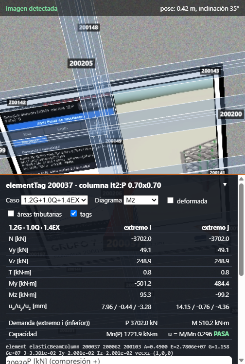
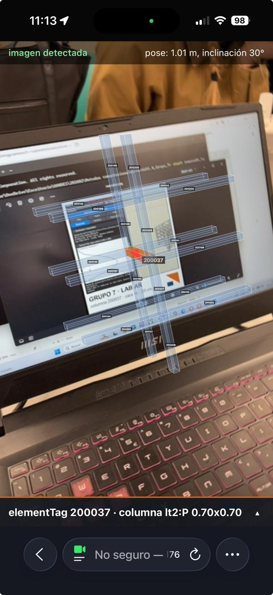
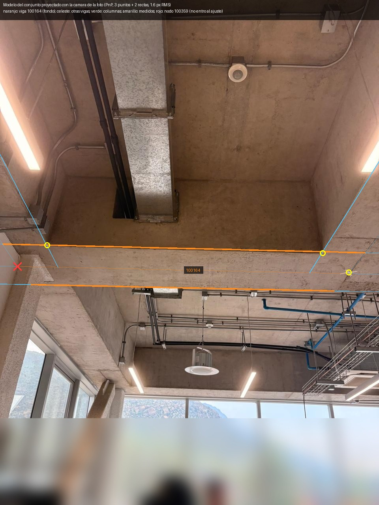

# Semana 6 — Validación AR y cierre técnico

**Grupo 7** · Métodos Computacionales en Obras Civiles, UAndes
Integrantes: Pedro Castillo, Monserrat Cubillos, Eduardo Vergara
Repositorio: https://github.com/bitscochits/A1P3_Grupo_7
Commit entregado: el hash que figura en Canvas (rama `semana06`)

El edificio es el **conjunto**: los dos cuerpos del Edificio de Ingeniería
en un solo modelo, `data/modelo/conjunto.json`, con **558 nodos y 937
elementos**. Son el antiguo (planos 2017_67, tags 1xxxxx) y el LT2 (planos
2024_22, tags 2xxxxx), unidos por una junta de dilatación libre de 5 cm. El
peso propio es G = 97 885.36 kN = 63 736.38 + 34 148.98. El elemento de la
AR es la **columna 200037**.

> **Datos al 01-10.** Todos los números ya incluyen el cambio del 29-09 de
> Pedro (`cce28b9`): las vigas de Ingeniería pasaron a la viga tipo del LT2,
> V 0.60×0.80, corroborada en el plano 2017_67 y en terreno. Con eso G de
> Ingeniería subió de 52 600.50 a 63 736.38 kN, los NO PASA del conjunto
> bajaron de 119 a 105 filas y la columna 200037 casi no cambió (u 0.296 →
> 0.295 en el caso por defecto).

Dónde está cada cosa:

- la app de AR (el LAB): [`semana06_lab/`](../semana06_lab/README.md), con
  [`COORDENADAS.md`](../semana06_lab/COORDENADAS.md) y
  [`GUION_DEMO.md`](../semana06_lab/GUION_DEMO.md);
- los scripts de este avance y su evidencia:
  [`semana06/`](../semana06/README.md);
- lo que falta revisar a mano:
  [`semana05/QUE_REVISAR.md`](../semana05/QUE_REVISAR.md).

La regla de oro no cambia: **Python/OpenSees calcula, el JSON transporta y
el teléfono dibuja.** La app de AR no resuelve nada: toma los números del
anexo de OpenSees y los muestra encima de la imagen.

Todos los números de este informe salen de una salida real, con su comando.
Se volvieron a correr el 29-09 sobre la rama `semana06`, y el 02-10 con lo
que se agregó después de la prueba en terreno (§1.1, §3.1 y §4.1). Cuando
algo no se comprobó, se dice.

```powershell
python semana06\verificar_semana06.py        # §5: la tabla de QA, en vivo (6 s)
python semana06\traza_200037.py              # §4: la columna 200037, de la lámina al teléfono
python semana06\precision_ar.py              # §3: el presupuesto de error del registro
python semana06\proyeccion_terreno.py        # §4.1: la viga 100164 del modelo, dibujada sobre la foto real
python semana06_lab\verificar_ar.py          # la app de AR, criterio por criterio (Chrome o Edge)
python semana06_lab\verificar_ar.py --config semana06_lab\config_ar_viga_100164.json   # la viga en terreno
python semana06_lab\servir.py                # la app por https en la red local, para el iPhone
python comun\verificar_todo.py               # la suite: 57 de 57 el 02-10 (§6, error 27)
```

> **En una línea.** La cadena lámina → modelo → OpenSees → app está
> comprobada número a número. La app registra y sigue la imagen en Chrome
> con una cámara sintética. **El 30-09 se probó en un iPhone**: en la sala,
> con el marcador, y **en el edificio, sobre dos vigas reales** (100161 y
> 100164), usando una foto del lugar como imagen de referencia (§1.1). El
> modelo dibujado con la pose de esa foto cae sobre la viga real, y un nudo
> que no entró al ajuste cae a 2.4 cm de su columna (§4.1). Lo que sigue sin
> medirse **en el teléfono** es el error de la pose con la focal real (§6,
> errores 1 y 7).

> **Fe de erratas de la Semana 5.** Cuatro frases de
> [`reports/semana05.md`](semana05.md) quedaron desactualizadas.
>
> 1. La línea 861 dice "No hay build móvil": el build Web existe y se probó
>    en un iPhone 16 (commits `ff947ad` y `98bd102`, y el §6 del mismo
>    informe).
> 2. Las líneas 85 y 842-844 ponen el suelo en −4.01 como "provisorio": hoy
>    está en −7.97 con `provisorio: false`
>    (`edificios/lt2/perfiles/lt2_2024_22.json`, `terreno`).
> 3. La línea 777 dice que dos entradas de la suite fallan con
>    `StreamingAssets` en el conjunto. Era un problema de estado, no de
>    cálculo: comparan `StreamingAssets/superposicion.json` con el del LT2.
>    Desde `d55d276` (Pedro, 29-09) lo versionado vuelve a ser el LT2, y la
>    suite completa da **52 de 52** (01-10).
> 4. CLAUDE.md daba la escala de la deformada del conjunto como x83: hoy es
>    **x160** (Ingeniería x110, LT2 x74). La escala la recalcula Python, y
>    cambió con los pilares 0.70×0.70, las 15 combinaciones y las vigas
>    V 0.60×0.80. CLAUDE.md ya está corregido.

---

## 1. Flujo AR

```
 imagen impresa   ─MindAR─▶  POSE        ─▶  ANCHOR          ─▶  TRANSFORM          ─▶  ELEMENTO      ─▶  RESULTADO
 (20 cm, en la               imagen→cámara    sistema de la        M = S(k)·Rᵀ·T(−c)       200037, con       P, M, Mn, u,
  columna o en               4×4, en cada     imagen, 1 u =        OpenSees → anchor       su tag de         esfuerzos y
  la mesa)                   cuadro           20 cm                (§2)                    OpenSees          desplazamientos
```

| paso | qué es | dónde está | cómo se comprobó |
|---|---|---|---|
| **Marker** | La imagen de referencia: la captura 14 del visor del conjunto, recortada sin reescalar (1000 × 1010 px). MindAR le encuentra 281 puntos de detección; la primera candidata, una captura agrandada, tenía 21. Se imprime a **20.0 cm**, y el PDF trae una regla de 10 cm para comprobar la impresión. Se pega en la cara +x de la columna 200037 (modo *sitio*) o sobre una mesa (modo *maqueta*, 1:50) | `semana06_lab/marcador/generar_marcador.py` → `marcador_imprimir.pdf`; `compilar_marcador.py` → `web/targets.mind` | `verificar_ar.py` [4]: la app detecta la imagen en las 3 poses del video sintético |
| **Pose** | En cada cuadro, MindAR busca la imagen y estima su pose respecto de la cámara: una matriz 4×4 de rotación y traslación, en píxeles de la imagen. La estima con **su propia cámara**, de 45° de campo vertical fijo. Un filtro One Euro la suaviza | `web/ar.js:358-360` (`imageTargetSrc`, `filterMinCF 0.0001`, `filterBeta 0.001`); cámara en `web/vendor/mindar/controller-mGt1s8dJ.js:55189` | [4], con la imagen a 0.45, 0.55 y 0.60 m: distancia estimada 0.451 / 0.551 / 0.597 m (error 1.1 / 0.6 / 2.6 mm) y ejes a 1.1° / 0.7° / 0.9° de los verdaderos |
| **Anchor** | El grupo de three.js que MindAR mueve con esa pose. Tiene el origen en el centro de la imagen, x a la derecha, y hacia arriba de la imagen y z saliendo de ella. **1 unidad = el ancho impreso** (0.20 m). Lo que cuelga del anchor queda pegado a la imagen | `ar.js:363-364` (`mindar.addAnchor(0)`, `anchor.group.add(modelo)`) | [3b]: el centro de la pose cae en el origen del anchor, [0, 0, 0], en los dos modos |
| **Transform** | La matriz fija que lleva un punto de OpenSees (m) al anchor: `M = S(k)·Rᵀ·T(−c)` (§2). El teléfono la arma con lo que manda Python: el centro `c` de la imagen y sus ejes `R`, **escritos en coordenadas de OpenSees** | `ar.js:44` `matrizModeloAAnchor` = `exportar_ar.py:89` `a_anchor`; la pose de la imagen en el edificio, `exportar_ar.py:138` `pose_del_marcador` | [3a]: ejes ortonormales y derechos, con residuo 0.0e+00. [3b]: la matriz de `ar.js`, corrida en Chrome, es la de Python a 2.8e-14 anchos en los 22 nodos; la columna mide 3.960 m a 1:1 y 7.9 cm a 1:50 |
| **Elemento** | El sector: 21 barras y 22 nodos alrededor de la columna (las barras con algún extremo a menos de 6 m de su eje, entre −0.05 y 3.91), cada una con **su tag de OpenSees**. La 200037 va en naranjo. Tocar una barra la selecciona por su tag (raycast) | `exportar_ar.py:191` `sector`; `ar.js:369-375` | [1]: los 21 elementos y los 22 nodos tienen el mismo tag, nodos, tipo, sección y coordenadas que `data/modelo/conjunto.json`, y la línea `element elasticBeamColumn <tag> <n1> <n2>` del anexo nombra los mismos |
| **Resultado** | El panel muestra el caso elegido (hay 15: 4 base y 11 combinaciones): N, V, T y M en los dos extremos, los desplazamientos, la demanda P-M (P, M, Mn y u) y la curva de interacción. En 3D dibuja el diagrama de momento y la deformada (x160). **El teléfono no calcula**: lee `ar.json`, que Python arma a partir del anexo de OpenSees | `ar.js:260` `actualizarPanel`; `web/datos/ar.json` ← `exportar_ar.py` ← `data/unity/semana04.json` ← OpenSees | [2]: 23 024 números de la app son idénticos bit a bit a los del anexo. El §4 compara el anexo con OpenSees resuelto de nuevo |

**Por qué es AR web y no Unity.** Los tres integrantes tienen iPhone y el
grupo no tiene Mac. AR Foundation con ARKit exige compilar en Xcode, que solo
corre en macOS. Por eso la app es **AR en el navegador**: MindAR hace el
seguimiento de la imagen y three.js dibuja, en Safari. Safari exige https
para abrir la cámara, así que `servir.py` sirve la app con un certificado
firmado por el PC para su IP. La decisión y la alternativa están en
[`semana06_lab/README.md`](../semana06_lab/README.md).

### Cómo reproducirlo

1. Imprimir `semana06_lab/marcador/marcador_imprimir.pdf` **al 100 %** y
   medir la regla de 10 cm. Si no mide 10.0 cm, corregir `ancho_impreso_m`
   en `config_ar.json` y correr `exportar_ar.py`.
2. `python semana06_lab\servir.py`. Imprime la dirección, por ejemplo
   `https://192.168.1.13:8443`. La primera vez, Windows pregunta si Python
   puede recibir conexiones: hay que permitirlo en redes privadas.
3. En el iPhone, conectado al mismo WiFi, abrir esa dirección en Safari.
   Aceptar el aviso del certificado ("Mostrar detalles → visitar este sitio
   web"), elegir **Maqueta** y permitir la cámara.
4. Apuntar a la imagen. Tiene que salir "imagen detectada", y encima, la
   columna 200037 en naranjo con su panel.
5. En el PC, `python semana06_lab\verificar_ar.py`: los cuatro bloques, en
   unos 30 s.

Lo que se comprueba sin teléfono lo hace el paso 5. El paso 3, Safari con la
cámara real, **se hizo el 30-09** en un iPhone del grupo (captura en
[`semana06/evidencia/iphone/`](../semana06/evidencia/iphone/LEEME.md); lo que
muestra y lo que no, en §1.1).



*Captura de `verificar_ar.py`: Chrome de escritorio con **video sintético**,
no un iPhone. La imagen está a 42 cm con 35° de inclinación. Arriba dice
"imagen detectada" y la pose estimada. La columna 200037 va en naranjo sobre
la imagen, a 1:50, y abajo están los números de OpenSees de
`1.2G+1.0Q+1.4EX`.*

### 1.1 En el teléfono y en el edificio (30-09 a 02-10)

**En el iPhone.** La app corrió en Safari, servida por `servir.py`, y
reconoció el marcador:



*Captura de pantalla **del teléfono**. Dice "imagen detectada", la pose
estimada (1.01 m, 30°) y `elementTag 200037 · columna lt2:P 0.70x0.70`. El
marcador estaba en la pantalla de un notebook, **de pie**: el modo maqueta
supone la imagen acostada, por eso el sector se ve en planta. Y la pantalla
no mide 20 cm, así que la distancia de 1.01 m no es la real. Prueba la
sesión AR, la detección, el anchor y el tag en el teléfono; **no** mide
error.*

**En el edificio: una foto del lugar como imagen de referencia.** Pegar el
marcador en una columna exige confirmar cuál es (§3, punto 2) y dejarlo
plano y derecho. En terreno se probó otra cosa: **la imagen de referencia
puede ser una foto de la estructura misma**. MindAR no necesita un
marcador, sino una imagen plana con detalle. Hay dos conjuntos de datos
más, que se eligen en la pantalla de inicio de la app:

| conjunto | imagen de referencia | cómo se ubica la imagen en el edificio | elemento |
|---|---|---|---|
| `config_ar.json` (por defecto) | el marcador impreso | en la cara +x de la columna, a 1.40 m (`pose_del_marcador`) | columna **200037** |
| `config_ar_viga_100161.json` | foto **de frente** del fondo de la viga, con un access point (`marcador/foto_viga_100161.jpg`) | el recorte va de borde a borde del fondo: su alto es b = 0.60 m, lo que da la escala (1.12 m de ancho), y su centro está a 0.30 m de la cara de la viga 100316 medido en terreno (`pose_en_viga`) | viga **100161** |
| `config_ar_viga_100164.json` | foto **en diagonal** del cielo, con una X de cinta en el nodo 100352 (`marcador/foto_vigas_100352.jpg`) | **PnP**: la pose desde la que se tomó la foto se ajusta con 3 puntos y 2 bordes de vigas cuya posición da el modelo, con la focal del iPhone (26 mm eq.). La imagen es el plano de la foto a la profundidad de la X (`camara_de_la_foto`, `pose_por_foto`) | viga **100164** |

El flujo es el mismo de arriba: solo cambia el primer eslabón.

```
 foto del lugar  ─PnP (PC)─▶  pose de la foto en el edificio (c, R)  ─▶  igual que arriba:
                               ↑ 3 puntos + 2 bordes del modelo          POSE → ANCHOR → M_AO → ELEMENTO → RESULTADO
```

**Lo que se agregó a la app** (`web/ar.js`; solo transforma y dibuja, no
calcula nada estructural):

- **Cada modo, su imagen.** En sitio, la app busca la foto del lugar; en la
  maqueta, el marcador impreso, con su ancho real (una foto del cielo de
  2.9 m acostada en una mesa no sirve). Una imagen por archivo de MindAR:
  con la foto del access point y el marcador en el mismo archivo, la foto
  dejaba de detectarse a 40° + 20° de giro (medido 3 veces); sola, sí.
- **Calce a mano.** Botones que corren, giran y escalan el modelo sobre la
  imagen: una matriz más, `A = T(t)·R_z(θ)·S(s)`, en el sistema de la
  imagen. Se guarda en el teléfono y se muestra, para pasarla a la
  configuración.
- **Giroscopio.** Al perder la imagen (por ejemplo, al alejarse), la app
  guarda la última pose y le aplica el giro que mide el teléfono. Así el
  modelo queda fijo al mirar para los lados. **Solo giros**: si se camina,
  se corre.
- **Cuánto se dibuja.** El sector de las vigas se exporta con 25 m de
  radio (126 y 140 barras), y el teléfono elige dibujar 6, 12 o 25 m.

**Cómo se comprobó.** `verificar_ar.py --config <conjunto>` corre los mismos
cuatro bloques en cada conjunto. Cada modo se prueba con **su** imagen en
el video sintético, y la foto del cielo además con el ajuste de la foto
(§3.1). Resultado del 02-10: 32, 43 y 44 OK, 0 FALLA. Están en la suite.

---

## 2. Transformación

Hay cuatro sistemas. Todos son de mano derecha, salvo el de Unity:

| sistema | origen y ejes | unidad |
|---|---|---|
| **O**, OpenSees | el del modelo; x al este, y al norte, z vertical | m |
| **I**, imagen | el centro de la imagen impresa; x a la derecha, y hacia arriba de la imagen, z saliendo de ella | m |
| **A**, anchor de MindAR | el mismo de I | 1 = el ancho impreso, w = 0.20 m |
| **C**, cámara | la del teléfono, que se mueve | — |

**La pose de la imagen en el edificio** es un dato del modelo, no del
teléfono. La arma Python (`exportar_ar.pose_del_marcador`) desde la columna
y `config_ar.json`:

- el **centro** `c` está sobre el eje de la columna, desplazado medio ancho
  (0.35 m) hacia la cara +x y levantado 1.40 m sobre el nodo inferior;
- los **ejes** son `R = [eₓ e_y e_z]` (en columnas): e_z es la normal de la
  cara, e_y es +z de OpenSees (arriba) y eₓ = e_y × e_z.

Un punto `p` de OpenSees pasa a la imagen y al anchor así:

```
q = Rᵀ (p − c)                     (m, en el sistema de la imagen)
a = k · q,   k = s / w             (anchos de imagen; s = 1 en sitio, 0.02 en maqueta)
```

En coordenadas homogéneas es una **composición de tres transformaciones**:
una traslación, una rotación y una escala uniforme:

```
M_AO = S(k) · [Rᵀ 0; 0 1] · T(−c)  =  ⎡ k eₓᵀ   −k eₓ·c ⎤
                                       ⎢ k e_yᵀ  −k e_y·c ⎥
                                       ⎢ k e_zᵀ  −k e_z·c ⎥
                                       ⎣  0  0  0     1   ⎦
```

Es literalmente la matriz de `ar.js:44-54`, fila por fila. Lo que se ve en
la pantalla es la cadena entera:

```
x_pantalla  =  P_MindAR · T_CA(t) · M_AO · p
               proyección  pose (cambia  fija: la manda Python
               de MindAR   en cada       en ar.json
                           cuadro)
```

`T_CA(t)` sale del seguimiento en cada cuadro. `M_AO` no cambia mientras no
se mueva la imagen. **El registro es `M_AO`**: dice dónde está la imagen
dentro del edificio.

**Con lo que se agregó en terreno (§1.1)**, la cadena gana dos factores, y
ninguno es cálculo estructural:

```
x_pantalla  =  P_MindAR · T_CA(t) · A · M_AO · p

A = T(t) · R_z(θ) · S(s)             calce a mano, en el sistema de la imagen (identidad si no se toca)
T_CA(t) = R(q_t⁻¹ · q₀) · T_CA(t₀)   si se pierde la imagen: la última pose, girada con el giroscopio
```

`q₀` es la orientación del teléfono en el último cuadro con imagen y `q_t`
la de ahora. La pose vieja se gira con el giro relativo, y como la cámara
de MindAR está quieta en el origen, el modelo queda fijo en el espacio
mientras solo se gire el teléfono. El signo se comprueba en Chrome: girar
10° a la izquierda corre un punto del frente a la derecha en sen 10°
(`verificar_ar.py` [3c], error 2.1e-18).

**La pose de una foto del lugar (viga 100164).** Ahí `c` y `R` no salen de
una cara declarada, sino de **desde dónde se tomó la foto**. Para la cámara
de la foto (x a la derecha, y hacia abajo, z hacia adelante) vale:

```
u = f·X_c/Z_c + W/2,   v = f·Y_c/Z_c + H/2,   X_c = R_f (X − C)
```

con `f` = 961 px (26 mm equivalentes sobre la diagonal de 960 × 1280 px).
Se ajustan `R_f` y `C` por mínimos cuadrados con 3 puntos (la X = nodo
100352 y dos esquinas del fondo de las vigas) y 2 bordes de vigas, todos
con su posición en el modelo. Resultado: la cámara en C = (24.32, 50.20,
2.10), mirando al sur y 32° hacia arriba, con **1.6 px de error medio**.
**La focal no se ajusta**: con puntos casi en un plano, distancia y zoom se
compensan, y el ajuste libre se va a un teleobjetivo a 14 m bajo tierra
(medido). La imagen de referencia es el plano de la foto a la profundidad
de la X, d = 2.90 m. Su centro y sus ejes son:

```
c = C + d · R_fᵀ (u_c − W/2, v_c − H/2, f)/f
eₓ = R_fᵀ (1, 0, 0),   e_y = R_fᵀ (0, −1, 0),   e_z = R_fᵀ (0, 0, −1)
ancho = d · (ancho del recorte en px) / f = 2.899 m
```

Con eso, `M_AO` es la misma fórmula de arriba. Para el nodo 100352, en
sitio: p − c = (−1.229, −0.275, −0.102) m → q = (1.218, −0.262, −0.213) m
→ a = q/2.899 = (0.420, −0.090, −0.073) anchos. En la maqueta (marcador
impreso de 0.20 m, 1:50, origen en el piso bajo la viga): q = (1.249,
0.046, 3.96) m → a = (0.125, 0.005, 0.396) anchos: 2.5 cm a la derecha y
7.9 cm sobre la mesa.

**Los números.** En modo **sitio**, c = (−2.38, 55.0833, 1.35),
eₓ = (0, 1, 0), e_y = (0, 0, 1), e_z = (1, 0, 0) y k = 1/0.20 = 5:

```
M_AO = ⎡ 0  5  0  −275.4165 ⎤      el techo de la columna, nodo 200103, p = (−2.73, 55.0833, 3.91):
       ⎢ 0  0  5    −6.75   ⎥      p − c = (−0.35, 0, 2.56)  →  q = (0, 2.56, −0.35) m
       ⎢ 5  0  0    11.90   ⎥      a = 5 q = (0, 12.8, −1.75) anchos
       ⎣ 0  0  0     1      ⎦      2.56 m sobre el centro de la imagen y 0.35 m detrás (el eje)
```

En modo **maqueta**, c es la base de la columna (−2.73, 55.0833, −0.05). Los
ejes son eₓ = (0, 1, 0), e_y = (−1, 0, 0) y e_z = (0, 0, 1): la imagen queda
acostada y su normal es la vertical. La escala es s = 0.02 (1:50), así que
k = 0.1. El nodo 200103 queda en q = (0, 0, 3.96) m y a = (0, 0, 0.396)
anchos: 7.92 cm sobre la mesa.

**Por qué el anchor no invierte ejes y Unity sí.** three.js y OpenSees son
de mano derecha. `R` es una rotación propia (eₓ × e_y = e_z, det R = +1) y
`M_AO` tiene determinante k³ > 0: no refleja nada. Unity es de mano
izquierda, y por eso el visor de escritorio intercambia ejes,
`Unity(x, z, y)`. Esa permutación tiene determinante −1 a propósito. Las dos
salidas parten de las mismas coordenadas de OpenSees.

**Cómo se comprobó.** `verificar_ar.py` hace tres comprobaciones:

- [3a]: R es ortonormal y derecha, con residuo 0.0e+00 en los dos modos. El
  centro está a 0.350 m del eje, sobre la cara, y 1.40 m sobre el nodo
  inferior.
- [3b]: abre `ar.js` en Chrome y lee la matriz que armó. En los 22 nodos
  coincide con la de `exportar_ar.py`: el peor caso es 2.8e-14 anchos en
  sitio y 5.6e-16 en maqueta, contra una cota de 1.7e-11. La columna mide
  3.960 m a 1:1 y 7.9 cm a 1:50.
- [4]: comprueba que `T_CA` sea la pose verdadera (§1 y §3).

---

## 3. Precisión

**En tres líneas.** Un error de ángulo Δθ en la pose mueve un punto que
está a una distancia r del centro de la imagen en r·Δθ. Un error de escala ε
(la distancia que estima MindAR, o el ancho impreso) lo mueve ε·r. A eso se
suman el corrimiento de la imagen entera (cómo se pegó) y los sesgos (a qué
nivel está el nodo). Con el error medido en video sintético (Δθ = 1.1°):

- **Maqueta 1:50:** 1.7 mm en el techo de la columna y 4.8 mm en el nodo
  más lejano (suma cuadrática).
- **Sitio 1:1:** 7.3 cm en el techo de la columna, y 8.8 cm con 5 cm de
  sesgo de nivel.

**Ninguno de los dos cuenta la focal ni se midió en un iPhone.** Todo sale
de `python semana06/precision_ar.py` (evidencia:
[`semana06/evidencia/precision_ar.txt`](../semana06/evidencia/precision_ar.txt)).
La transformación no aporta error: Python y `ar.js` coinciden a 2.8e-14.
Todo el error es físico.

**El brazo.** En sitio, el techo de la columna (200103) está a |q| =
2.58 m del centro de la imagen. El nodo más lejano del sector (200117) está
a 10.70 m, porque el sector toma una barra si cualquiera de sus extremos
está a menos de 6 m. En maqueta esos brazos se dibujan a 7.9 cm y 21.9 cm
(nodo 200122).

### Fuentes de error

| # | fuente | valor que se usa | sitio, 200103 | sitio, 200117 | maqueta, 200103 / 200122 | de dónde sale |
|---|---|---|---|---|---|---|
| 1 | pose de MindAR, ángulo | 1.1° (el peor de 3) | 4.96 cm | 19.94 cm | 1.52 / 4.21 mm | **medido en video sintético** (`verificar_ar.py` [4]; la imagen ocupaba 193–258 px) |
| 2 | pose de MindAR, distancia | 0.43 % (2.6 mm a 0.60 m) | 1.12 cm | 4.63 cm | 0.34 / 0.95 mm | ídem |
| 3 | escala de impresión | 1 % | 2.58 cm | 10.70 cm | 0.79 / 2.19 mm | **supuesto**; se elimina midiendo la regla de 10 cm |
| 4 | colocación: corrimiento | 5 mm | 0.50 cm | 0.50 cm | no aplica | **supuesto** |
| 5 | colocación: giro en su plano | 1° | 4.47 cm | 16.16 cm | no aplica | **supuesto**; se reduce pegando la imagen con un nivel |
| 6 | nivel del nodo contra el piso terminado | 5 a 10 cm | 5–10 cm | 5–10 cm | no aplica | **sesgo por medir**: −0.05 es un nivel de losa de 15 cm y el modelo no tiene el piso terminado |
| 7 | focal que supone MindAR | 45° fijo; iPhone 70° en el lado largo (**supuesto**) | 309–707 px de pantalla | hasta 968 px (nodo 200061) | 6–13 / 67–115 px | **no verificado**: simulado (ver abajo) |
| 8 | cuál es la columna física | 200037 es la tercera de su eje desde la base | 0 o 3.96 m | ídem | no aplica | **no verificado**: se confirma en obra |
| 9 | temblor del filtro de pose | `filterBeta 0.001` | — | — | — | **no medido** |

En las filas 1 a 5, cada corrimiento se calcula **exacto**: se gira o
escala la pose con la misma `a_anchor` de la app y se mide cuánto se mueve el
nodo. En la fila 1 se toma el eje de giro que más lo mueve. Por eso 200117
da 19.94 cm y no los 20.5 de r·Δθ, que es una cota.

### Combinación

- **Sitio, techo de la columna:** 7.26 cm en suma cuadrática de las filas 1
  a 5, y 13.63 cm en el peor caso. Con 5 cm de sesgo de nivel quedan 8.82 y
  18.63 cm. Con 10 cm, 12.36 y 23.63 cm. En el nodo más lejano, 28.2 cm en
  suma cuadrática.
- **Maqueta:** 1.75 mm en suma cuadrática y 2.66 mm en el peor caso en el
  techo, y 4.84 / 7.35 mm en 200122.

**Lo que el ensayo no cubre en sitio.** En el ensayo la cámara estaba a
0.45–0.60 m. Para ver la columna entera hay que pararse a 1.5 m, y ahí la
imagen se ve 2.5 a 3.3 veces más chica. Extrapolando el error como 1/tamaño,
el ángulo sube a 1.9–3.7°, o sea **8.6 a 16.5 cm** en el techo. Es una
extrapolación, no una medición. Se evita acercándose o imprimiendo la
imagen más grande (A3, 40 cm).

### Lo que queda fuera de la combinación, sin ocultarlo

1. **La focal (fila 7).** MindAR estima la pose con una cámara de 45° de
   campo vertical, sea cual sea el teléfono (`controller-mGt1s8dJ.js:55189`).
   Los puntos del plano de la imagen quedan bien igual. Los que están fuera
   de ese plano se desvían: el eje de la columna está 35 cm detrás de la
   imagen, y en maqueta la columna entera se para sobre ella.
   - `precision_ar.py` [4] lo simula. Genera lo que vería una cámara de
     verdad y ajusta la pose como MindAR, con su focal. Comprueba la
     simulación contra la fórmula cerrada de frente: 12.322 px = 12.322 px.
   - Con 70° en el lado largo del iPhone (un **supuesto**), la app diría que
     la imagen está 1.18 a 1.50 veces más lejos de lo que está. En sitio el
     techo se correría 309 a 707 px de pantalla. En maqueta el nodo 200122
     se correría 67 a 115 px (3.7 a 6.4 mm de pantalla), 2.5 a 4 veces todo
     lo anterior junto.
   - El ensayo [4] **no puede verlo**, porque su video se genera con la
     misma cámara de 45° (`verificar_ar.py:226`).
   - Se mide con la cinta (prueba *a* de abajo).
2. **La columna (fila 8).** En su eje hay tres columnas desde la base: la
   200005 (−7.97 → −4.01), la 200021 (−4.01 → −0.05) y la 200037
   (−0.05 → 3.91). Los títulos de las láminas rotulan −0.05 como "cielo
   piso 1", así que la 200037 es la columna del **piso 2**. El LAB la
   llamaba "del primer piso"; se corrigió en `config_ar.json` y en
   `semana06_lab/README.md`. El edificio está en pendiente, así que hay que
   confirmar en obra cuál es antes de pegar la imagen. Equivocarse en un
   piso son 3.96 m.
3. **Qué representa la cota −0.05 (fila 6).** El perfil la rotula como un
   nivel de losa y no dice si es su cara superior o su eje. De eso depende
   que el sesgo sea de 5 o de 10 cm. Por eso queda como algo por medir, no
   como un número.

### La prueba para medirlo en el iPhone

`precision_ar.py` [5] la imprime con los valores que tiene que dar. Hay una
tabla para anotarla en
[`semana06/evidencia/iphone/LEEME.md`](../semana06/evidencia/iphone/LEEME.md).

- **a) Focal, con una cinta.** Poner el teléfono de frente a la imagen a 30,
  50 y 80 cm; la barra "pose:" tiene que decir lo mismo que la cinta. Si
  dice 1.27 o 1.69 veces lo medido, se confirma la fila 7, y esa razón es la
  corrección.
- **b) Temblor.** Dejar el teléfono apoyado 10 s y grabar la pantalla. La
  dispersión de "pose:" es el temblor.
- **c) Maqueta, con una regla.** Desde el centro de la imagen, el nodo 200064
  tiene que quedar a 17.8 cm en x y el 200078 a 10.0 cm en −y. Los dos están
  sobre la mesa, así que no hay paralaje, pero **no ven la focal**. Para
  verla hay que poner una regla **vertical**: el techo de la columna tiene
  que quedar a 7.92 cm de la mesa.
- **d) Sitio.** Primero confirmar la columna (punto 2). Después, pegar cinta
  en las dos aristas de la cara +x, a 0.5, 1.0 y 2.0 m sobre el centro de la
  imagen: la caja dibujada, de 0.70 m, tiene que calzar con ellas. La
  distancia entre la base dibujada y el piso real es el sesgo de nivel, y se
  corrige con `altura_centro_m = 1.40 + Δ`.

### 3.1 Medido en terreno: la viga 100164

Con la foto del cielo (§1.1) hay algo que el marcador no da: **puntos de
la estructura real cuya posición en el modelo se conoce**. Con ellos el
error de registro se mide en la foto misma, en vez de suponerlo
(`python semana06/proyeccion_terreno.py`, evidencia
[`semana06/evidencia/terreno/`](../semana06/evidencia/terreno/proyeccion_viga_100164.txt)).

| # | fuente | valor | en el edificio | de dónde sale |
|---|---|---|---|---|
| 1 | ajuste de la foto | 1.6 px de error medio, 3.9 px el peor | 4.8 mm medio, 1.2 cm el peor, a la profundidad de la X (2.90 m) | **medido**: los 3 puntos y 2 bordes, reproyectados (`verificar_ar.py` [3a]) |
| 2 | **comprobación independiente** | el nodo 100359, que no entra al ajuste, cae a **7.3 px** de la columna blanca | **2.4 cm** | **medido**; la tolerancia es 15 px porque el centro de la columna se ubica a ojo |
| 3 | focal supuesta (26 mm eq.) | con 24 mm la cámara se corre 0.21 m y el eje gira 1.25° | hasta **10 cm** en el dibujo de los nudos a menos de 6 m | **medido** rehaciendo el ajuste con 24, 26 y 28 mm. El ajuste no distingue entre ellas (1.71, 1.57 y 1.47 px). La comprobación prefiere apenas la más corta (5.5, 7.3 y 11.6 px) |
| 4 | pose de MindAR sobre la foto | distancia 0.1 a 1.2 % y ejes a 1.0–2.4° (varía un poco entre corridas) | a 3 m, 1° son 5 cm | **medido en video sintético** con la foto a 6.5–8.7 m (la foto mide 2.9 m: misma escala en píxeles que el marcador) |
| 5 | nivel: modelo de ejes | la viga se dibuja centrada en su eje, con el fondo en eje − h/2 = 3.51 | si la cota del nodo es la cara superior de la losa, el fondo real está en 3.11: **0.40 m** | **no medido**. El ajuste calza el fondo dibujado con el real, así que el modelo entero queda corrido eso en la vertical respecto de la obra. Consistente con la cámara ajustada a 2.15 m sobre −0.05 (un teléfono en la mano, a ~1.75 m del piso real) |
| 6 | paralaje de una foto en diagonal | la imagen es un plano; la estructura, no | crece al alejarse del punto desde donde se tomó la foto | **no medido**; por eso conviene pararse donde se tomó |

**En resumen:** parado donde se tomó la foto, la viga dibujada cae sobre la
real con un error de **2 a 5 cm** en la foto misma (filas 1 y 2), al que
hay que sumarle hasta 10 cm por no conocer la focal (fila 3). Además está
el corrimiento vertical de **0.40 m** del modelo de ejes (fila 5). Las
filas 1 y 2 se miden en la foto, no en el video del teléfono: medir en
vivo sigue pendiente (§6, error 7).

---

## 4. Resultados: un elemento real, de la lámina al teléfono

El elemento es la **columna 200037** del conjunto: el pilar del eje C del
cuerpo LT2, `lt2:P 0.70x0.70`, entre −0.05 y +3.91 m (el piso 2, §3). Cada
eslabón se comprueba contra el anterior con `python semana06/traza_200037.py`
(evidencia:
[`semana06/evidencia/traza_200037.txt`](../semana06/evidencia/traza_200037.txt),
todo OK). El tramo modelo → OpenSees → JSON → float32 de Unity lo cubre
`python semana04/trazabilidad.py conjunto 200037`, que termina en "LA CADENA
CALZA".

| # | eslabón | evidencia | número |
|---|---|---|---|
| 1 | **Plano, planta** | `data/geometria/lt2.json`, lámina de referencia 2024_22-101 | un pilar de contorno cerrado de 0.70 × 0.70 m (rótulo `70x70`) en (32.3520, 18.1793) m, justo donde el modelo del LT2 pone su elemento **37** (nodos 62 → 103). El contorno está a (+0.116, −0.118) m del cruce de los ejes C y 2: la posición sale del dibujo del pilar, no del cruce de ejes |
| 2 | **Plano, elevación** | lámina **2024_22-305**, EJE C, cota −0.05 | `P.70x70  E Ø12a10 +4T Ø12a10 +4TL Ø12a10`. Cada traba amarra una barra intermedia en dos caras opuestas: 8 trabas dan 4 intermedias por cara, y con las 2 esquinas son 6 por cara, o sea 4·6 − 4 = **20 barras**. El Ø25 es **supuesto** (ρ = 2.00 %). La asignación queda con residuo 0.215 m, anotado en el dato |
| 3 | **Calce** | `edificios/conjunto/calce.json` | dx = −35.082 (entre caras, con la junta de 5 cm), dy = +36.904 (los ejes 1, 2 y 3 que comparten los planos), sin giro. El tag suma 200 000: 37 → **200037**, 62 → 200062 y 103 → 200103. (32.3520 − 35.082, 18.1793 + 36.904) = (−2.7300, 55.0833) |
| 4 | **Material** | `data/modelo/conjunto.json`, sección `lt2:P 0.70x0.70` | E = 27 805 574.98 kPa = 4700·√35·1000. La sección lleva su propio hormigón G35; el material del conjunto dice 28 MPa y la sección lo pisa |
| 5 | **OpenSees** | `ops.eleNodes(200037)` dentro del modelo construido | [200062, 200103]: el tag del JSON es el de OpenSees, sin tabla de traducción. La línea: `element elasticBeamColumn 200037 200062 200103 A=0.4900 E=2.7806e+07 G=1.1586e+07 J=3.381e-02 Iy=2.001e-02 Iz=2.001e-02 vecxz=(1,0,0)` |

### OpenSees contra lo que muestra la app (1.2G+1.0Q+1.4EX, el caso por defecto)

El conjunto se resolvió de nuevo con el motor del repo, y las fuerzas de
200037 se leyeron con `eleResponse(…, 'localForce')` **sin** el redondeo
del servidor:

| | N | Vy | Vz | T | My | Mz |
|---|---|---|---|---|---|---|
| OpenSees, extremo i | 3701.8253 | −49.0182 | −247.5748 | −0.8324 | 498.5698 | −95.1289 |
| app (`ar.json`), extremo i | 3701.8253 | −49.0181 | −247.5748 | −0.8323 | 498.5698 | −95.1289 |
| OpenSees, extremo j | −3701.8253 | 49.0182 | 247.5748 | 0.8324 | 481.8266 | −98.9831 |
| app (`ar.json`), extremo j | −3701.8253 | 49.0181 | 247.5748 | 0.8323 | 481.8266 | −98.9831 |

(Es el vector `localForce` `[N, Vy, Vz, T, My, Mz]` de cada extremo, en kN y
kN·m.)

- **Casos base G, Q, EX y EY:** la mayor diferencia entre la app y OpenSees
  es 4.95e-5, bajo la cota de 5e-5 (el servidor escribe 4 decimales).
- **La combinación:** la mayor diferencia es **7.65e-5 kN·m**, en T. La
  cota es 0.5e-4 × (Σ|λ| + 1) = 0.5e-4 × (3.6 + 1) = 2.30e-4: cada caso
  llega redondeado y se multiplica por su factor, y el anexo vuelve a
  redondear la suma.
- **Linealidad:** la misma combinación corrida como **un solo caso de
  carga** difiere de la suma en 1.1e-11 kN y 3.2e-16 m. El modelo es
  lineal, así que la suma del anexo es válida.
- **Desplazamientos:** la mayor diferencia es 1.17e-8 m, con cota 2.3e-8. El
  techo se corre ux = 14.07 mm. Entre los dos extremos hay 6.15 mm en
  3.96 m, pero con la combinación **mayorada** y la gravedad adentro: **no**
  es la deriva de NCh433.
- **Demanda:** manda el extremo i. Ahí P = 3701.8253 kN y
  M = √(498.57² + 95.13²) = 507.5641 kN·m (en j, M = 491.89). La curva de
  la familia 29 (20 Ø25, E Ø12a10) da Mn(P) = 1721.8685 kN·m, y
  u = M/Mn = **0.294775**, igual al de la app. PASA.
- **La combinación que gobierna** entre las 10 mayoradas no es la del caso
  por defecto: es **0.9G+1.4EX**, con P = 2270.6 kN, M = 474.2 kN·m,
  Mn = 1573.0 kN·m y **u = 0.301**, que PASA. Con menos axial, la columna
  queda bajo el balanceado y pierde más Mn de lo que baja M. Mn es
  **nominal, sin φ**: con φ = 0.65, u = 0.464, y sigue pasando.
- **Junta libre:** `lt2_G.json`, elemento 37, y `conjunto_G.json`, elemento
  200037, dan las mismas 12 fuerzas. El tag 37 también existe en Ingeniería
  (N = 1743.72 kN, otra columna): por eso el conjunto suma 100 000 y
  200 000.

### El panel del teléfono

Para `1.2G+1.0Q+1.4EX` el panel escribe (`ar.js:260`, con el mismo formato
que reproduce `traza_200037.py` [5]):

```
elementTag 200037 · columna lt2:P 0.70x0.70
N  −3701.8 / −3701.8 · Vy 49.0 / 49.0 · Vz 247.6 / 247.6 · T 0.8 / 0.8 · My −498.6 / 481.8 · Mz 95.1 / −99.0
u [mm]  7.92 / −0.44 / −3.28  y  14.07 / −0.75 / −4.36
Demanda (extremo i (inferior))  P 3701.8 kN  M 507.6 kN·m · Mn(P) 1721.9 kN·m · u = M/Mn 0.295 PASA
element elasticBeamColumn 200037 200062 200103 A=0.4900 E=2.7806e+07 …
```

El panel muestra esfuerzos **internos**, con la convención del anexo:
N = −f₀, así que la compresión sale negativa. P de la demanda es positiva en
compresión: −3701.8 y 3701.8 son el mismo axial. Son los números de la
captura del §1 (rehecha el 01-10 con los datos nuevos), y los de la tabla de
arriba redondeados.

**Dicho de frente.** Está demostrado que el elemento de la lámina, el del
modelo, el de OpenSees y el de la app son el mismo, con los mismos números.
**Que el modelo calce sobre la columna física no está demostrado:** la app
corrió en el iPhone (§1.1), pero la imagen no se pegó en la columna, que
además hay que confirmar en obra (§7, N2). Sobre una **viga** real sí se
demostró: §4.1. El Ø25 y el acero A630-420H son supuestos, y están marcados
en el dato.

### 4.1 Un elemento real en terreno: la viga 100164

La viga que se fotografió desde abajo el 30-09, entre la X de cinta y la
columna blanca, **es la 100164 del modelo**. Se comprueba así:

| | qué | número |
|---|---|---|
| **ID** | `element elasticBeamColumn 100164 100352 100359 A=0.4800 E=2.4870e+07 G=1.0363e+07 J=3.110e-02 Iy=2.560e-02 Iz=1.440e-02 vecxz=(0,0,1)` (la línea del anexo, la misma que muestra el panel) | `ingenieria:viga_x`, V 0.60×0.80 (las del LT2, corroboradas en plano y en terreno), L = 2.50 m, de (23.02, 47.70) a (25.52, 47.70), cota 3.91, viga del borde sur del cuerpo antiguo |
| **Nudos en terreno** | el nodo **100352** es la X pintada en el cruce con la viga 100316. El **100359** es donde llega la columna blanca, **que el modelo no tiene** (al 100359 solo llegan tres vigas: §6, error 30) | separados 2.50 m, como en el modelo |
| **Resultado** (OpenSees, anexo; `ar_viga_100164.json`) | `1.2G+1.6Q`: **My = −413.3 / −305.3 / −161.1 kN·m** (extremo i / centro / extremo j), Vz = 71.9 → 129.9 kN, T = 15.8 kN·m (es viga de borde), N = 0 (diafragma). Bajo G, el nodo 100352 baja 3.90 mm. En la app, el diagrama que se abre es My, que es donde trabaja la viga (vecxz vertical) | bit a bit con el anexo: `verificar_ar.py --config …100164.json` [2] |
| **Correspondencia** | el modelo dibujado sobre la foto real con la cámara ajustada (abajo). El fondo de la 100164 (naranjo) y el de las vigas que la cruzan (celeste) caen sobre los reales. El nodo 100359 (cruz roja), que **no entró al ajuste**, cae en la columna blanca | 7.3 px = **2.4 cm** (§3.1) |



*`python semana06/proyeccion_terreno.py --salida`. Es la foto que la app usa
como imagen de referencia en sitio, con el modelo del conjunto proyectado
**con la pose que se calcula de ella** (§2). Si la pose estuviera mal, las
líneas caerían corridas. Amarillo: los 3 puntos medidos; rojo: la
comprobación.*

Esto prueba el **registro**: la pose de la foto dentro del edificio, que es
lo que la app usa en sitio. No prueba lo que hace MindAR en vivo con la
cámara del teléfono: eso se probó en el iPhone (la app reconoció la foto
del access point en la viga 100161, y ahí se probó el calce a mano), pero
sin una medición de error en el teléfono (§6, error 1).

---

## 5. QA final estructural

La tabla sale de `python semana06/verificar_semana06.py`, que corre las diez
pruebas **en vivo** sobre el conjunto en 6 s. Cada fila tiene su criterio
escrito en el código, y el script termina con código 1 si una fila da FALLA.
**PARCIAL** quiere decir que la fila cumple lo que se puede comprobar, pero
que hay algo abierto que la misma prueba mide. Evidencia:
[`semana06/evidencia/qa_semana06.md`](../semana06/evidencia/qa_semana06.md).
El script está en la suite.

| Prueba | Estado | Número | Cómo se comprobó |
|---|---|---|---|
| Equilibrio G | **OK** | aplicada −97 885.3604 kN, reacción 97 885.3605 kN: error **8.6e-5 kN** (cota 4.2e-3). G = 97 885.36 = 63 736.38 + 34 148.98: cada cuerpo calculado desde su propio modelo, y los tres son los números de control que el script lee de CLAUDE.md | `calcular.equilibrio` sobre el G del anexo, resuelto ahora. La cota es 84 apoyos que cuentan en Fz × 0.5e-4 (el redondeo del servidor). Las reacciones se separan por grado de libertad: sumar todas dobla el corte |
| Equilibrio Q | **OK** | aplicada −20 509.6333 kN, reacción 20 509.6332 kN: error **9.0e-5 kN** (cota 4.2e-3) | Es el Q del anexo, el que muestra Unity: q = 3.0 kN/m² uniforme por área tributaria |
| Corte basal EX | **OK** | V = **10 814.0177 kN** aplicado, −10 814.0177 kN en los apoyos: error 5.9e-6 (cota 2.25e-3, 45 apoyos fuera de diafragma). V = 0.10 × (97 885.36 + 0.5 × 20 509.63) = 0.10 × 108 140.18 | El peso sísmico se controla por fuera de `armar_casos`: G y Q se suman de sus propios casos. El reparto es el triangular invertido declarado: F_i/(W_i·h_i) = 0.0088636 en los 10 diafragmas (desvío 2.0e-16). Sumar la columna entera de reacciones daría −31 474.95 kN (×2.91) |
| Corte basal EY | **OK** | 10 814.0177 kN contra −10 814.0174 kN: error 3.1e-4 (cota 2.25e-3) | Igual que EX. Sumar la columna entera daría −25 717.39 kN (×2.38) |
| Superposición | **OK** | **33 de 33** comparaciones dentro de la cota: 11 combinaciones × desplazamientos, reacciones y fuerzas `localForce`. La peor llega a 1.000 de la cota (1.4G, fuerzas) | `combinar.verificar` en las 11 combinaciones de `semana03/parametros.json`, contra OpenSees resuelto **con la carga combinada**, en todo el modelo (3348 GDL, 564 reacciones y 11 244 fuerzas por combinación). La cota es el redondeo del servidor más la coma flotante, `0.5·10⁻ᵈ(Σ\|λ\|+1) + 4ε·Σ\|λ\|·\|valor\|`. Además: la combinación de 200037 corrida como un caso difiere de la suma en 1.1e-11 (§4); los 15 casos del anexo son la suma de los base (`verificar_semana04.py conjunto` [2] y [3], en la suite); y los sliders de Unity combinan como Python (`verificar_instantanea.py`, en la suite con el LT2; el registro del conjunto de `semana05_lab/capturas_conjunto/` es anterior al cambio de vigas y no se usa) |
| M-phi | **OK** | columna 200037 a P = 0: Mn (hormigón a 0.003) = **1190.2** kN·m contra Whitney a mano 1194.6 (**0.37 %**). La rigidez fisurada de la curva es 201 835 kN·m² y Ec·I_cr a mano 202 176 (0.17 %). M_max 1549.1 kN·m en φ = 0.2027 1/m; ductilidad de curvatura 43 | Criterio: fibras contra cálculo a mano ≤ 2 %. Ese umbral detecta un diámetro menos: con Ø22, Whitney baja 20.5 %. El mallado de 20 contra 40 fibras da 0.22 %, dentro del < 0.5 % que declara `capacidad.py`. La curva la corta el acero en εsu = 0.10 (supuesto A630-420H), no el análisis |
| P-M columna | **OK** | tracción pura −4123.3 = −As·fy (exacta); flexión pura, fibras contra Whitney **0.37 %**; balanceado (P = 6232 kN), fibras 1751.7 bajo Whitney 2025.9 (15.7 %, del lado seguro). Gobierna 0.9G+1.4EX con **u = 0.301**, PASA | La curva del anexo (familia 29, 12 puntos) coincide con `capacidad.interaccion` a 4.2e-5. La u de los 15 casos, rehecha con `demanda_capacidad` sobre los esfuerzos del anexo, coincide con la guardada (peor 3.5e-7). En el balanceado, sin confinar da 1901.6 (6.5 %): el confinamiento explica cerca de la mitad de la diferencia |
| P-M muro | **PARCIAL** | 100537 (antiguo, 0.30×16.85, My): u = **0.577** en 0.9G−1.4EY. 200009 (LT2, 0.25×7.95, Mz): u = **0.662** en 0.9G+1.4EY. Los dos PASAN | **Cierra:** tracción pura exacta; el momento del plano, elegido por inercias, es el grande (en EY, 31 162.9 contra 19.7 kN·m fuera del plano); la curva del anexo es `capacidad.interaccion`; la u rehecha es la del anexo; y con las mismas hipótesis (mismo sentido, sin endurecimiento y 40 fibras) fibras = Whitney al 0.19 % y 0.38 %. **Abierto, y medido:** (1) 20 fibras no alcanzan en un muro largo: a P = 0, Mn sale 4.3 % (100537) y 2.2 % (200009) sobre el de 40 fibras. Con 40, las u que gobiernan pasan a 0.589 y 0.667, y ninguna cambia de PASA a NO PASA. (2) Cerca de P = 0 la curva incluye el endurecimiento de Steel01 (+15.6 % y +11.6 %): no es el Mn nominal de ACI. Por eso `verificar_rc.py` imprime −16.4 % en 100537 |
| IDs Unity | **OK** | 558 nodos y 937 elementos con el **mismo tag** en el modelo, el visor, el anexo y el GameObject: `Elem_200037_columna` = `element elasticBeamColumn 200037 200062 200103` | `comun/test_contrato_unity.py conjunto`: "EL CONTRATO JSON <-> UNITY ESTA SANO", con 96 de 96 muros iguales a su cuerpo de origen. Hay 0 diferencias de tag, nodos, tipo, sección y coordenadas entre `data/modelo/conjunto.json` y `data/unity/conjunto.json`. El nombre del GameObject sale de `VisorEstructura.cs:507` |
| AR | **OK** | la app coincide con OpenSees bit a bit (23 024 números en la 200037); la matriz de `ar.js` con la de Python a 2.8e-14; el tracking sintético da 0.6–2.6 mm y ≤ 1.1°. **Probada en un iPhone** el 30-09 (captura del teléfono) y en terreno sobre dos vigas: la 100164 dibujada sobre la foto real, con un nudo de control a 2.4 cm (§4.1) | `semana06_lab/verificar_ar.py` [1] a [4] en los tres conjuntos de datos (§1, §1.1 y §2), `semana06/proyeccion_terreno.py` y la captura de `semana06/evidencia/iphone/`. Lo que falta, el error medido **en el teléfono**, está en el §6, errores 1 y 7 |

**Dos cortes basales, y por qué.** `python comun/sismo.py conjunto`
informa 9 939.79 kN, no 10 814.02. Lee el EX guardado en `data/modelo/`, que
arma cada cuerpo con **su** peso sísmico. Ese caso también cierra (error
1.0e-5 kN). La diferencia, 874.23 kN, se explica completa:

- +233.93 kN por el peso aplicado directamente sobre los apoyos, que el
  anexo cuenta en W y el modelo no;
- +741.46 kN por la fracción de sobrecarga (el LT2 del modelo usa 0.25·Q de
  planos, Ingeniería no mete Q, y el anexo usa 0.5·Q con q = 3.0);
- −101.15 kN por la fórmula propia de Ingeniería.

Unity y la app muestran el del anexo. Los desplazamientos máximos lo
confirman: el EX del anexo da 17.6154 mm, y el del modelo 16.5068. Que haya
dos definiciones del peso sísmico es un error conocido (§6, 14).

---

## 6. Errores conocidos

Están todos, ordenados por impacto. "¿Cambia números?" dice si arreglarlo
movería un resultado estructural o solo la presentación. Los conteos del
mapa D/C salen del anexo del conjunto (15 casos × 207 elementos con curva
P-M) y se volvieron a contar el 29-09.

### Impacto alto

| # | error | ¿cambia números? | estado y evidencia | qué falta |
|---|---|---|---|---|
| 1 | **La AR corrió en un iPhone, pero su error no se midió en el teléfono.** El 30-09 se probó en Safari: detección, pose, anchor y tag con el marcador (captura en `semana06/evidencia/iphone/`), y en el edificio, la viga 100161 con una foto de su fondo, con el calce a mano. La captura es con el marcador **de pie en una pantalla**, no impreso en la mesa, y con el panel plegado. Del giroscopio y de la foto del cielo (viga 100164) no hay captura del teléfono. El registro de la 100164 se midió **en la foto** (§3.1), no en vivo | no | 1 captura del teléfono | capturas en maqueta (marcador impreso, panel desplegado) y en sitio sobre la 100164; la prueba de la cinta (N2) |
| 2 | **Fierro de muros del LT2 incompleto o mal leído.** El extractor lee CANT y no NUM: 181 barras de borde donde el plano da 411. De esas 181 asignaciones, 66 no son del muro (36 de dintel y 30 de la elevación perpendicular). 23 muros tienen barras recortadas contra la cara y 24 tienen el grupo descentrado | sí: Mn del LT2 hasta +97 % | `semana05/QUE_REVISAR.md` | pasar a NUM, sacar las barras ajenas y corregir el marco de `s` (H3). No se midió cuántos NO PASA arreglaría |
| 3 | **Sin φ y sin chequeo de corte.** u = M/Mn compara la demanda mayorada con la capacidad **nominal**. No hay Vn: la app muestra Vz = 248.9 kN en 200037 y nada lo compara | sí, en contra (u sube) | `git grep capacidad_corte` no encuentra código | H2 |
| 4 | **Cs = 0.10 sin R, I ni corte mínimo.** Es un valor de trabajo declarado (`semana03/parametros.json`). Escala todo el sismo, y con él todos los NO PASA | sí | declarado como supuesto; `--cs` lo cambia sin tocar código | el valor del profesor; H5 |
| 5 | **NO PASA en el mapa D/C: 105 de 3105 filas, en 34 de 207 elementos** (eran 119 antes de las vigas V 0.60×0.80). 21 de esas filas vienen de EX, EY y S3, que no son combinaciones de diseño. En las 10 mayoradas quedan 84 de 2070, en los mismos 34 elementos: 69 son una pata de núcleo comprimido revisada sola contra su propio As·fy y 15 no son pata. **Todas dependen del sismo**: en G, Q, 1.4G y 1.2G+1.6Q no falla nada. Sin explicación quedan 8 elementos: 200014 y 200015 (u 1.69 y 2.09, en tracción con 0.9G−1.4EX), 200030 (1.07), 100465 (1.37), las columnas 100042 y 100043 (§6, 10), y 100041 y 100464, que pasan apenas el 1 (1.007 y 1.018) | sí | recontado sobre el anexo del conjunto; `QUE_REVISAR.md` | el núcleo como sección compuesta (H1) y el fierro de muros (2) |

### Impacto medio

| # | error | ¿cambia números? | estado y evidencia | qué falta |
|---|---|---|---|---|
| 6 | **11 verticales del LT2 sin curva P-M** (200010, 011, 013, 026, 027, 042, 043, 058, 059, 074 y 075). No cuentan ni como PASA ni como NO PASA, y en el mapa salen grises: es una omisión **optimista** | sí | 218 verticales, 207 con demanda | leerles el fierro o declararlo `_supuesto`, y que el mapa diga "sin revisar" (P4, H3) |
| 7 | **El error de pose se midió con la cámara ideal de MindAR** (video sintético de 45°): es una cota inferior. La focal real del iPhone no está verificada, y en maqueta pesa 2.5 a 4 veces el resto (§3) | no (presentación) | `precision_ar.py` [4], simulado con un FOV supuesto | la prueba de la cinta (N2) |
| 8 | **Registro vertical en sitio: 5 a 10 cm, y la columna por confirmar.** −0.05 es un nivel de losa, no el piso terminado. La 200037 es la del piso 2 según las láminas; el LAB decía "primer piso" (corregido). **En las vigas, hasta 0.40 m**: el modelo es de ejes y dibuja el fondo de la viga en eje − h/2; si la cota del nodo es la cara superior de la losa, el fondo real está 0.40 m más abajo, y al calzar el fondo con el real el modelo entero queda corrido eso en la vertical (§3.1, fila 5) | no | §3 y §3.1 | medir Δ en obra (la altura del teléfono al tomar la foto lo da) y confirmar la columna (N2) |
| 9 | **Torsión en EY.** `sismo.py conjunto --detalle` marca torsión EXTREMA en 8 de los 9 pisos que se mueven. En el LT2, u_max/u_prom = 1.70 en los cinco pisos, idéntico corriendo el LT2 solo; el giro explica el 80 % del desplazamiento del borde. Es la planta, no un error: la rigidez en Y está cargada a un lado. Pero el sismo se aplica en el nodo maestro, sin torsión accidental (NCh433), y `sismo.py` calcula **un** centro de rigidez para dos cuerpos independientes | sí | salida de `sismo.py conjunto --detalle` | H5 |
| 10 | **Nudo colgado de la parrilla de Ingeniería (43.02, 55.20).** 100042 y 100043 fallan en 3 de las 4 combinaciones mayoradas con EY (peor u 1.153 y 1.067; eran 1.198 y 1.149 antes de las vigas nuevas). Ninguna falla es de gravedad sola | sí | `QUE_REVISAR.md` | mirarlo en el plano 2017_67: puede faltar un pilar |
| 11 | **u = 9999 en 22 filas de 9 elementos** (la P cae fuera de la curva). 20 son pata de núcleo comprimido y 2 de uno traccionado; ningún elemento aislado cae fuera. 17 de las 22 están en combinaciones de diseño | sí | recontado; CLAUDE.md §6 explica por qué no se densifica la curva | H1 |
| 12 | **Mallado de 20 fibras en muros largos** (+4.3 % y +2.2 % de Mn a P = 0) y **endurecimiento de Steel01** en el Mn cerca de P = 0 (+15.6 % y +11.6 %) | sí, poco: u 0.577 → 0.589 y 0.662 → 0.667 | la fila P-M muro del §5 lo mide | escalar las fibras con el largo del muro; nominal sin endurecimiento |
| 13 | **Inercia bruta sin fisurar.** En 200037, Ec·I_cr/Ec·Ig = 201 835/556 343 = 0.36. Los desplazamientos quedan del lado bajo | sí | §5 M-phi; `semana04/trazabilidad.py` | factores de fisuración (decisión de grupo) |
| 14 | **Dos definiciones del peso sísmico** (anexo 10 814.02 y modelo 9 939.79, §5). El anexo cuenta los 2 339.27 kN aplicados directo sobre los apoyos (+233.93 kN de corte, +2.2 %). Un solo patrón para los dos cuerpos le pasa al LT2 +59.44 kN (+1.6 %) sobre su propio Cs·W (3 851.72 contra 3 792.28): +125.30 por el patrón común y −65.86 por el desempate de niveles. Para la 200037 eso es +2.1 % de My sísmico (u 0.295 contra 0.290 con el LT2 solo, medido por Pedro). El equilibrio no lo ve, porque el total cierra | sí, poco | explicado al redondeo | una sola definición, con W por cuerpo (H5) |
| 15 | **Losa colaborante: la regla está escrita, pero no conectada.** Iz sube ×1.39 en el LT2 y ×1.81 en Ingeniería (medianas). Las vigas quedan más flexibles | sí | `comun/losa_colaborante.py` en la suite | H4 |
| 16 | **El reanálisis en vivo usa otra Q y otro sismo que el anexo.** Solo G coincide (LT2: Q −11 361.00 contra −7 547.68 kN) | sí, en vivo | `reports/semana05.md`, limitaciones | una sola Q (la del anexo) en `/analizar` |
| 17 | **La columna se revisa con el momento resultante** √(My² + Mz²) contra una curva uniaxial. Es una aproximación biaxial; en 200037 el momento está a 10.8° del eje principal | poco | declarado en `demanda_capacidad.demanda` | superficie biaxial (Bresler o fibras a 45°) |
| 18 | **Pilares de Ingeniería con Ø22 supuesto** (el 2017_67 no tiene cuadro de pilares). 16Ø22 en 0.70×0.70 da ρ = 1.24 %; Ø16 daría 0.66 %, bajo el mínimo de ACI | sí | declarado `_supuesto` en el perfil | leerlo en obra (H9) |

### Impacto bajo

| # | error | estado | qué falta |
|---|---|---|---|
| 19 | La deformada en AR va **recta** entre nodos; el visor de Windows la curva con las funciones de forma | declarado en el README del LAB | P1 |
| 20 | `semana05/comparar_unity.py` del LT2 se cae (`StopIteration`, `:621`) si el anexo en disco es el del conjunto. El conjunto no tiene un comparador Unity-Python de un solo comando: falta `superposicion_conjunto_control.csv` | los sliders del conjunto sí se comparan (`verificar_instantanea.py`) | que `bloque_preguntas` mire `info.edificio`; generar el CSV |
| 21 | `comun/combinar.py` deja pasar con un margen de 5 % **elegido a mano**. 1 de 33 comparaciones (1.4G, elemento 100103) pasa el piso de redondeo por 2.6e-15, que es coma flotante. Sus docstrings hablan de "45 casos" y de que con `--en-memoria` "el piso es cero": las dos cosas quedaron viejas | `verificar_semana06.py` ya usa la cota medida, redondeo + 4ε·Σ\|λ\|·\|valor\| | llevar esa cota a `combinar.py` |
| 22 | La evidencia de superposición del conjunto (`semana05/evidencia/superposicion_conjunto.*`) no está versionada, aunque la corrida da CALZA | se corrió con la evidencia redirigida | versionarla |
| 23 | En el anexo, `fpc_MPa` de cada elemento es 0.0. El f'c real está en la sección del modelo y en la curva | hueco de trazabilidad menor | escribirlo en el exportador |
| 24 | Losas de dibujo: 536.94 m² contra 504.66 del campo `area` (LT2) | solo dibujo | cuadrarlas (P5) |
| 25 | 462 áreas tributarias de Ingeniería sin qG, w ni luz (PEND del contrato) | el equilibrio de G cierra igual | P6 |
| 26 | La AR va por https con un certificado autofirmado (Safari avisa), y el visor tiene HTTP abierto (`ConstruirApp.cs:202`). `verificar_ar.py` necesita Chrome o Edge y Pillow, que no está en `requirements.txt` | sirve en la red local; el README del LAB ya nombra el verificador y el aviso del firewall | GitHub Pages (P3) |
| 27 | **La suite escribe archivos versionados.** Da 52 de 52 (01-10), pero deja `StreamingAssets/modelo_unity_edificio.json` con el modelo de **Ingeniería** (lo escribe `edificios/ingenieria/export_unity.py`, llamado por `benchmark_3d.py`) mientras los anexos quedan en el LT2, y reescribe los tiempos de `semana05/evidencia/superposicion_*.json`. Hasta el 29-09, con lo versionado en el conjunto, eso hacía fallar 2 entradas de la S5 (50 de 52) | se restaura con `git checkout` (lo que se hizo el 01-10) o con `lanzar_unity.py preparar <edificio>` antes de una demo. Los scripts de la AR y de la S6 arman el anexo del conjunto en memoria si en disco hay otro | que la suite no deje `StreamingAssets` mezclado (P7) |
| 28 | Modificación: 4 de 6 tipos (faltan material y área tributaria). La carga que sigue al usuario (SQ4, pestaña **Persona** de Unity, `VisorPersona.cs`) identifica el paño, resalta las vigas receptoras y muestra la carga asignada, pero no se resuelve en OpenSees | el enunciado pedía al menos 2 | H6 |
| 29 | `verificar_rc.py` no tiene criterio de pasa/falla, y su docstring dice 11.5 % (de antes del espejo) | `verificar_semana06.py` le pone criterio a la comparación | actualizar el docstring |
| 30 | **Una columna real que el modelo no tiene.** En terreno, en el nodo 100359 hay una columna (la blanca de la foto del cielo, §4.1), y en el modelo al 100359 solo llegan tres vigas (100164, 100167 y 100318). No se sabe si es estructural | si lo es, cambia el apoyo de esas vigas | visto el 30-09 | revisarla en el plano 2017_67 (como el error 10) |
| 31 | **La foto en diagonal como imagen de referencia calza mejor desde donde se tomó.** La app la trata como un plano y el cielo no lo es: al alejarse de ese punto aparece paralaje. Y la **focal** del ajuste es supuesta (26 mm eq.): con 24 mm el dibujo se corre hasta 10 cm (§3.1, fila 3) | no (presentación) | §3.1 | conocer el teléfono que tomó la foto, o ajustar la focal con más puntos fuera del plano |
| 32 | **El giroscopio solo corrige giros.** Al perder la imagen, el modelo queda fijo si se gira el teléfono, pero se corre si se camina: el navegador no mide la traslación (Safari no trae seguimiento del espacio sin imagen) | no (presentación) | `ar.js`, `verificar_ar.py` [3c] comprueba el signo | AR nativa (H8) |

---

## 7. Plan final

Hoy es martes 29-09 y la entrega es el viernes 02-10. Las horas son
estimadas, no medidas.

### Núcleo (lo que tiene que estar el viernes, unas 12 h)

| # | tarea | quién | horas | hecho cuando |
|---|---|---|---|---|
| N1 | **AR en un iPhone real**, en maqueta y en sitio, con `servir.py` y Safari. **Hecho en parte (30-09)**: Safari aceptó el certificado, la app detectó el marcador y, en el edificio, la foto de la viga 100161 (§1.1). Falta la captura con el marcador impreso y el panel desplegado | Eduardo | 3–5 | hay una captura **del teléfono** en `semana06/evidencia/iphone/` con "imagen detectada" y el panel de 200037 en `1.2G+1.0Q+1.4EX`: P 3701.8, M 507.6, Mn 1721.9 y u 0.295 PASA (hoy hay una, sin el panel desplegado). Otro integrante lo reproduce siguiendo `GUION_DEMO.md` |
| N2 | **Medir el error real**: la prueba de la cinta (focal) a 30, 50 y 80 cm; la regla vertical en maqueta; y en sitio, la columna confirmada y el desnivel entre la base dibujada y el piso | Eduardo y Monse | 2 | la tabla de `evidencia/iphone/LEEME.md` está llena y el §3 tiene el error medido en cm y grados |
| N3 | **Suite completa** otra vez después de N1 (el 01-10 dio 52 de 52) y restaurar lo que deja escrito (§6, 27) | Pedro | 1 | 52 de 52 con fecha y hash, y `git status` limpio |
| N4 | **Revisar la tabla del §5** contra `evidencia/qa_semana06.md` regenerada después de N1 | Monse | 1 | las diez filas con estado, número y comando, y la fila AR en OK |
| N5 | **Repasar el §6** con el grupo: que cada uno pueda explicar los errores 1 a 5 | los tres | 2 | cada integrante responde "¿por qué hay NO PASA?" y "¿qué error tiene la AR?" |
| N6 | **Llevar `semana06` a `main`** y dejar el hash en Canvas | Eduardo | 0.5 | `git rev-list --count origin/main..semana06` = 0 |

### Polish (si sobra tiempo; no cambia números)

| # | tarea | quién | horas |
|---|---|---|---|
| P1 | La deformada **curva** en AR, con un test de JS contra la función de Python (como `semana05/test_curva_deformada.py`) | Eduardo | 4–6 |
| P2 | El desnivel medido en `config_ar.json`, con su origen | Eduardo | 1 |
| P3 | La AR en un https de verdad (GitHub Pages), sin el aviso del certificado | Eduardo | 2 |
| P4 | Mapa D/C: los 11 sin curva como "sin revisar", y un filtro "solo combinaciones de diseño" | Eduardo | 2–3 |
| P5 | Cuadrar las losas de dibujo (536.94 contra 504.66 m²) | Pedro | 2 |
| P6 | Tributarias de Ingeniería con qG, w y luz (462 PEND) | Eduardo | 4–6 |
| P7 | La cota medida de `verificar_semana06.py` llevada a `combinar.py`, docstrings al día, Pillow en `requirements.txt`, y que la suite no deje `StreamingAssets` mezclado | Pedro | 1–2 |

### Honors (más allá de lo pedido)

| # | tarea | quién | horas | qué demostraría |
|---|---|---|---|---|
| H1 | El núcleo como **sección compuesta** de fibras, biaxial | Pedro | 8–16 | reevalúa las 78 filas de pata comprimida y las 25 con u = 9999 |
| H2 | **φ(εt)** desde la corrida de fibras y **Vn** de muros y columnas (ACI 318-08) | Monse y Pedro | 8–12 | el D/C de diseño, no el nominal |
| H3 | El fierro de muros del LT2 bien leído (NUM, sin barras ajenas, `s` en el marco del muro) y los 11 sin curva | Pedro | 8–12 | de 207 a 218 elementos con demanda |
| H4 | La losa colaborante conectada en los dos cuerpos | Pedro y Eduardo | 8–12 | G sigue en 97 885.36 kN y las vigas ganan rigidez |
| H5 | El sismo con R e I de NCh433, la fuerza en el centro de masa, la torsión accidental y un W por cuerpo | Pedro | 4–8 | una sola definición del peso sísmico |
| H6 | La carga que sigue al usuario (SQ4) **resuelta en OpenSees**: la pestaña Persona ya muestra el reparto | Eduardo | 8–12 | ΣRz = P en cada posición |
| H7 | **Pushover** no lineal | Monse y Pedro | 20–40 | la rama elástica igual a la rigidez lineal |
| H8 | AR nativa con ARKit (necesita un Mac) | Eduardo | 15–25 | la focal real, sin supuestos |
| H9 | **As-built**: medir la 200037 y 3 a 5 pilares y compararlos con el modelo | los tres | 4–6 | valida el 0.70×0.70 y el Ø22 supuesto |

---

## Rúbrica

| criterio | puntos | dónde |
|---|---|---|
| AR reproducible | 5 | §1 (flujo y "Cómo reproducirlo") y §1.1 (en el iPhone y en terreno, con tres conjuntos de datos), `semana06_lab/README.md`, `verificar_ar.py` en la suite para los tres. Falta la captura con el panel desplegado (N1) |
| Transformaciones/registro | 4 | §2 (la composición `S(k)·Rᵀ·T(−c)`, con números) y §3 (presupuesto de error, focal y prueba en el teléfono); la pose de una foto del lugar por PnP (§2) y el registro **medido** en terreno (§3.1) |
| Trazabilidad estructural | 3 | §4: la 200037 de la lámina 2024_22-101/305 al panel, con `traza_200037.py`; §4.1: la viga 100164 en terreno, con su ID, su resultado y el modelo dibujado sobre la foto real (`proyeccion_terreno.py`) |
| QA global | 5 | §5: diez filas en vivo con `verificar_semana06.py`, en la suite |
| Plan de cierre | 3 | §6 (29 errores, sin ocultar) y §7 (núcleo / polish / Honors, con dueño y "hecho cuando") |
