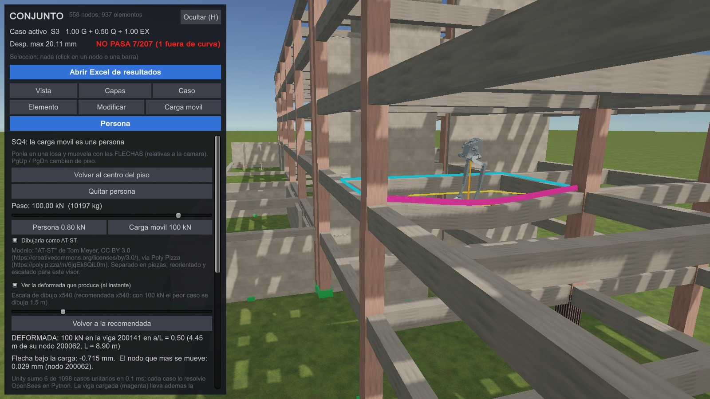

# Semana 5 — LAB: interacción, modificación y experiencia estructural

Esta carpeta es **la entrega del LAB** (10 puntos). Es una entrega
distinta del **avance** de la misma semana (20 puntos), que está en
[`semana05/`](../semana05/) y la armó Pedro: el viewer estructural, el
Excel, el realismo, la carga móvil y la preparación móvil.

Casi todo lo que el LAB pide **ya existe** en ese trabajo. Esta carpeta
hace dos cosas:

1. **Mapear** cada criterio del LAB a dónde se demuestra, para que
   cualquiera del grupo pueda defenderlo sin buscar.
2. **Cerrar lo que faltaba** para este enunciado en concreto: los
   sliders que responden *al instante* y la tabla de criterios de
   reanálisis.

| archivo | qué es |
| --- | --- |
| [`CRITERIOS_REANALISIS.md`](CRITERIOS_REANALISIS.md) | Cuándo hay que reanalizar y cuándo no, derivado de `K·u = F` y comprobado con el motor. Es el criterio 5 de la rúbrica. |
| [`GUION_DEMO.md`](GUION_DEMO.md) | La demostración en vivo, ordenada por los cinco criterios. |
| `verificar_instantanea.py` | Comprueba que la combinación de los sliders es la de Python: el algoritmo, repetido en Python con aritmética de 32 bits sobre 10 juegos de λ; y con `--registro`, **los números que la app real escribió** al mover los sliders. |

Y en Unity:

| archivo | qué es |
| --- | --- |
| `unity/Assets/Scripts/VisorSemana05.Instantanea.cs` | Los cuatro sliders que combinan **en el momento y sin servidor**, y rehacen la demanda-capacidad. |
| `unity/Assets/Scripts/CapturaSemana05.cs`, paso **D2** | Mueve esos sliders en la app real con cuatro juegos de λ y deja lo que Unity calculó en `semana05/capturas/registro.txt` (fotos 18b y 18c). |
| `capturas_conjunto/` | Las mismas capturas de la app con el **conjunto** (23 fotos y `registro.txt`). `verificar_instantanea.py conjunto --registro semana05_lab/capturas_conjunto/registro.txt` pasaba al capturarse (commit `2ba12bd`): E3 = 29.67 mm, NO PASA 10/207, igual a Python. **Ya no corresponde al modelo**: después, las vigas de Ingeniería pasaron a `V 0.60x0.80` (las del LT2, corroboradas en plano y terreno) y con el modelo de hoy E1 da 9.63 mm donde el registro dice 25.04. Hay que volver a capturar; la evidencia del **LT2** (la que corre la suite) no cambió. |
| `Defensa_LAB_Semana5.pdf` | La guía de defensa para los **dos edificios** (LT2 y conjunto), con los números de hoy. |

---

## Dónde está cada criterio

| criterio | pts | dónde se demuestra | cómo se sabe que está bien |
| --- | :---: | --- | --- |
| **Interactividad** | 2 | Navegar (arrastrar, rueda, `F`, `C`). Seleccionar barra o nodo → pestaña **Elemento**. Capas en **Capas** (apoyos por tipo, ejes locales, áreas tributarias, diafragmas). Combinación en **Caso**. Respuesta combinada: deformada + diagramas. Demanda-capacidad: curva P-M y *Mapa demanda / capacidad*. | `semana05/comparar_unity.py` (43 filas de pestañas y cabeceras, 0 falla) · `semana05/UX.md` · fotos 01–14b |
| **Modificación del modelo** | 2 | **Cuatro** de las seis de la lista. **M1** *activar/desactivar elemento*: pestaña **Modificar** → borrar la barra 69 → *Recalcular*. **M3** *sección*: la viga 337 pasa a `V 0.30x0.80`, en la misma pestaña. **M4** *apoyo*: el nodo 2 pasa de empotrado a rótula. **M2** *intensidad de carga*: `--cs 0.20`, que además es el ejemplo de lo que **no** necesita reanálisis. | `semana05/reanalisis_demo.py` (M1, M3, M4 reproducibles y en la suite) · `comparar_anexos.py` · `semana05/MODIFICACIONES.md` · fotos 21–22 |
| **Superposición en Unity** | 2 | **Caso → Superposicion (Semana 5)**, bloque *Superposicion INSTANTANEA en Unity*: los sliders `G`, `Q`, `EX`, `EY` actualizan deformada, esfuerzos y P-M **al instante**: entre **0.9 y 4.4 ms** medidos en la app, sin servidor. E1–E3 precalculados y LIBRE por servidor quedan como referencia; los botones `E1`/`E2`/`E3` ponen los mismos factores para comparar a la vista. | `verificar_instantanea.py lt2 --registro semana05/capturas/registro.txt` · `semana05/verificar_superposicion.py` (4 vías) · fotos 17 y 18b (el mismo E3 por dos caminos) |
| **Demanda-capacidad dinámica** | 2 | El punto (P, M) se mueve con los sliders, y con él `Mn`, `u` y el `pasa / no pasa`. El mapa D/C repinta el edificio y actualiza el conteo. | `verificar_instantanea.py --registro`: `P`, `M`, `Mn`, el extremo que manda, `pasa` y los conteos de la cabecera coinciden con Python en lo que la app escribió · foto 18c (el punto en tracción con λG < 0) |
| **Defensa / criterios de reanálisis** | 2 | La tabla de [`CRITERIOS_REANALISIS.md`](CRITERIOS_REANALISIS.md), con sus números; y en la app el aviso de anexo desactualizado tras editar, también junto a los sliders. | Cada fila contrastada con el motor: `Cs` ×2 → `EX` ×2 a un paso de redondeo; `E` uniforme ×2 → `Δf = 0.0 kN` |
| *SQ4 (recomendado)* | — | Dos partes. La **carga móvil** resuelta en OpenSees: pestaña **Carga movil**, 30 posiciones sobre el eje de vigas 203–208, con reparto y conservación. Y la **carga asociada al usuario**: pestaña **Persona** → *Poner persona*, flechas para caminar y `PgUp`/`PgDn` para cambiar de piso. En cada paso identifica el paño y la región tributaria donde está parada, resalta las vigas receptoras y muestra la carga asignada (ver abajo). | `semana05/CARGA_MOVIL.md` · fotos 19–20 · `unity/Assets/Scripts/VisorPersona.cs` |

---

## Lo que agregó este LAB, y por qué

### Los sliders instantáneos

El enunciado es exigente: *"los sliders deben actualizar
**instantáneamente** la deformada, los resultados y el punto P-M"*.

Lo que había antes era el caso **LIBRE**, que manda los λ a
`POST /combinar` y espera la respuesta de Python. Es correcto y sigue
siendo la referencia, pero espera 0.6 s después del último movimiento
del slider, suma la ida y vuelta al servidor, y sin servidor no
funciona.

`VisorSemana05.Instantanea.cs` agrega el caso **INSTANT**, que combina en
Unity los mismos casos base que ya trae `semana04.json` y responde en
**0.9 a 4.4 ms** en el LT2 (378 barras, 232 nodos; medido en la app,
`registro.txt` → `ins.*.ms`).

**Por qué esto no rompe la regla de oro.** Unity no resuelve `K·u = F`:
no arma rigidez ni toca el modelo. Hace tres cosas sobre números que
OpenSees ya calculó:

1. **Escalar y sumar** los cuatro casos base. Es la superposición, que
   vale porque `K` es la misma y el modelo es elástico, y que Python
   verificó contra una corrida explícita de OpenSees.
2. **Retabular antes de sumar.** Los casos base no vienen en las mismas
   estaciones: una viga cargada trae 9 puntos en G (220 de las 378
   barras del LT2) y en Q (204), y solo 2 en EX y EY. Se interpola
   linealmente a la malla fina, y es **exacto**: sin carga repartida el
   axial y los cortes son constantes y los momentos son rectas.
3. **Rehacer la demanda**, que *no* es lineal y por eso no se suma: del
   `f` combinado salen (P, M) con la misma regla de
   `demanda_capacidad.demanda()`, y `Mn` se interpola en la curva P-M que
   calculó Python con fibras.

**Y no se cree por argumento: se comprueba, por dos caminos.**
`verificar_instantanea.py` repite esa combinación en Python —con la
misma aritmética de 32 bits que Unity— y la compara contra
`semana05/superposicion.caso_combinado()` en 10 juegos de λ, incluidos
negativos, un solo caso y el nulo. Eso prueba el algoritmo. Y con
`--registro` cruza contra Python **lo que la app real escribió** al mover
los sliders (paso D2 de `CapturaSemana05`): desplazamientos, extremos de
las barras de control, `P`, `M`, `Mn`, el extremo que manda, `pasa / no
pasa` y los conteos de la cabecera. Eso prueba el C#. Cada cota sale de
sus causas: el redondeo del anexo (`5e-5·(Σ|λ|+1)`) y los redondeos de 32
bits contados (`16·2⁻²⁴·Σ|λ·v|`).

> **Dos errores que encontró la verificación.**
>
> *El primero* lo encontró la réplica: la primera versión interpolaba
> usando la `x` de cada estación y fallaba por `1.1e-2` kN·m. Las `x`
> vienen redondeadas a 4 decimales en el anexo —hasta `5e-5 m`—, y ese
> error multiplicado por la pendiente del momento, que es el corte (272
> kN en la viga 337 bajo G), llega a `1.4e-2` kN·m. Se cambió a
> interpolar por **fracción de índice** —las mallas son equiespaciadas de
> 0 a L, y el bloque [1] del verificador de la Semana 4 lo comprueba—, y
> el peor error bajó a `1.6e-4`, dentro de la cota `2.5e-4` que sale del
> redondeo y del float32.
>
> *El segundo* lo encontró la auditoría del código y lo demuestra el
> registro: el caso INSTANT se registraba con `tipo = "combinacion"`, y
> el hook que lo recibe solo **reemplaza** un caso existente si es de tipo
> `"superposicion"`. El primer movimiento del slider funcionaba; todos
> los siguientes eran rechazados y la pantalla quedaba congelada en el
> primer λ. La réplica en Python no podía verlo, porque no replica el
> hook. Hoy el registro comprueba que la versión sube 1 en cada
> movimiento (`0 → 1, 2, 3, 4`).

### La tabla de criterios de reanálisis

`semana05/MODIFICACIONES.md` explica M1 y M2 paso a paso, pero no tenía
la regla general. [`CRITERIOS_REANALISIS.md`](CRITERIOS_REANALISIS.md) la
deriva de `K·u = F`, la lleva a una tabla de doce filas y **comprueba
cada fila con el motor**. Tres distinciones que el enunciado premia:

- **Escalar un caso completo es superposición** (`λQ = 1.5`), pero
  **subir la carga de una sola viga no lo es**: no existe un caso base
  resuelto para eso.
- **Doblar `Cs` no necesita reanálisis**: `EX(0.20) = 2·EX(0.10)` a un
  paso de redondeo (`1e-8 m`, `1e-4 kN`). Es `λEX = 2`. Lo que sí es
  otro caso base es cambiar `q` o el patrón en altura.
- **La capacidad no sale de `K·u = F`.** Cambiar una sección con fierro
  obliga a reanalizar *y* a recalcular su curva P-M.

---

## Cómo se corre

```powershell
python comun\lanzar_unity.py sincronizar lt2     # deja el LT2 en StreamingAssets
python comun\lanzar_unity.py app lt2             # la app de Windows
python semana05\servidor_s5.py                   # opcional: habilita LIBRE y el reanálisis
```

Los sliders instantáneos y el mapa D/C funcionan **sin** servidor. El
servidor hace falta para el caso LIBRE (la referencia de Python) y para
M1 y M3 desde la app.

La comprobación del LAB:

```powershell
python semana05_lab\verificar_instantanea.py lt2 --registro semana05\capturas\registro.txt
python semana05\verificar_superposicion.py lt2
python semana05\compilar_unity.py                # los C# compilan sin abrir Unity
```

Y para rehacer la evidencia (fotos y registro), con el servidor arriba:

```powershell
python comun\lanzar_unity.py build lt2 --forzar
build\LaboratorioEstructural.exe -capturarS5 semana05\capturas
python semana05\comparar_unity.py semana05\capturas\registro.txt
```

La suite entera (`python comun\verificar_todo.py`, 44 entradas) incluye
`verificar_instantanea.py --registro` y las M3 y M4; tarda entre 2 y 8
minutos, reexporta los anexos y deja el LT2.

---

## Lo que queda corto, dicho de frente

- **SQ4: la persona.** La carga móvil recorre un **eje fijo de vigas**
  (30 posiciones resueltas en OpenSees). La que sigue **al usuario** está
  en la pestaña **Persona** (`VisorPersona.cs`, agregada después de la
  entrega). Su peso se asigna entero al elemento dueño de la región
  tributaria donde está parada: la misma regla con que el modelo carga
  la losa. Unity solo ubica un punto dentro de los polígonos que arma
  Python (`areas_tributarias`). Dos propiedades de esos polígonos,
  medidas sobre el conjunto con 56 758 puntos de muestra, hacen que el
  reparto no sea ambiguo: **ningún punto de losa cae en regiones de dos
  elementos distintos** (0 de 49 940), y 92 de las 883 regiones son de
  **muros**, que también se resaltan. Desde el 05-10 también muestra su
  **efecto** (sección siguiente). Lo que sigue sin mostrar son los
  esfuerzos que produce: ni momentos ni D/C.
- **La deformada de la persona (05-10), sin servidor.** Camina un AT-ST
  (2.8 m, de juguete; modelo de Tom Meyer, CC BY 3.0) y el edificio se
  deforma donde pisa, al instante. Python resuelve en OpenSees **una
  carga unitaria por cada nodo que puede recibirla** (Fz = 1 kN hacia
  abajo, Mx y My = 1 kN·m): 474 casos en el LT2, 624 en Ingeniería,
  1098 en el conjunto (`semana05_lab/influencias_persona.py`). El modelo
  es lineal, así que la carga P en la abscisa α de una viga es la suma
  de **seis** de esos casos con los pesos de Hermite (las fuerzas nodales
  equivalentes que OpenSees ensambla para `-beamPoint`), y dentro de la
  viga cargada se suma la flecha biempotrada con la forma adimensional
  φ(ξ, α) por la flexibilidad L³/EI que exporta Python. Es la licencia
  de los sliders: combinar casos ya resueltos. Supuestos, en el JSON:
  la carga cae en la **proyección** de la persona sobre la viga (la
  regla pareja de G, q·A/L, haría que caminar a lo largo de una viga no
  cambie nada) y, si la región es de un muro, en su nodo de esa cota
  (como la losa). Comprobado: la suma = OpenSees resolviendo la carga
  directo, en todos los GDL (1.4e-15 sin cuantizar; lo que suma Unity,
  en enteros de 16 bits y float32, dentro de su cota: a lo más el
  0.003 % del mayor desplazamiento); la elástica de la viga cargada =
  `carga_movil.desplazamiento_en`; las fórmulas del C# se leen y se
  comparan con las de Python; y lo que **la app** sumó y dibujó
  (`capturas_persona/registro.txt`) = OpenSees directo. Con 100 kN la
  viga 200141 del conjunto baja 0.715 mm bajo la carga; a ×540 se ve.

  

  ```
  python semana05_lab/influencias_persona.py lt2          resuelve, verifica y escribe (15 s; conjunto 100 s)
  python semana05_lab/influencias_persona.py lt2 --verificar [--registro <registro.txt>]
  python semana05_lab/personaje_atst.py                   el AT-ST a Resources/Personaje/atst.json
  LaboratorioEstructural.exe -capturarPersona <carpeta>   fotos y registro
  ```
- **La modificación cubre cuatro de las seis** de la lista (el enunciado
  pide al menos dos): activar/desactivar elemento, intensidad de carga,
  sección y apoyo. Quedan fuera **propiedad material** y **área
  tributaria**: se pueden cambiar editando el modelo, pero no hay control
  en el panel ni guardia que las cubra.
- **El peso propio no sigue a la sección.** Si se cambia una sección
  desde la app, `K` se actualiza pero su peso no, porque las cargas de G
  vienen sumadas en el modelo. Está declarado en
  [`CRITERIOS_REANALISIS.md`](CRITERIOS_REANALISIS.md) §4 y se ve en la
  salida de M3: la carga aplicada no se mueve.
- **Los NO PASA son muros con fierro incompleto en los planos.** En E3
  no pasan los muros 14, 15, 16 y 29; las 40 columnas del LT2 pasan en
  los 15 casos. La armadura de esos muros es la que el extractor pudo leer
  de planos que no la traen completa (registrado en `AGENTS.md`, Semana
  4), así que su `Mn` sale con menos fierro del que probablemente hay.
  El NO PASA marca dónde falta información, no un veredicto sobre el
  edificio; `u = 9999` quiere decir que `P` cayó fuera del rango de la
  curva.
